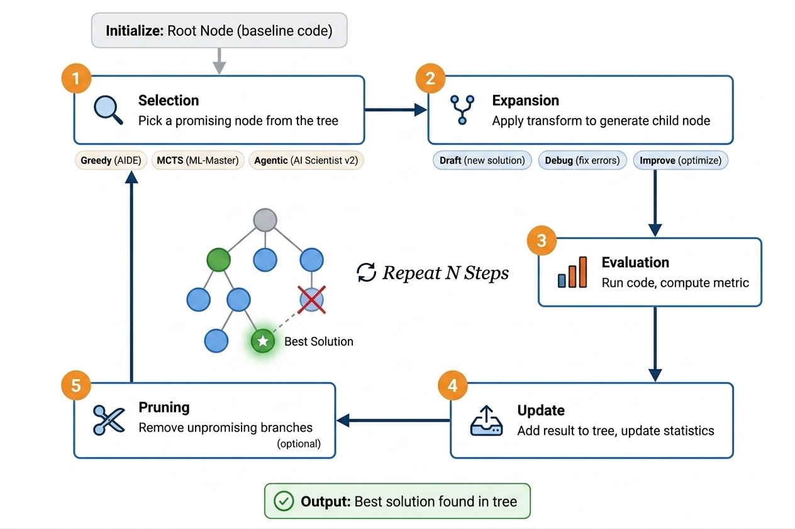
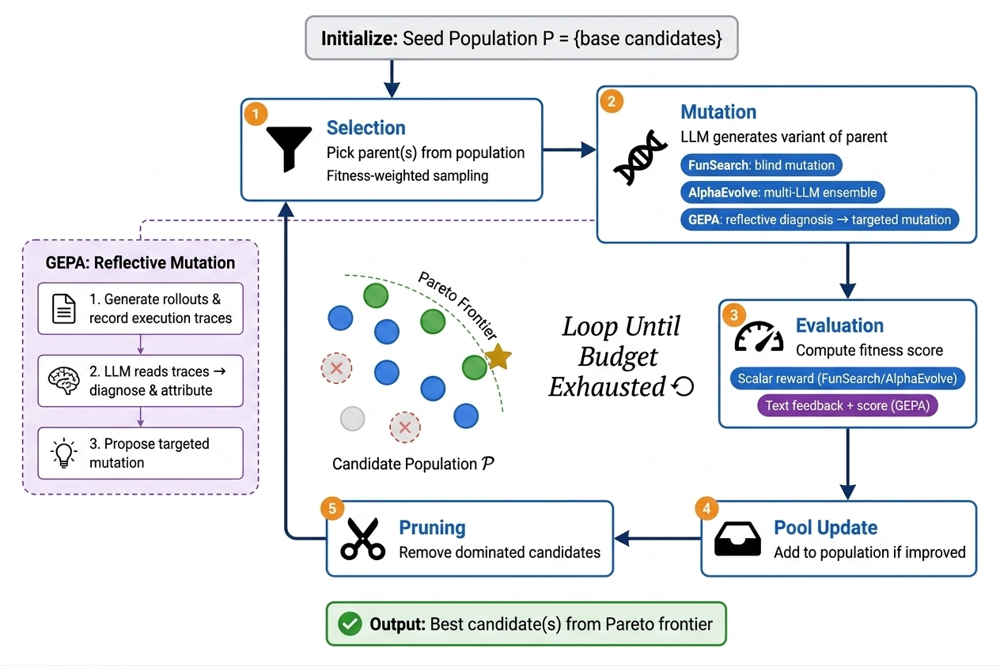
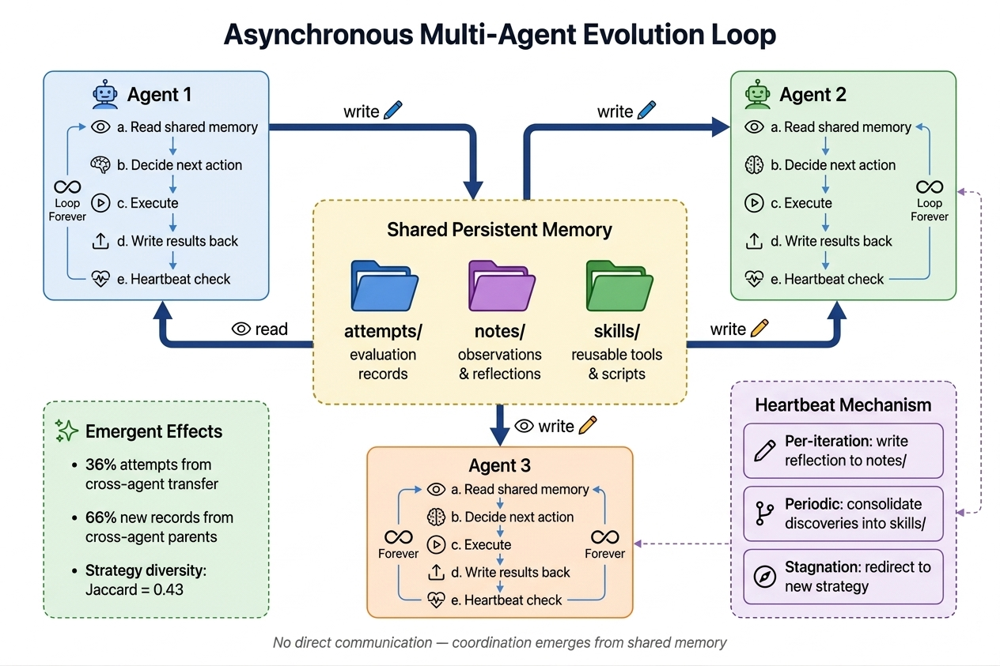

# AutoResearch

AutoResearch = 基模 + Agent Loop。当基模固定时，方法循环设计成为了竞争的本质。

这篇文章讲一下 AutoResearch 发展到现在的几种常见循环设计。以及一个通用的分析框架，当有新的AutoResearch方法出现时，你可以使用这个分析框架直接得出这个新方法的优劣势。

### 1 四种循环

#### 1.1 **线性循环 Keep-or-Discard**

> **代表系统**：Karpathy autoresearch（2025）

<figure><figcaption></figcaption></figure>

线性循环是最简单也最直觉的循环设计：每次尝试一个想法，如果结果更好就保留，否则回退。Karpathy 的 autoresearch 只有三个文件，循环逻辑由一个Markdown 指令（[program.md](http://program.md)）定义。

```python
【初始化】与用户确认运行标签 → 创建 git 分支 → 读取所有源文件 → 验证数据 → 确认启动

【主循环】
    1. 检查 git 状态（当前分支和 commit）
    2. 修改 train.py，实现一个实验想法
    3. 提交 commit
    4. 运行实验（固定 5 分钟时间预算）
    5. 提取指标（val_bpb，越低越好）
    6. 若崩溃 → 尝试修复（最多几次）→ 重试或记录失败
    7. 将结果记录到 results.tsv
    8. 若 val_bpb 改善 → 保留 commit，推进分支
       否则 → git reset，回退到上一个基线
```

设计的最大亮点在于“固定5 分钟的时间预算”这个约束选择，它迫使 Agent 思考的是"什么改动能在极短训练后就产生可测量的收益”，淘汰了那些需要训练很久才能看到效果的方案。人类的参与在编辑完 [program.md](http://program.md) 后达到了最小化，这个循环不会停下来问人类的意见，而是会自主执行，直到人类手动中断。

但是简洁的同时也带来了很多结构性的局限：

1. 它无法并行探索多个方向
2. 失败实验的经验没有被结构化保存（可能反复尝试同一个idea死循环）
3. 短时间约束容易让框架陷入局部最优
4. 只看最终指标这个标量反馈无法传达"为什么失败"，可解释性不够

#### 1.2 **树搜索循环搜索**

> **代表系统**：AIDE（2024）、AI Scientist v2（2025）

<figure><figcaption></figcaption></figure>

树搜索的核心思想是：不要把解空间的探索限制在一条线性路径上，而是维护一棵搜索树，允许同时保持多个探索方向，并在任意节点发起新的分支。树的每个节点是一个完整的代码解决方案，边是代码变换操作。

```
【初始化】创建根节点（空白方案或基线代码）

【主循环】重复 N 步：
    1. 选择：从树中挑选一个有潜力的节点
    2. 扩展：对该节点施加变换，生成子节点
       - 草稿：从头生成全新方案
       - 调试：修复当前节点的错误
       - 改进：在当前节点基础上优化
    3. 评估：运行代码，计算指标
    4. 回传：将结果添加到树中，更新节点统计
    5. 剪枝：移除明显无望的分支（可选）

【输出】树中找到的最优方案
```

树搜索相比线性循环的根本优势在于**回溯能力**和**方案多样性**。当某条路径走进死胡同时，线性循环只能通过 git reset 回到上一步然后尝试另一个方向，而树搜索可以回到树中任意一个历史节点重新出发。

听起来有点抽象，下面以 AIDE 的具体实现为例：

AIDE 中的每个节点是一个完整的、可独立运行的 Python 脚本，是一个从数据加载到模型训练到输出指标的完整 ML pipeline。有三种算子类型（算子代表对节点的更改）：

* **Draft（草稿）** 是从零开始生成一个全新方案。LLM 收到的 prompt 包含：任务描述、当前所有成功方案的摘要（称为 Memory），以及"不要重复已有方案"的指令。这确保每个 draft 尝试不同的建模方向——比如第一个 draft 可能用 XGBoost，第二个可能用神经网络，第三个可能用 feature engineering + 线性模型。
* **Debug（调试）** 针对有 bug 的节点。LLM 收到的 prompt 包含：完整的 buggy 代码、终端输出（包含报错信息和 traceback），以及"修复这个 bug"的指令。LLM 需要阅读错误信息并产出修复后的完整代码。如果修复后仍然有 bug，可以继续 debug（直到深度上限）。
* **Improve（改进）** 针对已经能正常运行的节点。LLM 收到的 prompt 包含：当前方案的完整代码、所有成功方案的摘要，以及"提出一个单一的、可实验验证的改进"的指令。关键约束是"atomic improvement"——每次只改一个东西（比如只换特征工程方法，或只换模型超参数），这样可以清楚地归因效果。

AIDE 认为有 bug 的节点代表已投入精力但尚未成功的探索方向，值得修复，所以会从有bug且为叶节点且调试深度没有达到上限的节点中随机选一个进行调试。如果存在好的节点，选择指标最好的那个节点，对其进行改进。

AIDE 采用的是贪婪策略——总是选当前最优节点做 improve。优势是收敛很快，但是如果Draft 1 很早就获得了好指标，后续所有 improve 都会集中在它的子树上，其他 draft 的子树被"饿死"。

**MCTS 选择**（ML-Master 等系统）用 UCB（Upper Confidence Bound）公式解决这个问题：

```
UCB(node) = 平均收益 + C × sqrt(ln(总访问次数) / 该节点访问次数)
```

第一项倾向于已知的好节点（利用），第二项倾向于被访问次数少的节点（探索）。系数 C 控制二者的平衡。这意味着即使 Draft 5 的初始指标较差，只要它被访问的次数少，UCB 公式就会给它一个"好奇心加分"，使系统偶尔去探索它。

类似 AI Scientist v2 的工作则完全抛弃了公式化的选择策略，让 Agent 自主判断"现在应该深耕哪个方向"。这种方式的优势在于 Agent 可以利用语义理解做出更智能的选择。

#### 1.3 遗传进化池循环

> **代表系统**：FunSearch（2023）、AlphaEvolve（2024）、GEPA（2025）

<figure><figcaption></figcaption></figure>

遗传进化的核心思想来自生物演化：维护一个候选种群，通过选择优秀个体、对其施加突变（在这里由 LLM 完成）、评估后代的适应度，逐代推动种群向更优方向进化。与树搜索不同的是，进化池中的个体之间没有严格的父子拓扑——任何个体都可以被选为突变的起点，多个个体可以被交叉组合。

```
【初始化】
    候选种群 P = {种子方案}

【主循环】直到预算耗尽：
    1. 选择：从种群中挑选父本（根据适应度加权采样）
    2. 突变：LLM 基于父本生成变体
    3. 评估：计算新候选的适应度
    4. 更新种群：若满足条件则加入种群
    5. 剪枝：移除被支配的候选

【输出】种群中的最优候选
```

**FunSearch**（DeepMind, 2023）使用 MAP-Elites 算法维护种群——不只保留最优个体，而是在多个行为维度的每个 niche 中都保留最优个体，从而维持种群的多样性。但在 FunSearch 中，所有搜索规则（选择策略、评估标准、种群管理）都是人工硬编码的，LLM 只负责变体生成。

**GEPA**（2025）用**文本反馈取代标量奖励**来驱动突变方向。具体而言，系统先对当前候选进行 rollout，记录完整的执行轨迹（包括每一步的推理过程、工具调用和输出），然后让 LLM 阅读这些轨迹来诊断问题、归因原因、提出有针对性的修改方案。

#### 1.4 异步多 Agent 进化循环

> **代表系统**：CORAL（2026）

<figure><figcaption></figcaption></figure>

前面三种循环本质上都是单一搜索过程（即使内部有多个角色参与，搜索的状态空间仍然是统一管理的）。以 CORAL 为代表的方法使用**多个 Agent 各自独立运行完整的搜索循环，通过共享持久记忆间接协调，无需任何显式通信协议**。

```
【每个 Agent 独立运行】异步循环：
    a. 读取共享记忆（attempts/ notes/ skills/）
    b. 自主决定下一步动作（无固定顺序）：
       - 尝试新想法
       - 重访过去的某次尝试
       - 将成功经验封装为 skill
       - 记录失败模式到 notes
       - 评估当前方案
    c. 执行动作
    d. 将结果写回共享记忆
    e. 心跳检查（反思 / 整合 / 方向调整）

【跨 Agent 协调】
    - 每个 Agent 在独立的 git worktree 中运行
    - 不直接通信，所有协调通过共享记忆发生
    - 一个 Agent 的发现自然影响其他 Agent 的后续搜索
```

**共享持久记忆**以文件系统的形式实现，分为三个目录：`attempts/` 存储所有历史评估记录（JSON 格式，按 commit hash 索引）、`notes/` 存储观察和反思（Markdown 格式，支持合并和分类）、`skills/` 存储可复用的过程和工具（包含自然语言描述和可执行脚本）。每个 Agent 通过符号链接访问共享记忆，按需读取以避免上下文过载，并且 Agent 可以主动整理和重组记忆结构。


### 2 通用分析框架

在分析具体系统之前，先建立一个通用的分析框架。任何 AutoResearch 方法循环都可以从以下四个维度进行解构：

1. 搜索拓扑：**搜索拓扑**决定了系统在解空间中的行走方式。线性路径每次只走一步，要么保留要么回退；树形分支允许同时保持多个探索方向并随时回溯；遗传池维护一个候选种群，通过选择和突变不断演化；异步并行则让多个独立 Agent 同时探索，通过共享记忆间接协调。
2. 反馈信号：**反馈信号**决定了系统从每次实验中能学到多少。最简单的标量奖励只告诉系统"好了多少"，但不解释"为什么"。结构化指标提供多维评估。文本反馈则能传达完整的诊断信息——哪个模块出了问题、哪种策略有潜力但需要调整。信息越丰富，系统下一步决策的质量就越高，但获取和处理的成本也越大。
3. 记忆架构：**记忆架构**决定了系统能否从历史中学习。无记忆的系统每次实验都从零开始思考；Git 历史提供了可回溯的版本记录但缺乏结构化查询；解树保留了搜索过程的完整拓扑；文件系统池支持多 Agent 并发读写；知识图谱则提供了最丰富的语义结构和跨项目的知识复利。
4. 决策主体：**决策主体**决定了"谁在控制搜索过程"。早期系统中，人类硬编码所有搜索规则，LLM 只是被调用的突变算子。后来 Agent 逐步获得了决定搜索策略的自主权——选择探索哪个方向、何时放弃当前路径、如何综合历史经验。

以下表格概括了各维度的主要选项及其代表系统：

| 搜索拓扑 | 代表系统                         | 反馈信号   | 记忆架构      | 决策主体       |
| ---- | ---------------------------- | ------ | --------- | ---------- |
| 线性路径 | Karpathy autoresearch        | 标量奖励   | Git 历史    | Agent 自主   |
| 树形分支 | AIDE, AI Scientist v2        | 标量/结构化 | 解树        | 贪婪/Agentic |
| 遗传池  | FunSearch, AlphaEvolve, GEPA | 标量→文本  | Pareto 前沿 | 人定规则→反射    |
| 异步并行 | CORAL                        | 复合信号   | 文件系统池     | 多 Agent 自主 |

### 参考

1. [https://github.com/karpathy/autoresearch](https://github.com/karpathy/autoresearch)
2. [https://arxiv.org/abs/2403.17373](https://arxiv.org/abs/2403.17373)
3. [https://github.com/SakanaAI/AI-Scientist-v2](https://github.com/SakanaAI/AI-Scientist-v2)
4. [https://deepmind.google/blog/funsearch-making-new-discoveries-in-mathematical-sciences-using-large-language-models/#:\~:text=Update%3A%20In%20December%202024%2C%20we%20published%20a%20report,to%20amplify%20human%20performance%20in%20combinatorial%20competitive%20programming.](https://deepmind.google/blog/funsearch-making-new-discoveries-in-mathematical-sciences-using-large-language-models/)
