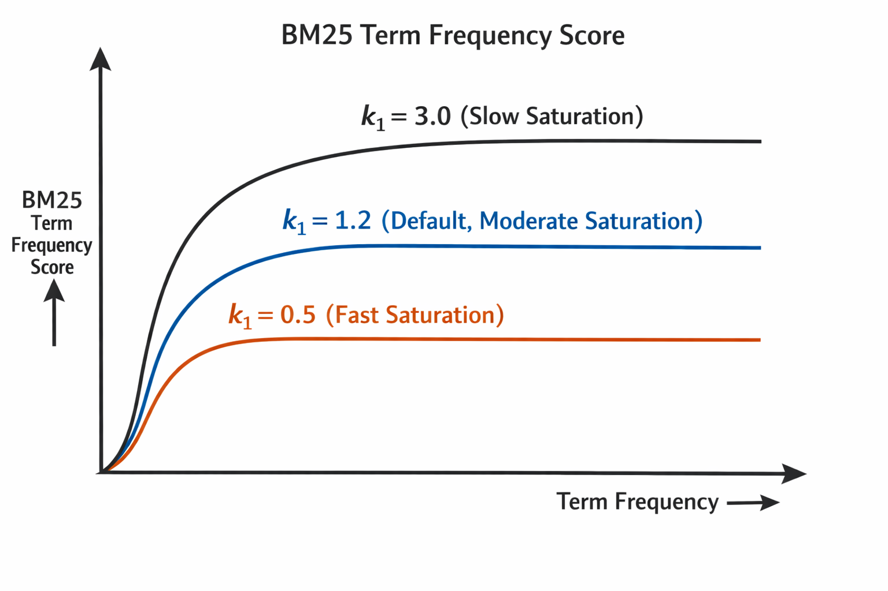

# 文本表示方法

给你一段文本，怎么把它变成机器能计算的东西？这个问题在 NLP 领域被反复回答了几十年，诞生了无数方案。

### 1 词袋模型

词袋模型（Bag of Words, BoW）的假设：一段文本 = 一堆词的集合，就像拿着袋子装着一堆词一样，不需要考虑词序。

比如下面两句话：

```
A: "猫追狗"
B: "狗追猫"
```

在词袋模型眼里，A 和 B 是**完全相同**的——都是 `{猫, 追, 狗}`。

### 2. TF-IDF

#### 2.1 词频和逆文档频率

TF-IDF 的全称是 **Term Frequency - Inverse Document Frequency**，由两部分组成：

* **TF（词频）：一个词在当前文档中出现得越多，越重要。**
  * $$\text{TF}(t, d) = \frac{\text{词 } t \text{ 在文档 } d \text{ 中出现的次数}}{\text{文档 } d \text{ 的总词数}}$$
* **IDF（逆文档频率）：一个词在越多文档中出现，越不重要。**
  * $$\text{IDF}(t) = \log \frac{N}{1 + \text{df}(t)}$$，其中 N 是总文档数，df(t) 是包含词 t 的文档数，分母加 1 是为了避免除零。

"的"、"是"、"在"这种词，几乎在每篇文档中都出现，它们的 IDF 极低。而"SimHash"可能只在少数文档中出现，IDF 就很高。

**为什么 IDF 要取 log？**

**log 把乘法关系压缩成了加法关系**，让权重差异保持在合理范围内。这和人类对"稀有度"的感知是一致的——你觉得一个罕见词比常见词重要一些，但不是重要几个数量级。

#### 2.2 TF-IDF 向量 + 余弦相似度

把 TF 和 IDF 乘起来，就得到每个词的 TF-IDF 权重：

$$\text{TF-IDF}(t, d) = \text{TF}(t, d) \times \text{IDF}(t)$$

一篇文档中所有词的 TF-IDF 值排成一个向量，就是这篇文档的 **TF-IDF 向量**。

我们可以用余弦相似度比较两篇文档的相似度：

$$\text{cos}(\vec{a}, \vec{b}) = \frac{\vec{a} \cdot \vec{b}}{|\vec{a}| \times |\vec{b}|}$$

**TF-IDF 向量 + 余弦相似度**就是最经典的文本相似度方案，统治了 NLP 领域很多年。

#### 2.3 一个具体的例子

假设我们有 3 篇文档的语料库：

```
D1: "猫 喜欢 吃 鱼"
D2: "猫 喜欢 玩 球"  
D3: "狗 喜欢 吃 骨头"
```

词表：\[猫, 喜欢, 吃, 鱼, 玩, 球, 狗, 骨头]

先算 IDF（N=3）：

| 词  | 出现在几篇文档中 | IDF = log(3/(1+df))              |
| -- | -------- | -------------------------------- |
| 猫  | 2        | log(3/3) = 0                     |
| 喜欢 | 3        | log(3/4) ≈ -0.29（实际实现会用变体公式避免负值） |
| 吃  | 2        | log(3/3) = 0                     |
| 鱼  | 1        | log(3/2) ≈ 0.41                  |
| 玩  | 1        | log(3/2) ≈ 0.41                  |
| 球  | 1        | log(3/2) ≈ 0.41                  |
| 狗  | 1        | log(3/2) ≈ 0.41                  |
| 骨头 | 1        | log(3/2) ≈ 0.41                  |

"喜欢"在所有文档中都出现，IDF 最低；"鱼""球""骨头"各只在一篇中出现，IDF 最高。**TF-IDF 自动把"区分度高"的词挑了出来。**

#### 2.4 TF-IDF 的局限性

**1. 无法处理同义词。**

"机器学习"和"ML"在 TF-IDF 眼里是完全不同的两个词，余弦相似度为 0。但人类知道它们是一回事。

**2. 无法处理一词多义。**

"苹果"在"苹果很好吃"和"苹果发布了新 iPhone"中含义完全不同，但 TF-IDF 会给它们相同的权重。

### 3 BM25

#### 3.1 从 TF-IDF 到 BM25

TF-IDF 有一个隐含的假设：**词频越高，重要性线性增长**。一个词出现 10 次就比出现 1 次重要 10 倍。

但这合理吗？

想象一篇 10000 词的文档，"深度学习"出现了 200 次。另一篇 500 词的文档，"深度学习"出现了 20 次。哪篇和"深度学习"更相关？

直觉上是后者——在更短的篇幅里更高频地提到，说明主题更聚焦。但 TF-IDF 会认为前者更相关（200 > 20）。

BM25（Best Matching 25）针对这两个问题做了修正：

**问题一：词频的边际收益递减。**

"深度学习"出现 1 次 → 5 次，相关性大幅提升。但从 50 次 → 100 次呢？提升微乎其微。BM25 用一个**饱和函数**来建模这种效应。

**问题二：长文档天然词频更高。**

一篇 10000 词的文档，几乎任何词都比 500 词的文档出现得更多。BM25 引入了**文档长度归一化**来消除这种偏差。

#### 3.2 BM25 公式

BM25 的评分公式如下：

$$\text{BM25}(q, d) = \sum_{t \in q} \text{IDF}(t) \cdot \frac{f(t,d) \cdot (k_1 + 1)}{f(t,d) + k_1 \cdot \left(1 - b + b \cdot \frac{|d|}{\text{avgdl}}\right)}$$

其中：

* **IDF(t)**：和 TF-IDF 一样，稀有词权重更高
* **f(t,d)**：词 t 在文档 d 中的出现次数（原始词频）
* **|d|**：文档 d 的长度
* **avgdl**：语料库中文档的平均长度
* **k₁** 和 **b**：两个超参数

**k₁ 控制词频饱和的速度。**

* k₁ = 0：完全忽略词频，只看词有没有出现（退化为布尔模型）
* k₁ 越大：词频的影响越接近线性（越像原始 TF）
* 典型取值：k₁ = 1.2 \~ 2.0

用一张图理解更直观：

<figure><figcaption></figcaption></figure>

**b 控制文档长度归一化的强度。**

* b = 0：完全不做长度归一化（长文档和短文档一视同仁）
* b = 1：完全按长度归一化（长文档被严厉惩罚）
* 典型取值：b = 0.75

**调参建议：**

* 如果你的语料中文档长度差异很大（比如混合了推文和长文），b 应该大一些
* 如果文档长度比较均匀，b 可以小一些
* k₁ 通常用默认值就行，除非你的场景中词频分布特别极端

#### 3.3 为什么 BM25 至今仍是搜索引擎的标配？

深度学习模型满天飞的今天，为什么 Elasticsearch、Lucene、各大搜索引擎的**第一道召回**仍然在用 BM25？

三个原因：

**1. 速度。** BM25 基于倒排索引，查询复杂度是 O(查询词数 × 包含该词的文档数)。对于十亿级别的文档库，毫秒级返回结果。深度学习模型做不到。

**2. 可解释性。** BM25 的每一项得分都可以追溯到具体的词和权重。debug 的时候，你能清楚地知道为什么某篇文档排在前面。

**3. 基线够强。** 在大多数信息检索任务上，BM25 的召回率已经相当好了。很多号称"超越 BM25"的深度学习模型，在实际部署中和 BM25 的差距远没有论文里写的那么大。

工业界的常见做法通常是：**BM25 做粗召回（从十亿缩到几千），然后用深度模型做精排（从几千缩到几十）**。

### 4 SimHash

TF-IDF 和 BM25 解决的是"两段文本有多相似"的问题。但有时候我们需要回答一个更粗暴的问题：

> **这两个网页是不是同一篇文章的复制品？**

搜索引擎每天爬取数十亿网页，其中大量是互相抄袭、镜像、或者只改了几个字的重复内容。如果不去重，搜索结果页会被同一篇文章的不同副本淹没。

用 TF-IDF + 余弦相似度能做吗？能，但太慢了。十亿篇文档两两比较，需要 10^18 次运算。

我们需要一种方法：**把每篇文档压缩成一个短指纹，然后用指纹快速比较。**&#x8FD9;就是 SimHash 要做的事。

#### 4.1 局部敏感哈希（LSH）的思想

传统哈希（如 MD5、SHA256）有一个特性：输入稍有变化，输出完全不同。"Hello" 和 "hello" 的 MD5 值天差地别。这对安全性很好，但对相似度检测来说是灾难。

**局部敏感哈希（Locality-Sensitive Hashing, LSH）** 反其道而行：

> **相似的输入 → 相似的哈希值；不相似的输入 → 不相似的哈希值。**

SimHash 是 LSH 家族中最著名的成员之一，由 Moses Charikar 在 2002 年提出，后被 Google 用于网页去重并广为人知。

#### 4.2 SimHash 的构造过程

假设我们要为一篇文档生成一个 64 位的 SimHash 指纹，过程如下：

**Step 1：分词 + 加权**

把文档拆成词，每个词赋予一个权重（可以用 TF-IDF 权重）。

```
文档："机器学习 是 人工智能 的 核心 技术"

词及权重：
  机器学习 → 5.2
  是       → 0.3
  人工智能 → 4.8
  的       → 0.1
  核心     → 3.1
  技术     → 2.7
```

**Step 2：每个词生成传统哈希**

对每个词计算一个 64 位的传统哈希值（如 MurmurHash）：

```
机器学习 → 1010 0111 ... (64位)
人工智能 → 0110 1101 ... (64位)
核心     → 1100 0010 ... (64位)
```

**Step 3：加权合并**

初始化一个 64 维的全零向量 V。对每个词的哈希值：

* 如果第 i 位是 1，则 V\[i] += 该词的权重
* 如果第 i 位是 0，则 V\[i] -= 该词的权重

```
以"机器学习"（权重 5.2，哈希 10100111...）为例：
V[0] += 5.2  （第0位是1）
V[1] -= 5.2  （第1位是0）
V[2] += 5.2  （第2位是1）
V[3] -= 5.2  （第3位是0）
V[4] -= 5.2  （第4位是0）
V[5] += 5.2  （第5位是1）
V[6] += 5.2  （第6位是1）
V[7] += 5.2  （第7位是1）
...
```

所有词处理完后，V 的每个维度累积了所有词在该位上的加权投票。

**Step 4：二值化**

```
V[i] > 0  → 最终指纹第 i 位 = 1
V[i] ≤ 0 → 最终指纹第 i 位 = 0
```

最终得到一个 64 位的二进制指纹，比如：`1010011100110101...`

**整个过程的直觉：** 高权重的词对最终指纹的影响更大。如果两篇文档的高权重词大致相同，它们的 SimHash 指纹也会大致相同。

#### 4.3 用汉明距离快速判重

两个 SimHash 指纹的**汉明距离**（Hamming Distance）= 对应位不同的个数。

```
指纹A: 1 0 1 0 0 1 1 1
指纹B: 1 0 1 1 0 1 0 1
差异:   . . . X . . X .  → 汉明距离 = 2
```

计算汉明距离极其高效——只需要一次 XOR 操作 + popcount（数 1 的个数），现代 CPU 一条指令就能完成。

**判重规则：**

| 汉明距离 | 含义            |
| ---- | ------------- |
| 0    | 完全相同（或极其相似）   |
| 1-3  | 高度疑似重复（改了几个字） |
| 4-10 | 可能有关联         |
| >10  | 基本不同          |

在 Google 的实践中，通常**汉明距离 ≤ 3 就判定为近似重复**。

#### 4.4 分桶策略

即使有了 SimHash，十亿文档两两比较汉明距离仍然是 O(n²)。实际工程中会用**分桶（Blocking）** 策略：

把 64 位指纹分成 4 个 16 位的段。如果两个指纹的汉明距离 ≤ 3，那么至少有一个段是完全相同的（鸽巢原理）。

所以：

1. 对每个段建一个哈希表
2. 只比较至少有一个段相同的文档对
3. 候选对数量从 O(n²) 降低到远小于此的规模

