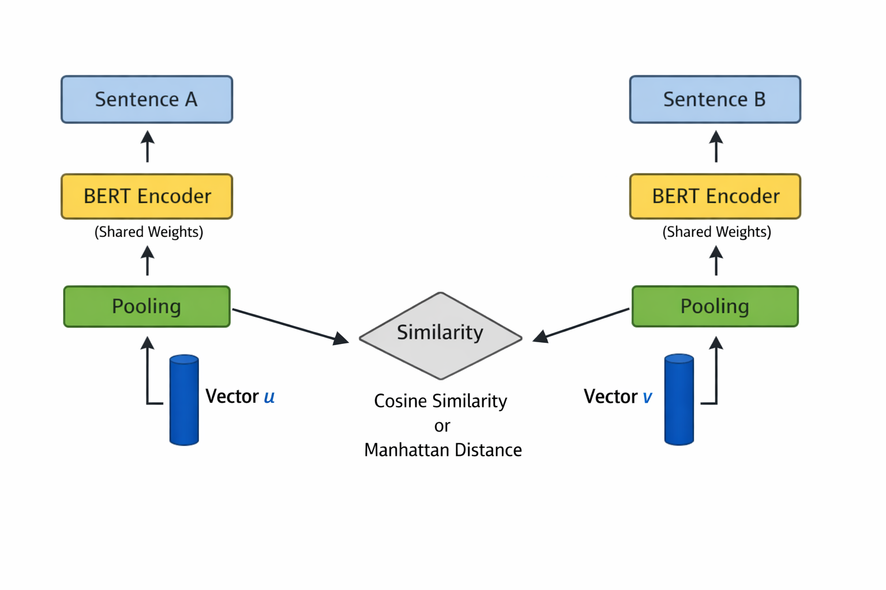

# 词向量

根据词频来表示的词汇语义，有一个很大的缺陷，就是**不懂语义。**

```
"我很快乐"
"我很开心"
```

这两句话在人类看来几乎完全相同。但在 TF-IDF 的世界里，"快乐"和"开心"是两个毫不相干的维度，余弦相似度很低。

问题的根源在于：TF-IDF 把每个词当成一个独立的符号，词与词之间没有任何关联。"猫"和"狗"的距离，等于"猫"和"微积分"的距离——都是正交的。

所以我们需要一种全新的表示方式：**让语义相近的词，在向量空间中也彼此接近。**

这就是词向量（Word Embedding）要做的事。

### 1 Word2Vec

#### 1.1 核心直觉

Word2Vec 的核心思想可以用一句话来表示：**一个词的含义，由它周围的词决定。**

"猫"和"狗"经常出现在相似的上下文中（"养了一只\_\_\_"、"\_\_\_在沙发上睡觉"），所以它们的含义应该是相近的。

Word2Vec 把这个语言学直觉变成了一个可计算的任务：**用一个词的上下文来预测这个词（或者反过来），训练出来的中间产物——词向量——自然就捕获了语义信息。**

具体的实现在之前的文章中已经讲过，这里不再赘述，参见：

[static-word-embeddings.md](../../basics/machine-learning-basics/feature-extraction/text-representation-models/static-word-embeddings.md "mention")

### 2 从词向量到句子向量

有了词向量之后，一个自然的问题是：**怎么得到一个句子的向量？**

#### 2.1 平均池化

最简单的方法：把句子中所有词的向量取平均。

$$\vec{s} = \frac{1}{n} \sum_{i=1}^{n} \vec{w_i}$$

"我 喜欢 吃 苹果" → (vec(我) + vec(喜欢) + vec(吃) + vec(苹果)) / 4

在很多场景中效果还不错。平均操作相当于在高维空间中找了一个"重心"，能大致表示整个句子的语义方向。

#### 2.2 TF-IDF 加权平均

平均池化的问题是"的""了""在"这种停用词和"量子计算"这种核心词权重相同。

改进方案：用 TF-IDF 权重做加权平均。

$$\vec{s} = \frac{\sum_{i=1}^{n} \text{tfidf}(w_i) \cdot \vec{w_i}}{\sum_{i=1}^{n} \text{tfidf}(w_i)}$$

效果比简单平均好一些，因为停用词的权重被压低了。

但是无论是平均还是加权平均，都有一个根本问题：**丢失了词序信息。**

```
"猫追狗" 和 "狗追猫"
```

它们包含完全相同的词，词向量的平均值也完全相同。但含义明显不同。

更深层的问题是：**句子的含义不等于词义的简单加总。** "他没有不高兴"的意思不等于"他""没有""不""高兴"四个词向量加起来。

要真正得到好的句子向量，我们需要专门为句子级别的语义设计模型。

### 3 Sentence-BERT

#### 3.1 BERT 的问题

到 2018 年，BERT 横空出世，在几乎所有 NLP 任务上刷新了记录。BERT 通过双向 Transformer 编码器，能够生成**上下文相关**的词表示——同一个词在不同语境中会有不同的向量。

BERT 的标准用法是：把两个句子拼起来，输入模型，输出一个分类结果（相似/不相似）。

```
输入: [CLS] 句子A [SEP] 句子B [SEP]
输出: 相似度分数
```

这叫做 **交叉编码（Cross-Encoder）**。效果很好，但有一个致命的效率问题：

假设你有 10000 个句子，想找出最相似的两个。交叉编码需要对每一对都跑一次 BERT：

$$C_{10000}^{2} = 49,995,000 \text{ 次 BERT 推理}$$

BERT 一次推理大约 10ms，总共需要 **约 139 小时**。这在实际应用中完全不可接受。

**那用 BERT 的 \[CLS] 向量呢？**

BERT 在每个输入序列的开头会加一个 \[CLS] token，有人认为它的隐藏状态可以作为整个句子的表示。

但实验表明，**直接用 BERT 的 \[CLS] 向量做余弦相似度，效果甚至不如 GloVe 词向量的平均值。**

因为 BERT 的预训练目标（Masked Language Model + Next Sentence Prediction）并没有训练 \[CLS] 向量去捕获句子级别的语义。\[CLS] 向量更多是为下游分类任务准备的——它在微调阶段才学到有用的信息。直接拿预训练的 \[CLS] 向量算相似度，得到的基本是噪声。

#### 3.2 Sentence-BERT 的解决方案

Sentence-BERT（SBERT，2019 年）的核心思路很简洁：

> **用孪生网络（Siamese Network）训练 BERT，让它学会为每个句子独立输出一个好的向量。**

架构如下：

<figure><figcaption></figcaption></figure>

**1. 共享权重。** 两个 BERT 编码器是同一个模型，参数完全共享。这保证了同一个句子无论走哪条路径，得到的向量都一样。

**2. 池化策略。** BERT 输出的是一个 token 序列的向量，需要池化成一个句子向量。SBERT 测试了三种池化方式：

* \[CLS] 向量
* 所有 token 向量的平均值（Mean Pooling）
* 所有 token 向量的逐维最大值（Max Pooling）

实验结果：**Mean Pooling 效果最好。**

#### 3.3 训练方式

SBERT 主要用了两种训练方式：

**方式一：在 NLI 数据集上用 Softmax 分类。**

NLI（Natural Language Inference）数据集包含句子对及其关系标签：

* **蕴含（Entailment）**："一只猫在睡觉" → "有动物在休息"
* **矛盾（Contradiction）**："一只猫在睡觉" → "所有动物都醒着"
* **中性（Neutral）**："一只猫在睡觉" → "猫是灰色的"

训练时，把两个句子的向量 u、v 以及它们的差 |u-v| 拼接起来，过一个 Softmax 分类器：

$$\text{softmax}(W \cdot [u; v; |u-v|])$$

预测三分类标签。这种方式利用了大规模 NLI 数据集（如 SNLI + MultiNLI，约 100 万条数据），训练信号丰富。

**方式二：在 STS 数据集上用 Cosine Loss。**

STS（Semantic Textual Similarity）数据集直接提供了句子对的相似度分数（0-5）。

训练时直接优化两个句子向量的余弦相似度与标注分数的均方误差：

$$\text{Loss} = \text{MSE}(\cos(u, v), \text{label})$$

有了 SBERT，句子相似度搜索的流程变成：

1. 离线：对所有句子跑一次 BERT，得到向量，存入索引
2. 在线：对查询句子跑一次 BERT，得到向量，用余弦相似度在索引中检索

同样是 10000 个句子找最相似的对：

* Cross-Encoder：49,995,000 次推理 ≈ 139 小时
* SBERT：10000 次推理 + 余弦相似度计算 ≈ **几秒钟**

### 4 CoSENT

#### 4.1 SBERT 损失函数的问题

SBERT 的 Softmax 分类损失有一个微妙的问题：它把语义相似度简化成了离散的三分类（蕴含/矛盾/中性），丢失了细粒度的相似度信息。

而 Cosine Loss（均方误差）也有问题：它对每个句子对独立优化，没有考虑**句子对之间的相对关系**。

举个例子：

* 句子对 A 的标注相似度是 0.9
* 句子对 B 的标注相似度是 0.3

Cosine Loss 分别优化 A 的余弦相似度接近 0.9、B 的余弦相似度接近 0.3。但它不直接保证 **A 的分数就是高于 B 的分数**。

#### 4.2 CoSENT 的排序思想

CoSENT（Cosine Sentence，苏剑林提出）采用了一种不同的思路：

> **不关心绝对分数，只关心排序：正例对的余弦分数应该高于负例对。**

具体来说，对于一个 batch 中的所有句子对，CoSENT 的损失函数要求：

**如果句子对 i 的标注相似度高于句子对 j，那么它们的余弦相似度也应该满足这个顺序。**

数学形式上，CoSENT 使用了一种类似于 Circle Loss 的排序损失：

$$\mathcal{L} = \log \left(1 + \sum_{i \in \Omega_{pos}, j \in \Omega_{neg}} e^{\lambda(\cos_j - \cos_i + m)}\right)$$

其中：

* $$\Omega_{pos}$$ 是正例对集合（标注相似度高于阈值）
* $$\Omega_{neg}$$ 是负例对集合（标注相似度低于阈值）
* $$\cos_i$$、$$\cos_j$$ 是对应句子对的余弦相似度
* $$\lambda$$ 是温度系数
* $$m$$ 是 margin

**直觉上，**&#x6BCF;当某个负例对的分数接近或超过某个正例对的分数时，损失就会急剧增加。模型被迫把正例对和负例对在分数上拉开距离。

#### 4.3 与 Circle Loss 的关系

CoSENT 的损失函数和 Circle Loss 有密切关联。Circle Loss 的核心思想是：

> **对于每个正例-负例对，让它们的相似度分数之间有一个明确的 margin。**

传统的对比损失（如 Triplet Loss）只考虑一个 anchor 和一个正例、一个负例之间的关系。Circle Loss（和 CoSENT）则在一个 batch 中考虑所有正负例对的交叉关系，优化信号更稠密。

区别在于：Circle Loss 原本是为人脸识别等检索任务设计的，使用的是欧氏距离或内积；CoSENT 将其适配到了文本语义匹配场景，使用余弦相似度作为度量。

#### 4.4 为什么 CoSENT 在中文场景中效果更好？

**1. 中文语义匹配的标注数据通常较少。** CoSENT 的排序损失比 Softmax 分类损失更高效地利用了每个 batch 中的信息——它考虑了所有句子对的相对顺序，而不仅仅是每个句子对独立的标签。

**2. 中文 STS 数据集的标注一致性往往不如英文。** 不同标注者对"这两句话有多相似"的打分可能差异较大。CoSENT 只关心排序而不关心绝对分数，对标注噪声更鲁棒。

**3. 实验验证。** 在 ATEC、BQ、LCQMC、PAWSX、STS-B 等中文语义匹配基准上，CoSENT 持续优于 SBERT 的 Softmax 和 Cosine Loss。
