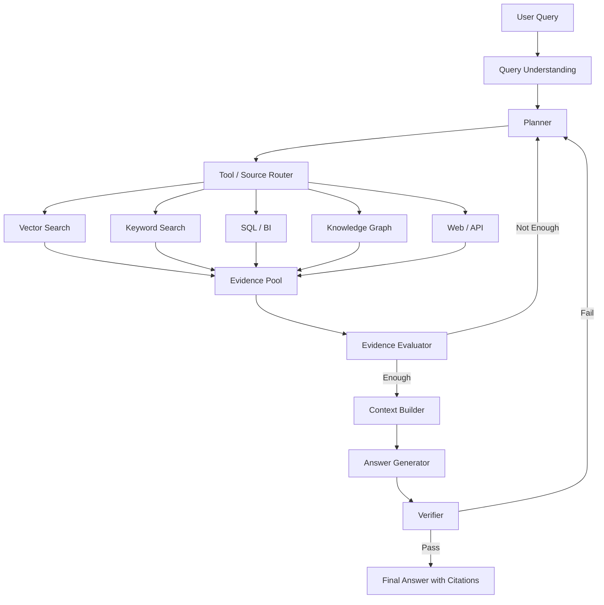

# Agentic RAG

### 1 为什么需要 Agentic RAG

RAG 的核心思想是，把语言模型的**参数化记忆**和外部知识库的**非参数化记忆**结合起来，从而在知识密集型任务上获得更好的事实性和可更新性。

这个思路非常重要。因为大模型本身有几个天然限制：

1. 模型参数里的知识会过时
2. 模型很难给出可靠出处
3. 领域私有知识通常不在预训练语料里

RAG 给大模型接了一套外部知识访问机制，但早期或者最常见的 Naive RAG 有一个很大的假设：**用户的问题可以通过一次检索解决。**

典型流程是：

```
Query
-> Embedding
-> Vector Search Top-K
-> 拼接 Prompt
-> LLM Answer
```

这在简单场景里够用，但在复杂场景里不够。

比如用户问：

> “我们最近几个客户流失案例里，最主要的共同原因是什么？和产品文档、客服记录、销售反馈能不能对上？”

这个问题不是一次向量检索能解决的。它至少包含：

* 需要识别“最近几个客户流失案例”
* 需要分别查 CRM、客服工单、销售记录、产品文档
* 需要对多类证据做归因
* 需要判断哪些信息可靠、哪些只是个案
* 需要最后给出可追溯的结论

这就是 Agentic RAG 要解决的问题。

### 2 Agentic RAG 是什么？

**Agentic RAG 是一种把 Agent 的规划、工具调用、反思、验证能力引入 RAG 流程的架构，让系统能够动态决定何时检索、检索什么、去哪里检索、是否继续检索，以及如何验证最终答案。**

Agentic RAG 是一次动态循环：

```
Plan, retrieve, evaluate, revise, retrieve again, verify, then answer.
```

这和 ReAct 的思想很接近。ReAct 论文提出让语言模型交错地产生 reasoning traces 和 actions：推理帮助模型规划、跟踪、更新行动，行动则让模型访问外部知识库或环境获取额外信息。

放到 RAG 里，action 就可以是：

* 搜向量库
* 搜关键词索引
* 查 SQL 数据库
* 查知识图谱
* 调用内部 API
* 访问网页
* 读取代码仓库
* 查日志系统
* 读取历史对话
* 调用 reranker
* 调用 fact checker
* 触发二次检索

总结来说，Agentic RAG 的关键是让模型拥有一个**检索决策循环**。

### 3 从 Naive RAG 到 Agentic RAG

我们可以把 RAG 的演进粗略分成三层。

| 类型           | 核心流程                                                   | 优点          | 问题              |
| ------------ | ------------------------------------------------------ | ----------- | --------------- |
| Naive RAG    | 单次检索 + 单次生成                                            | 简单、便宜、容易上线  | 不会判断是否需要检索，不会纠错 |
| Advanced RAG | Query Rewrite、Hybrid Search、Rerank、Context Compression | 检索质量更高      | 流程仍然大多是静态的      |
| Agentic RAG  | 规划、工具选择、多轮检索、证据评估、自我修正                                 | 适合复杂问题和多源知识 | 成本、延迟、稳定性更难控制   |

Naive RAG 解决的是“模型没有外部知识”的问题。

Advanced RAG 解决的是“检索质量不够好”的问题。

Agentic RAG 解决的是“系统不知道如何获取和验证知识”的问题。

这三个阶段不是互相替代，而是逐层叠加。一个好的 Agentic RAG 系统，底层仍然需要优秀的 chunking、embedding、hybrid retrieval、reranking 和 context building。

***

### 4. 为什么 Agentic RAG 会出现？

原因很简单：真实问题越来越不像“搜索题”，而更像“研究题”。

普通 RAG 擅长回答这种问题：

> “合同里关于提前终止的条款是什么？”

但不擅长回答这种问题：

> “这份合同里有哪些对我们不利的风险？和上一版相比有什么变化？哪些条款需要法务重点关注？”

前者是定位问题，后者是分析问题。

对于分析问题，一次检索通常不够。系统要先拆解问题，再分别找证据，最后综合判断。

这也是最近一批 RAG 研究的共同趋势：从“检索一次”走向“动态检索”和“自适应检索”。

例如，FLARE 提出在生成长文本时主动判断何时、检索什么信息，而不是只在开头检索一次；它会预测接下来要生成的内容，并在低置信度时触发检索。([arXiv](https://arxiv.org/abs/2305.06983?utm_source=chatgpt.com))

Self-RAG 则把检索、生成和自我批判结合起来，让模型按需检索，并通过 reflection tokens 判断检索内容和生成内容的质量。([arXiv](https://arxiv.org/abs/2310.11511?utm_source=chatgpt.com))

CRAG 进一步强调：检索结果本身可能是错的，所以系统需要一个 retrieval evaluator 来评估检索文档质量，并在必要时触发额外搜索或修正流程。([arXiv](https://arxiv.org/abs/2401.15884?utm_source=chatgpt.com))

Adaptive-RAG 则从问题复杂度出发，动态选择不检索、单步 RAG 或多步 RAG，避免简单问题被复杂流程拖慢，也避免复杂问题被简单流程答错。([arXiv](https://arxiv.org/abs/2403.14403?utm_source=chatgpt.com))

这些研究背后的共同方向就是：**RAG 不应该永远是固定 Top-K 检索，而应该根据任务状态动态调整。**

这正是 Agentic RAG 的核心。

***

### 5. Agentic RAG 的典型架构

一个工程上可落地的 Agentic RAG 系统，可以拆成 8 个模块：

```
用户问题
  ↓
Query Understanding / Intent Classification
  ↓
Planner：拆解问题、制定检索计划
  ↓
Router：选择数据源和工具
  ↓
Retriever：向量检索 / 关键词检索 / SQL / Graph / API / Web
  ↓
Evidence Evaluator：判断证据相关性、充分性、冲突
  ↓
Context Builder：重排、压缩、组织上下文
  ↓
Generator：生成带引用的答案
  ↓
Verifier：事实校验、引用校验、格式校验
  ↓
最终回答
```

可以画成这样：



这张图的关键是两个循环：

第一个循环是：

```
Planner -> Retriever -> Evidence Evaluator -> Planner
```

它解决“证据不够怎么办”。

第二个循环是：

```
Generator -> Verifier -> Planner
```

它解决“答案不可靠怎么办”。

所以 Agentic RAG 的本质是：**把检索从一次性动作，变成可反馈、可重试、可收敛的过程。**

***

### 6. Agentic RAG 的核心能力

#### 6.1 判断是否需要检索

不是所有问题都需要 RAG。

例如：

> “帮我把这句话润色一下。”

不需要检索。

但如果用户问：

> “我们公司最新的报销政策是什么？”

就必须检索。

普通 RAG 往往默认所有问题都检索，这会带来两个问题：

一是浪费成本和延迟。\
二是引入不相关上下文，反而干扰模型。

Self-RAG 的一个重要思想就是按需检索，而不是对每个输入都固定检索。([arXiv](https://arxiv.org/abs/2310.11511?utm_source=chatgpt.com))

工程上可以做一个轻量级 router：

```
无需检索：写作、翻译、格式转换、通用解释
需要检索：事实查询、企业知识、时间敏感问题、需要引用的问题
需要多步检索：比较、归因、综合分析、多源交叉验证
```

这一步看似简单，但对成本影响很大。

***

#### 6.2 查询改写与问题拆解

用户的问题通常不是一个好的搜索 query。

用户会问：

> “这个方案为什么之前没推下去？”

但系统真正需要检索的可能是：

```
项目名称 + 推进失败原因
项目名称 + 会议纪要 + blocker
项目名称 + 客户反馈
项目名称 + 技术评审
项目名称 + 成本评估
```

Agentic RAG 需要先把用户问题转成一组可检索的子问题。

例如：

```
原问题：
“为什么 A 客户最终没有续约？”

拆解：
1. A 客户最近一次续约沟通记录是什么？
2. CRM 中记录的流失原因是什么？
3. 客服工单中是否出现高频问题？
4. 销售是否提到竞品或价格因素？
5. 产品使用数据是否显示活跃度下降？
6. 这些证据之间是否一致？
```

这一步是 Agentic RAG 和普通 RAG 的核心差异。

普通 RAG 问的是：

```
我应该搜什么文档？
```

Agentic RAG 问的是：

```
为了回答这个问题，我需要证明哪些子结论？
```

***

#### 6.3 工具选择：不只是向量数据库

很多 RAG 系统一开始就把所有问题都丢给向量库。但真实业务知识往往分布在多种系统里：

| 数据类型     | 更适合的检索方式              |
| -------- | --------------------- |
| 文档、手册、制度 | 向量检索 + 关键词检索          |
| 数值报表     | SQL / BI 查询           |
| 实体关系     | Knowledge Graph       |
| 工单、日志    | 关键词检索 + 聚合统计          |
| 代码仓库     | 代码搜索 + AST / repo map |
| 实时信息     | API / Web Search      |
| 跨文档主题    | Graph RAG / 聚类摘要      |

Agentic RAG 的 router 应该根据问题选择工具，而不是无脑搜向量库。

比如：

> “Q2 华东区销售额同比增长多少？”

这不应该走向量库，应该走 SQL。

再比如：

> “A 客户和 B 客户流失的共同原因是什么？”

这可能要查 CRM、工单、会议纪要，再做综合归因。

再比如：

> “这批访谈材料里的主要矛盾是什么？”

这更接近全局理解问题，普通 Top-K RAG 未必合适。GraphRAG 论文就指出，传统 RAG 对面向整个语料的全局问题并不擅长，而 GraphRAG 通过实体图和社区摘要来支持这类 query-focused summarization。([arXiv](https://arxiv.org/abs/2404.16130?utm_source=chatgpt.com))

***

#### 6.4 多轮检索与证据充分性判断

Agentic RAG 最重要的能力之一，是判断：

```
现在的证据够不够回答？
```

普通 RAG 不问这个问题。它只要检索到了 Top-K，就默认可以回答。

但真实系统里，检索结果可能有四种情况：

| 检索结果     | 系统应该怎么做       |
| -------- | ------------- |
| 证据充分且一致  | 直接生成答案        |
| 证据相关但不完整 | 继续检索          |
| 证据互相冲突   | 查更权威来源或标注冲突   |
| 证据不相关    | 改写 query 或换工具 |

CRAG 的思路正是引入轻量级检索评估器，对检索结果质量打分，并根据置信度触发不同动作。([arXiv](https://arxiv.org/abs/2401.15884?utm_source=chatgpt.com))

工程上可以设计一个 evidence evaluator，让它输出结构化结果：

```json
{
  "relevance": 0.82,
  "coverage": 0.65,
  "conflict": true,
  "missing_evidence": [
    "缺少客户最后一次续约会议记录",
    "缺少产品使用数据"
  ],
  "next_action": "retrieve_more"
}
```

注意，这个 evaluator 不应该只问“大模型你觉得够了吗”。更可靠的方式是结合规则、检索分数、引用覆盖率、来源优先级和 LLM judge。

***

#### 6.5 生成后的验证

Agentic RAG 不应该在生成答案后就结束。

因为即使检索结果正确，模型仍然可能：

* 张冠李戴；
* 错误归因；
* 把弱证据说成强结论；
* 引用了不存在的来源；
* 把多个来源混在一起；
* 忽略时间顺序；
* 对冲突证据过度简化。

RAG 并不能彻底消除幻觉。RAG 评估研究也强调，RAG 系统评估不能只看最终答案，还要同时评估检索质量、事实一致性、安全性和计算效率。([arXiv](https://arxiv.org/abs/2504.14891?utm_source=chatgpt.com))

所以生产级 Agentic RAG 至少需要三类验证：

| 验证类型 | 要回答的问题              |
| ---- | ------------------- |
| 引用验证 | 答案里的每个关键断言是否能被引用支持？ |
| 事实验证 | 答案是否忠实于检索内容？        |
| 任务验证 | 是否真正回答了用户的问题？       |

ARES 等 RAG 自动评估框架把评估拆成 context relevance、answer faithfulness、answer relevance 等维度，这种拆法很适合落到 Agentic RAG 的 verifier 中。([arXiv](https://arxiv.org/abs/2311.09476?utm_source=chatgpt.com))

***

### 7. 一个 Agentic RAG 的伪代码

可以把 Agentic RAG 简化成下面这个循环：

```python
def agentic_rag(question, budget):
    state = {
        "question": question,
        "sub_questions": [],
        "evidence": [],
        "missing": [],
        "attempts": 0
    }

    while state["attempts"] < budget.max_steps:
        plan = planner(state)

        tool_calls = router(plan)

        new_evidence = []
        for tool_call in tool_calls:
            result = execute_tool(tool_call)
            new_evidence.extend(result)

        state["evidence"].extend(new_evidence)

        evaluation = evidence_evaluator(
            question=question,
            evidence=state["evidence"]
        )

        if evaluation["is_sufficient"]:
            answer = generator(question, state["evidence"])
            verification = verifier(answer, state["evidence"])

            if verification["pass"]:
                return answer
            else:
                state["missing"] = verification["issues"]
        else:
            state["missing"] = evaluation["missing_evidence"]

        state["attempts"] += 1

    return fallback_answer(state)
```

这里的关键是：

```
planner
router
retriever
evidence_evaluator
generator
verifier
```

这六个模块可以是同一个大模型的不同 prompt，也可以是多个小模型、规则系统和工具组合。

生产系统里，我更建议用“有限状态机”或“图工作流”来实现，而不是让 Agent 完全自由循环。因为开放式 Agent 很容易带来不可控的成本、延迟和安全风险。

***

### 8. Agentic RAG 和普通 RAG 的对比

| 维度       | 普通 RAG      | Agentic RAG |
| -------- | ----------- | ----------- |
| 检索次数     | 通常一次        | 可多轮         |
| Query    | 用户原始问题或简单改写 | 可拆解、扩展、重写   |
| 数据源      | 通常单一向量库     | 多数据源、多工具    |
| 控制流      | 固定 pipeline | 动态 workflow |
| 是否判断证据充分 | 通常不判断       | 显式判断        |
| 是否处理冲突证据 | 较弱          | 可检测并继续查证    |
| 是否适合多跳问题 | 一般          | 更适合         |
| 成本与延迟    | 较低          | 较高          |
| 可控性      | 较强          | 需要额外约束      |
| 工程复杂度    | 低           | 高           |

所以 Agentic RAG 不是银弹。

它适合复杂问题，不适合所有问题。

***

### 9. 什么时候应该用 Agentic RAG？

适合用 Agentic RAG 的场景，通常有几个特征。

#### 9.1 问题需要多步推理

例如：

> “为什么这个客户从高活跃变成了流失风险客户？”

这需要查行为数据、客服工单、销售记录、合同信息，最后做归因。

#### 9.2 问题需要多数据源

例如：

> “这个供应商是否存在合规风险？”

可能要查合同、付款记录、审计报告、新闻、黑名单、内部评价。

#### 9.3 问题需要验证

例如：

> “这份法律文件里哪些条款和我们模板不一致？”

这类问题必须有证据、有引用、有差异定位，不能只给一个“感觉”。

#### 9.4 问题本身很模糊

例如：

> “这个项目现在卡在哪里？”

系统需要先理解“项目”是谁、有哪些相关文档、最近状态是什么、阻塞项来自哪里。

#### 9.5 问题需要全局综合

例如：

> “这 200 篇用户访谈里，最核心的产品问题是什么？”

这类问题不一定能靠 Top-K chunk 解决，可能需要 Graph RAG、聚类、主题建模或多阶段摘要。GraphRAG 对全局 sensemaking 问题的讨论，正好说明了普通 RAG 在这类任务上的边界。([arXiv](https://arxiv.org/abs/2404.16130?utm_source=chatgpt.com))

***

### 10. 什么时候不应该用 Agentic RAG？

以下场景不建议上来就用 Agentic RAG。

#### 10.1 简单 FAQ

例如：

> “报销发票需要多久内提交？”

普通 RAG 足够。

#### 10.2 低价值、高频、强延迟敏感问题

Agentic RAG 多轮检索、多次模型调用，延迟和成本都更高。对于客服高频问题，应该优先用普通 RAG、缓存和规则路由。

#### 10.3 数据源质量很差

Agentic RAG 不是垃圾数据的解药。

如果文档本身过时、重复、冲突严重、权限混乱，Agent 只会更快地把混乱放大。

#### 10.4 没有评估集

Agentic RAG 的复杂度比普通 RAG 高很多。如果没有离线评估集、线上日志、人工审核流程，很难判断“变复杂”到底有没有带来收益。

***

### 11. Agentic RAG 的工程难点

#### 11.1 成本不可控

普通 RAG 通常一次 embedding search + 一次 LLM call。

Agentic RAG 可能变成：

```
1 次 planner
3 次检索
2 次 rerank
1 次 evidence evaluator
1 次 generator
1 次 verifier
```

如果没有预算控制，很容易成本爆炸。

所以必须设置：

```
max_steps
max_tool_calls
max_tokens
max_latency
max_retrieved_chunks
```

并为不同问题类型设置不同预算。

***

#### 11.2 延迟变高

Agentic RAG 的多轮流程天然增加延迟。

工程上可以做几件事：

* 并行检索多个数据源；
* planner 用小模型；
* evaluator 用小模型或规则模型；
* 高频问题走缓存；
* 简单问题走普通 RAG；
* 复杂问题才进入 Agentic RAG；
* 对 Top-K 先粗排，再对少量候选做 rerank。

这和 Adaptive-RAG 的思想一致：不同复杂度的问题应该使用不同强度的检索策略。([arXiv](https://arxiv.org/abs/2403.14403?utm_source=chatgpt.com))

***

#### 11.3 上下文越来越长

Agentic RAG 检索多轮后，很容易堆出一大堆上下文。

但上下文长不等于答案好。Lost in the Middle 研究发现，长上下文模型对位于输入中间的信息利用并不稳定，相关信息在开头或结尾时表现更好，而在中间时性能可能明显下降。([arXiv](https://arxiv.org/abs/2307.03172?utm_source=chatgpt.com))

RULER 也指出，简单的 needle-in-a-haystack 测试并不能充分代表长上下文理解能力；随着长度和任务复杂度增加，很多长上下文模型会出现明显性能下降。([arXiv](https://arxiv.org/abs/2404.06654?utm_source=chatgpt.com))

所以 Agentic RAG 不应该把所有检索结果都塞进 prompt。它必须做 context selection：

```
检索很多，不代表输入很多。
```

比较好的做法是：

```
retrieve broad
rerank carefully
compress selectively
cite precisely
```

***

#### 11.4 KV Cache 和推理成本

如果 Agentic RAG 每一步都把完整历史、完整证据和完整工具输出塞给模型，推理成本会很高。

长上下文输入会增加 prefill 成本，也会占用更多 KV cache。vLLM 的 PagedAttention 论文就指出，高吞吐 LLM serving 的一个关键瓶颈是 KV cache：它会随着请求长度动态增长，如果管理不当会造成显著内存浪费并限制 batch size。PagedAttention 通过类似操作系统分页的方式管理 KV cache，从而提升 serving 吞吐。([arXiv](https://arxiv.org/abs/2309.06180?utm_source=chatgpt.com))

这对 Agentic RAG 的启发是：

不要把 Agent 的所有中间过程都原样塞回上下文。

更好的方式是维护结构化状态：

```json
{
  "question": "...",
  "current_plan": "...",
  "verified_facts": [],
  "open_questions": [],
  "evidence_ids": [],
  "discarded_evidence": []
}
```

模型需要时再按 evidence\_id 拉取原文，而不是每轮都重复传全部文本。

***

#### 11.5 Agent 会跑偏

Agentic RAG 最大的问题之一，是 Agent 可能过度行动。

它可能：

* 不停改写 query；
* 查无关数据源；
* 在证据足够时仍继续检索；
* 被工具输出里的 prompt injection 影响；
* 把低质量来源当成权威来源；
* 为了完成任务而“编造”中间结论。

所以 Agentic RAG 必须有边界：

```
工具白名单
数据源权限控制
最大循环次数
引用强约束
来源优先级
人类审批节点
失败兜底策略
```

生产系统里的 Agentic RAG，最好不是“完全自治智能体”，而是“受控的检索状态机”。

***

### 12. Agentic RAG 的典型模式

#### 模式一：Router RAG

先判断问题类型，再选择路径。

```
简单事实问题 -> 普通 RAG
复杂分析问题 -> Agentic RAG
结构化数据问题 -> Text-to-SQL
全局总结问题 -> Graph RAG
无需外部知识 -> 直接 LLM
```

适合大多数生产系统。

***

#### 模式二：Multi-Hop RAG

把问题拆成多个子问题，逐步检索。

```
问题：A 公司为什么收购 B 公司？

子问题：
1. A 公司最近战略方向是什么？
2. B 公司核心资产是什么？
3. 双方业务是否互补？
4. 市场和财务动机是什么？
5. 管理层公开表述是什么？
```

适合研究、投研、法律、医疗、科研问答。

***

#### 模式三：Corrective RAG

先检索，再判断检索结果质量。如果质量不够，就纠错。

```
retrieve
-> grade documents
-> if irrelevant: rewrite query
-> if incomplete: retrieve more
-> if conflicting: search authoritative source
-> generate
```

CRAG 就是这一类思路的代表。([arXiv](https://arxiv.org/abs/2401.15884?utm_source=chatgpt.com))

***

#### 模式四：Self-Reflective RAG

模型不仅生成答案，还评估：

```
我是否需要检索？
检索内容是否相关？
我的答案是否被证据支持？
```

Self-RAG 是这一方向的代表，它通过自我反思机制提升事实性和引用质量。([arXiv](https://arxiv.org/abs/2310.11511?utm_source=chatgpt.com))

***

#### 模式五：Graph Agentic RAG

当问题涉及实体关系、跨文档归因、全局主题时，可以把知识图谱和 Agentic RAG 结合起来。

```
文档 -> 实体抽取 -> 关系图谱 -> 社区摘要 -> 图检索 -> 多跳推理
```

GraphRAG 适合回答“整批文档说明了什么”这类问题，而不只是“哪一段文档包含答案”。([arXiv](https://arxiv.org/abs/2404.16130?utm_source=chatgpt.com))

***

### 13. 一个推荐的落地方案

如果你要从 0 到 1 做 Agentic RAG，我建议不要一上来做复杂多 Agent，而是按下面四步演进。

#### 第一阶段：把普通 RAG 做扎实

先做好：

```
文档清洗
chunking
metadata
hybrid search
reranking
引用生成
基础评估集
```

没有好的检索底座，Agent 只是在垃圾堆里更努力地翻垃圾。

***

#### 第二阶段：加 Query Router

让系统判断：

```
是否需要检索？
走哪个数据源？
用普通 RAG 还是 Agentic RAG？
```

这是性价比最高的一步。

***

#### 第三阶段：加 Evidence Evaluator

每次检索后判断：

```
是否相关？
是否充分？
是否冲突？
是否需要继续检索？
```

这一步会显著提升系统稳定性。

***

#### 第四阶段：加 Verifier

生成答案后检查：

```
每个关键结论是否有引用？
引用是否真的支持结论？
有没有遗漏重要冲突？
是否应该拒答或降低置信度？
```

到这一步，你的系统才真正开始接近生产级 Agentic RAG。

***

### 14. 评价 Agentic RAG：不要只看答案对不对

Agentic RAG 的评估要比普通 RAG 更复杂，因为它不仅有最终答案，还有中间过程。

我建议至少评估 6 类指标：

| 指标                | 含义           |
| ----------------- | ------------ |
| Retrieval Recall  | 正确证据是否被找到了   |
| Context Precision | 放进上下文的内容是否相关 |
| Faithfulness      | 答案是否被证据支持    |
| Citation Accuracy | 引用是否准确       |
| Task Completion   | 是否完成用户真实任务   |
| Cost / Latency    | 成本和延迟是否可接受   |

RAG evaluation survey 已经指出，RAG 的评估需要覆盖系统性能、事实准确性、安全性和计算效率，而不仅是最终文本质量。([arXiv](https://arxiv.org/abs/2504.14891?utm_source=chatgpt.com))

对 Agentic RAG 来说，还要额外评估：

```
工具选择是否正确？
检索轮数是否合理？
是否过度检索？
是否漏查关键数据源？
失败时是否能正确兜底？
```

这部分非常重要。因为 Agentic RAG 不是一个单次模型调用，而是一条动态决策链。

***

### 15. 最后：Agentic RAG 不是让系统更“自由”，而是让系统更“会查证”

很多人一听 Agentic RAG，会想到一个完全自动的 AI Agent：自己规划、自己搜索、自己写报告、自己验证。

这个方向当然令人兴奋，但工程上更现实的理解应该是：

**Agentic RAG 不是让 RAG 变得不可控，而是让 RAG 拥有受控的自适应能力。**

它不是为了炫技，而是为了解决普通 RAG 的真实痛点：

* 一次检索不够；
* 用户问题太模糊；
* 数据源太分散；
* 证据可能不足；
* 检索可能错误；
* 答案需要引用；
* 复杂任务需要多步推理。

所以，我更愿意把 Agentic RAG 定义为：

> 一个以证据为中心的动态检索工作流。

它的核心不是 Agent，也不是向量数据库，而是这三个问题：

```
为了回答这个问题，我需要哪些证据？
现在的证据够不够？
如果不够，下一步该去哪里查？
```

当 RAG 能回答这三个问题时，它就不再只是一个“检索增强生成”系统，而开始变成一个真正的知识工作系统。

***

## 文章结尾可以用这一段

如果说 Naive RAG 解决的是“让模型看到外部知识”，那么 Agentic RAG 解决的是“让模型知道如何寻找、判断和使用外部知识”。

前者像搜索框，后者像研究助理。

真正有价值的 RAG 系统，未来不会只是：

```
更大的向量库 + 更长的上下文
```

而会是：

```
更好的检索决策 + 更可靠的证据评估 + 更严格的答案验证
```

这就是 Agentic RAG 值得关注的原因。

***

### 参考资料建议放在文末

* Patrick Lewis et al., **Retrieval-Augmented Generation for Knowledge-Intensive NLP Tasks**。RAG 经典论文，提出结合参数化记忆和非参数化外部记忆。([arXiv](https://arxiv.org/abs/2005.11401?utm_source=chatgpt.com))
* Shunyu Yao et al., **ReAct: Synergizing Reasoning and Acting in Language Models**。Agentic RAG 中“推理 + 行动”范式的重要基础。([arXiv](https://arxiv.org/abs/2210.03629?utm_source=chatgpt.com))
* Zhengbao Jiang et al., **Active Retrieval Augmented Generation / FLARE**。代表主动检索方向。([arXiv](https://arxiv.org/abs/2305.06983?utm_source=chatgpt.com))
* Akari Asai et al., **Self-RAG**。代表自我反思式检索增强生成。([arXiv](https://arxiv.org/abs/2310.11511?utm_source=chatgpt.com))
* Shi-Qi Yan et al., **Corrective Retrieval Augmented Generation**。代表带检索质量评估和纠错机制的 RAG。([arXiv](https://arxiv.org/abs/2401.15884?utm_source=chatgpt.com))
* Soyeong Jeong et al., **Adaptive-RAG**。代表根据问题复杂度选择不同检索策略的方向。([arXiv](https://arxiv.org/abs/2403.14403?utm_source=chatgpt.com))
* Darren Edge et al., **From Local to Global: A Graph RAG Approach to Query-Focused Summarization**。适合引出 Graph RAG 和全局问题。([arXiv](https://arxiv.org/abs/2404.16130?utm_source=chatgpt.com))
* Aoran Gan et al., **Retrieval Augmented Generation Evaluation in the Era of Large Language Models**。适合作为 RAG 评估部分参考。([arXiv](https://arxiv.org/abs/2504.14891?utm_source=chatgpt.com))
