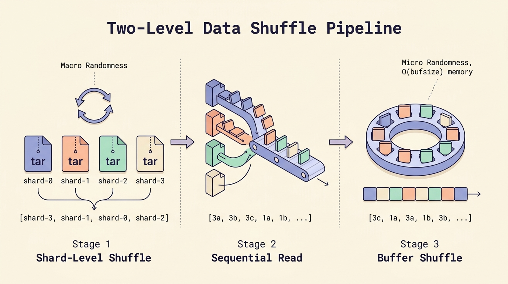
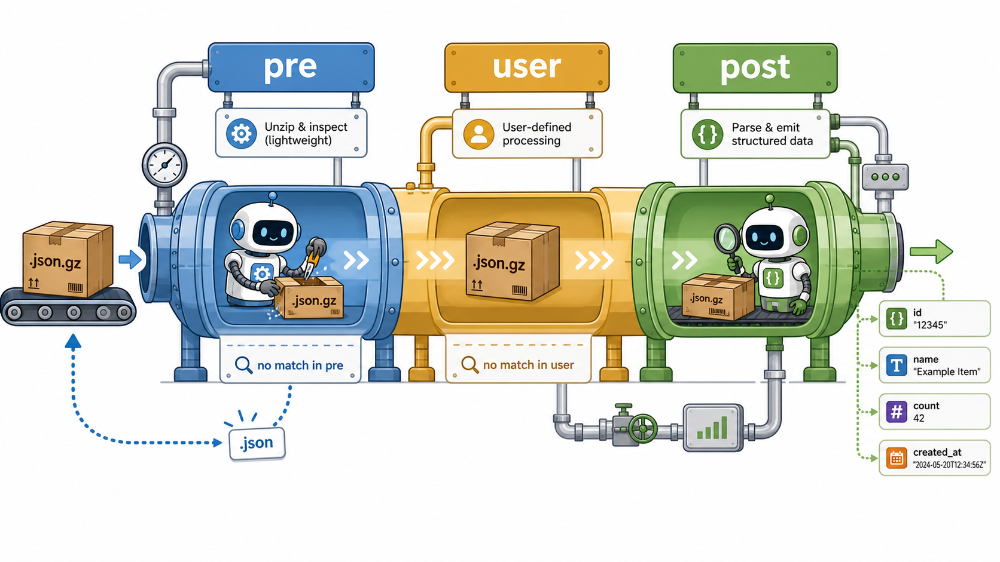

# WebDataset

## 1 顺序 I/O

训练多模态大模型时，数据集往往包含数百万到数十亿个小文件（图片、文本、点云等）。数据量大并不是问题，训练文本语言模型的时候我们也经历过tb甚至pb级别的数据量，实际的瓶颈是**访问次数太多。**

我们首先需要复习一下计算机组织原理，关于存储设备的物理原理。存储设备一般有机械硬盘（HDD）、固态硬盘（SSD）、网络存储（S3/GCS/OSS）。

### 1 计算机存储体系

#### 1.1 HDD

<figure><figcaption></figcaption></figure>

机械硬盘（HDD）可以想象成一台**唱片机，**&#x6570;据存储在磁盘的同心圆轨道（磁道）上。每个轨道被划分为若干个扇区（通常 512B 或 4KB）。磁头负责数据的读写，悬浮在盘片上方，需要物理移动到目标轨道。

读取一个文件需要三个步骤：

1. 寻道 (Seek)：磁头从当前轨道移动到目标轨道，平均耗时约 10ms
2. 旋转延迟 (Rotational Latency)：等待盘片旋转到目标扇区正好经过磁头下方，平均耗时约 4ms
3. 数据传输 (Transfer)：磁头读取经过下方的数据，顺序读约 150-200 MB/s

其中步骤1和步骤2是固定开销，与读多少数据无关。

但是假设我们需要读 100 万个小文件，每张 50KB，存储方式的不同对性能的影响很大。

如果是随机 I/O：

* 每个文件：seek(10ms) + rotate(4ms) + transfer(50KB / 150MB/s ≈ 0.3ms) = 14.3ms；
* 总时间：1,000,000 × 14.3ms = 14,300 秒 ≈ 4 小时；
* 实际带宽：50GB / 14,300s ≈ 3.5 MB/s

如果是顺序 I/O：

* 定位一次：seek(10ms) + rotate(4ms) = 14ms
* 连续读取：50GB / 150MB/s = 333 秒
* 总时间：333 秒 ≈ 5.5 分钟
* 实际带宽：≈ 150 MB/s

#### 1.2 SSD

<figure><figcaption></figcaption></figure>

SSD（Solid State Drive，固态硬盘）数据存储在 NAND 闪存芯片上，通过纯电信号访问。要修改一个 Page 中的数据，必须先擦除整个 Block（包含几百个 Page），再重新写入。SSD 比 HDD 快，核心原因有两个：

1. **无机械运动**：读任何位置的数据都是电信号寻址，不需要等磁头移动或盘片旋转
2. **多通道并行**：控制器同时从 4-8 个闪存芯片读取数据，类似 RAID 0 的效果

但是SSD仍然惧怕海量的小文件，虽然没有机械寻址的过程，但是瓶颈从硬件转移到了软件层。

每次处理一个小文件，需要有文件系统开销、NVMe 协议开销，同时随机 I/O 会导致Page Cache 效率下降。Linux 的 Page Cache 是以 4KB 页为单位缓存文件数据的。
100 万个小文件（每个 50KB）= 约 1250 万个 4KB 页。
Page Cache 的查找是 O(1) 的（基于 radix tree），
但每个文件的 Cache 是独立管理的，100 万个文件 = 100 万次独立的 Cache 查找/管理。

#### 1.3 网络存储

网络存储读取一个小文件的完整流程：

1. DNS解析
2. TCP 三次握手
3. TLS 握手
4. 发送 HTTP GET 请求
5. 服务端处理（鉴权、查找对象）
6. 传输数据
7. TCP 连接关闭

单个文件造成的延迟会被百万级的数据量放大。


总而言之，无论哪种存储介质，**顺序 I/O 都显著优于随机 I/O**。&#x20;

tar 打包的本质就是：**把小文件合并成大文件，把随机访问模式强制转换为顺序访问模式。**

### 2 tar 如何实现顺序 I/O

tar 做的事情很简单：在训练前把这海量小文件首尾相接，写成一个连续的大文件。

tar（Tape Archive）最初设计用于磁带备份，而磁带是**纯顺序设备**—— 只能从头到尾读，不能跳转。这个历史原因决定了 tar 的内部结构：

<figure><figcaption></figcaption></figure>

每个文件由两部分组成：

* **Header**（512 字节）：文件名、大小、权限、时间戳等元数据
* **Data**：文件内容，填充到 512 字节的整数倍

关键特点：

* **没有中央目录/索引**（与 zip 不同）。找到第 N 个文件的唯一方式是从头读到第 N 个
* 这正好适合流式读取——从头到尾扫一遍，遇到什么处理什么
* 512 字节对齐是因为磁带和早期硬盘的最小读写单位就是 512 字节（一个扇区）

#### 2.1 流式读取的实现细节

在 Python 中，这对应 `tarfile.open(fileobj=stream, mode="r|*")` 的流式模式：

```python
tarfile.open(fileobj=stream, mode="r|*")
```

本地文件可以进行`seek` 操作，因为任意位置都可以读，但是像 HTTP 相应流、S3 流式下载、子进程的 stdout 管道是不行的。

`r:*` 代表随机访问模式：

tar 文件本身没有中央目录（与 zip 不同），但 Python 的 `tarfile` 在 `r:*` 模式下会**预先把整个 tar 扫一遍**，把每个文件的位置（offset）记到内存里建成索引。之后就可以按名字直接跳转：

```python
tar = tarfile.open("a.tar", "r:*")
tar.getmember("xxx.jpg")    # 按名字查找 → 内部 seek 到那个位置
tar.extractfile("xxx.jpg")  # 跳过去读 → 内部又 seek 一次
```

这要求底层文件对象**必须支持 seek**。HTTP 流不支持 seek，所以这种模式根本没法用在网络流上。

`r|*` 代表流式模式：

```python
tar = tarfile.open(fileobj=stream, mode="r|*")
for member in tar:                         # 顺序遍历
    data = tar.extractfile(member).read()  # 当前条目立刻读
```

tarfile 内部只会调用 `read()` ，不调用`seek()` 。

但是天下没有免费的午餐：

流式模式使得webdataset可以从网络流直接读，不用先把整个 tar 下载到本地，也不需要预先建索引，内存占用低。但是只能从头到尾遍历一次，对象用完即弃，没法通过名字查找。

#### 2.2 处理内存泄露

`tar.members` 是 `tarfile` 对象内部维护的一个 **Python 列表**，记录"目前为止见过的所有文件条目"。每次 `for member in tar` 迭代一步，tarfile 都会把当前的 TarInfo 对象追加到这个列表里：

```python
tar = tarfile.open(fileobj=stream, mode="r|*")
for member in tar:
    # tarfile 内部相当于做了：
    #     self.members.append(member)
    process(member)
```

TarInfo 是一个小对象，存的是文件名、大小、权限、修改时间这些元数据，本身不大（几百字节）。但条目数量乘上去就可观了。

这个本来是给随机访问模式 `r:*` 设计的，因此流式模式 `r|*` 下我们不会用这份清单，所以每次 yield 之后会手动 `tar.members = []` 把列表重置为空。


## 2 Group by keys

tar 内部的文件以共享前缀的方式组织同一个样本：

```
000042.jpg
000042.txt
000042.json
```

需要将它们聚合成一个样本字典：

```python
{"__key__": "000042", "jpg": <bytes>, "txt": <bytes>, "json": <bytes>}
```

但是如果从多个 shard 串联读取时，shard A 的最后一个样本和 shard B 的第一个样本 可能具有相同前缀（例如都叫 `000000`）。如果没有隔离机制，它们会被错误地合并。

WebDataset用了 EOF 哨兵机制，`tar_file_expander` 在每个 shard 的文件读完后发射 `{}`（空字典）：

```python
for sample in tar_file_iterator(source["stream"]):
    yield sample
yield {}  # EOF 哨兵
```

`group_by_keys` 检测到哨兵后强制刷新：

```python
if filesample == {}:           # shard 边界
    if valid_sample(current_sample):
        yield current_sample
    current_sample = None      # 重置为 None，而不是 {}
    continue
```

重置为 `None`（而不是 `{}`）确保下一个文件会创建全新的样本字典。

## 3 惰性生成器链

#### 3.1 三层柯里化系统

WebDataset的api如下：

```
dataset = (
    wds.WebDataset("shard_{000..999}.tar")
    .shuffle(1000)              # ← 传入配置，返回 DataPipeline
    .decode("rgb")              # ← 传入配置，返回 DataPipeline
    .to_tuple("jpg;png", "json")# ← 传入配置，返回 DataPipeline
)

for batch in dataset:
    ...
```

每个方法（`shuffle`、`decode`、`to_tuple`）都是**配置阶段，**&#x5373;都是惰性生成器。**在从最外层迭代器拉取数据之前，不会执行任何操作。**&#x771F;正的计算延迟到 `for batch in dataset` 时才开始。这要求每个方法返回一个**新的 Pipeline 对象**，并且携带一个「待执行的函数」（柯里化）。

整个 pipeline 的内存占用 ≈ 一个 shuffle 缓冲区 + 当前 batch，与数据集大小无关。 这使得在有限内存的机器上处理 TB 级数据集成为可能。

Python 里实现柯里化有很多方式（闭包、lambda、`functools.partial`），WebDataset 搞了三个类，用于同时解决另一个问题：**多进程序列化**。

WebDataset的三层柯里化系统：

| 层级  | 类/装饰器            | 职责      | 解决什么问题                                                         |
| --- | ---------------- | ------- | -------------------------------------------------------------- |
| 第一层 | `FilterFunction` | 可序列化的闭包 | `multiprocessing` 的 `spawn` 模式需要 pickle 传递函数，普通 lambda/闭包无法序列化 |
| 第二层 | `RestCurried`    | 工厂      | 接收配置参数（如 `1000`），生产 `FilterFunction`                           |
| 第三层 | `pipelinefilter` | 装饰器     | 把原始函数包装成 `RestCurried`，并保留 `__name__`、`__doc__`                |

第一层：**`FilterFunction` —— 可序列化的 stage**

```
class FilterFunction:
    def __init__(self, f, *args, **kw):
        self.f = f          # 原始函数，如 _shuffle
        self.args = args    # 配置参数，如 (1000,)
        self.kw = kw

    def __call__(self, data):
        return self.f(data, *self.args, **self.kw)   # 数据注入
```

Python 的 `pickle` 可以序列化类实例（只要类在顶层定义），但不能序列化内层闭包。这让它能通过 `multiprocessing` 在进程间传递。

**第二层：`RestCurried` —— 工厂**

```
class RestCurried: def init(self, f): self.f = f
    def __call__(self, *args, **kw):
        return FilterFunction(self.f, *args, **kw)
```

`RestCurried.__call__`返回一个配置好的 `FilterFunction`。

**第三层：`pipelinefilter` —— 入口装饰器**

```
def pipelinefilter(fn):
    result = RestCurried(fn)
    functools.update_wrapper(result, fn)   # 让 result 拥有 fn 的名字和文档
    return result
```

使用：

```
@pipelinefilter
def _shuffle(data, bufsize):
    ...

shuffle = _shuffle   # 现在 shuffle 是一个 RestCurried 对象
stage = shuffle(1000)   # 返回 FilterFunction，等待 data
```

理论上可以写一个「万能类」同时干三件事，但那样会混淆**配置阶段**和**执行阶段**的语义。WebDataset 拆三层是为了**状态隔离**：

```
# 如果只有一个类，对象在不同时刻会处于两种矛盾状态：
class ConfusedStage:
    def __init__(self, f, *args):
        self.f = f
        self.args = args      # 有时这是配置参数
        # 但有时 args 里又要包含 data？语义混乱
    
    def __call__(self, *args):
        # 这里要判断：我现在是被用户调用（配置），还是被 pipeline 调用（执行）？
        pass
```

而三层结构让**每个对象只有一种职责、一种状态**：

* `RestCurried` 实例永远只等**配置参数**，永远不会被传入 `data`
* `FilterFunction` 实例已经被配好了参数，永远只等**数据流**

这种**不可变性**避免了运行时判断「我现在处于哪个阶段」的混乱。

#### 3.2 Pipeline 如何串联

`DataPipeline` 内部维护一个 `pipeline` 列表，存着所有 stage：

```
[self.source, shuffle_stage, decode_stage, to_tuple_stage]
```

`iterator1()` 用**左折叠**把它们串起来：

```
def iterator1(self):
    source = self.invoke(self.pipeline[0])   # 第一个 stage 是数据源，无输入
    for step in self.pipeline[1:]:
        source = self.invoke(step, source)   # 每个 stage 包一层：step(上游迭代器)
    return source
```

#### 3.3 无限流上的虚拟 epoch

有些数据源是**无限流**，例如 `ResampledShards`（有放回地无限重复采样 shard）：

训练需要「每个 epoch 固定 N 个样本」。`with_epoch(nsamples)` 的实现：

```
def with_epoch(self, nsamples=-1):
    self.repetitions = sys.maxsize   # 无限重复
    self.nsamples = nsamples
    return self
```

运行时，pipeline 反复调用 `iterator1()` 产生迭代器，用 `islice` 截断到 `nsamples`：

```
iterator = self.iterator1()
yield from itertools.islice(iterator, self.nsamples)   # 精确产出 N 条
```

这样无限流被切成固定长度的 epoch，配合 `repetitions` 实现多 epoch 训练。

## 4 两级 Shuffle

顺序读取 tar 意味着数据天然有序。但是训练通常需要随机性，
我们又不能全量 shuffle，因为数据太大，不能完整放进内存中。

WebDataset 的方案结合两个层级：

1. **Shard 级 shuffle**：打乱 shard 文件的读取顺序（宏观随机性）
2. **Buffer shuffle**：在固定大小的缓冲区内随机交换（微观随机性）

<figure><figcaption></figcaption></figure>

#### 4.1 实现细节

**Shard 级 Shuffle**

一个shard就是一个tar文件，

`SimpleShardList.__iter__` 拷贝 URL 列表后用带种子的 RNG 打乱：

```python
def __iter__(self):
    urls = self.urls.copy()
    if self.seed is not None:
        random.Random(self.seed).shuffle(urls)
    for url in urls:
        yield dict(url=url)
```

但是这样遇到一个问题：固定seed会导致每个epoch的shuffle顺序一摸一样，缺少多样性

```
# 假设 seed=42，有 4 个 shard
Epoch 0: seed=42 → [shard-3, shard-1, shard-0, shard-2]
Epoch 1: seed=42 → [shard-3, shard-1, shard-0, shard-2]  # 一模一样！
Epoch 2: seed=42 → [shard-3, shard-1, shard-0, shard-2]
```

但是也不希望它完全随机，那样实验不可复现。

`detshuffle` 变体让种子 = `base_seed + epoch`，每个 epoch 不同但完全可复现。

```
# 你只需给一个 base_seed=42
shuffler = detshuffle(urls, base_seed=42)

Epoch 0: seed = 42 + 0 = 42 → [shard-3, shard-1, shard-0, shard-2]
Epoch 1: seed = 42 + 1 = 43 → [shard-0, shard-3, shard-2, shard-1]
Epoch 2: seed = 42 + 2 = 44 → [shard-1, shard-0, shard-3, shard-2]
```

好处如下：

1. 每个 epoch 顺序不同，保证训练多样性
2. 给定 (base\_seed, epoch) 就能精确复现

**Buffer 级 Shuffle**

Shard 级 shuffle 只解决了"哪个 shard 先被读到"的问题。但在单个 shard 内部，样本仍然是**严格顺序**的。如果直接按顺序输出，模型会在短时间内连续看到同一个 shard 的同类样本（例如同一个视频的所有帧、同一个网页的所有图文对），造成严重的**局部相关性**。

Buffer shuffle 的任务是：在**固定内存**（O(bufsize)）的限制下，打散样本的流出顺序，实现跨 shard 的微观混合。

可以把 Buffer理解成一个滑动窗口：

* Buffer 大小固定为 `bufsize`，不会随着数据量增长。
* 每次从 Buffer 中**随机挑选**一个样本输出，而不是输出最早进入的那个。
* Buffer 从上游按顺序接收样本，保持与上游的耦合关系。

这里带来一个问题，Buffer 的"随机输出"操作需要高效，因为要执行 n 次。

我们能想到的最朴素的方法需要 O(n) 时间，因为 pop(k) 需要移动 k 之后的所有元素，示例代码如下：

```python
k = rng.randint(0, len(buf) - 1)
return buf.pop(k)
```

而 WebDataset使用了一个经典的**交换-删除**技巧，将时间复杂度降为 O(1)：

```
def pick(buf, rng):
    k = rng.randint(0, len(buf) - 1)
    # 将选中的第 k 个元素与最后一个元素交换
    buf[k], buf[-1] = buf[-1], buf[k]
    # 从末尾 pop，O(1)，因为不涉及中间元素的移动
    return buf.pop()
```

**Double-Dipping**

Buffer Shuffle 的完整生命周期分为三个阶段：

1.  预热 （**Warm-up**）

    ```
    for sample in data:
        buf.append(sample)
        if len(buf) >= initial:
            break
    ```

    在积累到 `initial` 个样本（默认 100）之前，**不输出任何样本**。这是为了保证第一个输出的样本是从至少 `initial` 个候选中随机选出的。如果没有预热，第一个样本进入 Buffer 后就会被立即输出（此时 Buffer 只有 1 个元素，"随机"毫无意义），前几十个样本的随机性极差，相当于**伪顺序读取**。
2.  稳态循环 （**Steady State**）

    ```
    for sample in data:
        buf.append(sample)                    # 1. 新样本入 Buffer
        try:
            buf.append(next(data))            # 2. Double-Dipping：额外多拉一个
        except StopIteration:
            pass
        if len(buf) >= initial:
            yield pick(buf, rng)              # 3. 随机输出一个
    ```

    `for sample in data` 本身会消费 1 个样本，额外的 `next(data)` 再消费 1 个。这意味着 Buffer 的**填充速度是输出速度的 2 倍**。为什么需要 Double-Dipping？假设 shard 很大（每个 shard 有 10000 个样本），如果不加速填充，Buffer 会长期处于"半空"状态，导致同一 shard 的样本在 Buffer 中停留时间过长，**跨 shard 混合不充分**。Double-Dipping 让 Buffer 更快达到满容量，增强相邻 shard 的样本共存概率。
3.  排空 （Drain）

    上游耗尽后，Buffer 中剩余样本被逐个随机抽出，直到清空。这保证了**最后几个样本也是随机的**，不会出现"末尾样本顺序输出"的偏差。

    ```
    while len(buf) > 0:
        yield pick(buf, rng)
    ```

## 5 Decoder 链条

一个样本字典包含多种文件类型：`.jpg`、`.txt`、`.json`、`.pcd.npz` 等， 每种需要不同的解码方式。WebDataset 使用责任链模式： handler 列表按顺序尝试，第一个返回非 None 的结果胜出。

这具有良好的可扩展性：添加新 handler 就能支持新文件类型，无需修改现有代码。

每个 handler 具有统一接口：

```python
def handler(key: str, data: bytes) -> Any | None
```

* `key`：带前导点的文件后缀（如 `.jpg`、`.pcd.npz`）
* `data`：原始字节
* 返回 `None` 表示传递给下一个 handler（"我不处理这种类型"）
* 返回任意非 None 值表示认领（"这是解码结果"）

外层循环（最多 10 次迭代）处理链式 Continue 返回 （如 `.json.gz.enc` → 解密 → 解压 → 解析）。 `for/else` 结构：`else` 子句仅在内层循环完成且没有 `break` 时执行 （即没有返回 Continue）。

<figure><figcaption></figcaption></figure>

## 6 分布式分片

多节点多 worker 训练时，每个 (node, worker) 组合必须读取互不重叠的 shard 子集。 WebDataset 的方案极其简洁：用 `itertools.islice(src, offset, None, stride)` 做等间隔抽取。

```python
def split_by_node(src, group=None):
    rank, world_size, worker, num_workers = pytorch_worker_info(group)
    if world_size > 1:
        yield from islice(src, rank, None, world_size)
    else:
        yield from src

def split_by_worker(src):
    rank, world_size, worker, num_workers = pytorch_worker_info()
    if num_workers > 1:
        yield from islice(src, worker, None, num_workers)
    else:
        yield from src
```

例如，假设我们有 4 节点 × 2 worker，800 个 shard。

```
所有 shard: [0, 1, 2, 3, 4, 5, 6, 7, 8, 9, 10, 11, ...]

split_by_node 之后 (stride=4):
  Node 0: [0, 4, 8, 12, ...]   (200 个 shard)
  Node 1: [1, 5, 9, 13, ...]   (200 个 shard)
  Node 2: [2, 6, 10, 14, ...]  (200 个 shard)
  Node 3: [3, 7, 11, 15, ...]  (200 个 shard)

在 Node 0 上再 split_by_worker (stride=2):
  Worker 0: [0, 8, 16, ...]    (100 个 shard)
  Worker 1: [4, 12, 20, ...]   (100 个 shard)
```

总计：8 路并行读取，每路 100 个独占 shard。

## 7 ShardWriter 自动分片写入

将海量样本打包成 tar shard 时，需要自动按大小/数量切分：

* 太大：下载慢，部分读取时浪费空间
* 太小：文件数太多，文件系统开销大
* 需要一致的命名规范，便于 brace expansion 展开

自动分片有两个触发条件：

```python
if self.count >= self.maxcount or self.size >= self.maxsize:
    self.next_stream()
```

* `maxcount=100000` 每个 shard 最多样本数（默认）
* `maxsize=3e9` 每个 shard 最大字节数（约 3GB，默认）

Tar 内文件命名：

```
{sample["__key__"]}.{field_name}
```

字段按**字母序排列**写入（`sorted(obj.keys())`）：

```
000001.cls
000001.jpg
000001.json
000001.txt
```

以 `_` 开头的 key 是元数据，默认跳过（除非 `keep_meta=True`）。

Shard 命名使用 Python `%` 格式化：`pattern % shard_index`

```python
"dataset-%06d.tar" % 0   → "dataset-000000.tar"
"dataset-%06d.tar" % 1   → "dataset-000001.tar"
```

这与 brace expansion 无缝集成：`"dataset-{000000..000099}.tar"` 展开为全部 100 个 shard。

文件按后缀自动序列化：

| 后缀                 | 编码方式                            |
| ------------------ | ------------------------------- |
| `cls`、`index`、`id` | `str(x).encode("ascii")`        |
| `txt`、`text`       | `x.encode("utf-8")`             |
| `json`、`jsn`       | `json.dumps(x).encode("utf-8")` |
| `pth`              | `torch.save` 到 BytesIO          |
| `npy`              | `numpy.lib.format.write_array`  |
| `npz`              | `np.savez_compressed`           |
| `jpg`、`jpeg`       | PIL Image → JPEG quality 100    |
| `png`              | PIL Image → PNG                 |
| `pkl`、`pickle`     | `pickle.dumps`                  |
| `mp`、`msgpack`     | `msgpack.packb`                 |
| bytes/bytearray    | 直接写入                            |

## 8 ResampleShared 有放回采样

假设有 **100 个数据分片（shard）**，要分给 **8 个 Worker** 并行读取：

```
100 ÷ 8 = 12 余 4
```

这意味着：

* 4 个 Worker 拿到 **13 个 shard**
* 4 个 Worker 拿到 **12 个 shard （有闲置状态）**

如果 Worker 数量很大（比如 64 个），余数带来的不均匀会更严重。一些 Worker 会提前空闲，导致 GPU 利用率低。

```python
def __iter__(self):
    self.epoch += 1
    seed = make_seed(self.worker_seed(), self.epoch, self.seed)
    rng = random.Random(seed)
    for _ in range(self.nshards):
        yield {"url": rng.choice(self.urls)}
```

`ResampledShards` 让**每个 Worker 独立从全量池子里有放回地抽 N 次**。

* 每个 Worker **恰好有 N 个 shard** 可读 → **绝对均衡**
* 同一个 shard 可能被同一个 Worker 抽到多次 → 没关系，重复读总好过空闲

与 `SimpleSharedList` 对比：

|            | SimpleShardList      | ResampledShards          |
| ---------- | -------------------- | ------------------------ |
| 采样方式       | 无放回                  | 有放回                      |
| Epoch 长度   | 恰好 len(urls) 个 shard | 可配置（nshards）             |
| 跨 epoch 重叠 | 无（每个 shard 恰好看一次）    | 可能（同一 shard 出现在多个 epoch） |
| Worker 均衡  | 可能不均匀                | 始终均匀                     |
| 可复现性       | 有 seed 时确定性          | 可配置                      |
| 适用场景       | 中小规模数据集              | 大规模分布式训练                 |

## 9 FileCache

#### 9.1 为什么需要缓存？

如果训练数据存在**亚马逊 S3**（或阿里云 OSS）上，每次读取一个 shard 是这样的流程：

```
Worker → 网络请求 → S3 服务器 → 下载 500MB tar 包 → 解压读取
```

**痛点**：

* **慢**：网络下载速度慢
* **重复**：训练有 10 个 epoch，同一个 shard 会被下载 **10 次**
* **费钱**：每次下载都走公网流量，云厂商按流量计费

**FileCache 的思路**：第一次从远程下载后，把 shard **存到本地硬盘**。之后直接从本地读，速度从 \~100MB/s 提升到 **\~2GB/s**（SSD 本地读取），提升 **10\~20 倍**。

#### 9.2 整体架构

```python
# 没有缓存：每次 epoch 都重新从 S3 下载
DataPipeline(
    ShardList(urls),           # 列出所有 shard URL
    url_opener,                # 从远程打开流
    tarfile_to_samples(),      # 解压 tar
    ...
)

# 有缓存：第一次下载到本地，之后直接从本地读
DataPipeline(
    ShardList(urls),
    FileCache("./cache", max_size=100e9),  # ← 插入缓存层
    tarfile_to_samples(),
    ...
)
```

`FileCache` 对外伪装成 `url_opener`：输入是 URL，输出是 `{url, stream, local_path}`。但内部会先检查本地有没有，没有就去远程下载。

#### 9.3 设计细节

**URL 怎么映射到本地路径？**

**问题**：远程 URL 很长，比如 `s3://my-bucket/dataset/train/shard-001.tar`，怎么存到本地？

**方案**：提取 URL 中的"路径部分"，支持保留若干层父目录。

```python
def url_to_cache_name(url, ndir=0):
    # 解析 URL，拿到路径部分
    path = parsed.path.lstrip("/")           # "dataset/train/shard-001.tar"
    segments = path.split("/")               # ["dataset", "train", "shard-001.tar"]
    
    # 只取最后 ndir+1 段
    return "/".join(segments[-1 - ndir:])   # ndir=0 → "shard-001.tar"
                                              # ndir=1 → "train/shard-001.tar"
```

| `ndir` 参数            | 缓存路径                        | 用途                     |
| -------------------- | --------------------------- | ---------------------- |
| `0`（默认）              | `cache/shard-001.tar`       | 扁平结构，简单                |
| `1`                  | `cache/train/shard-001.tar` | 保留一层目录，防止不同文件夹下的同名文件冲突 |
| 特殊 URL（如 `pipe:` 开头） | URL 编码后取最后 128 字符           | 处理非标准协议                |

**为什么保留目录层级？**&#x20;

防止 `train/shard-001.tar` 和 `val/shard-001.tar` 在扁平缓存中互相覆盖。

**如何防止下了一半的文件污染缓存**

**问题**：如果下载到一半进程崩溃了，缓存目录里会留一个残缺的文件。下次训练读到这个半成品，会直接报错。

**方案**：先写到临时文件，下载完成后再"原子移动"。

```python
# 临时文件名包含进程 ID，防止多进程冲突
tmp = dest + f".temp{os.getpid()}"   # 例如：shard-001.tar.temp1234

# 1. 下载到临时文件
download_fn(url, tmp)

# 2. 原子重命名：这个操作要么成功（文件完整到位），要么失败（什么都没发生）
os.rename(tmp, dest)                  # tmp → shard-001.tar
```

`os.rename()` 在同一文件系统内是**原子操作**。即使进程在 `download_fn` 中途被 `kill -9`，也只会留下一个 `.temp1234` 垃圾文件，不会破坏正式的缓存。

**如何做Tar 格式完整性校验**

**问题**：网络不稳定时，下载可能"正常结束"但文件内容被截断或损坏。如果不校验直接进缓存，后续每次读都会报错。

**方案**：下载后检查文件头的前 512 字节。

```python
with open(dest, "rb") as f:
    header = f.read(512)

# 检查是否是合法的 tar 或 gzip 文件
is_gzip = header[0:2] == b"\x1f\x8b"           # gzip 魔数
is_tar  = header[257:262] == b"ustar\x00"     # POSIX tar 签名

if not (is_gzip or is_tar):
    os.remove(dest)                              # 删除损坏文件
    raise ValueError(f"下载的文件格式异常: {url}")
```

tar 文件的格式签名就在头部，不需要读完整个文件就能判断基本合法性。快速且有效。

**LRU 淘汰：缓存目录满了怎么办？**

**问题**：本地磁盘不是无限的。假设你设置了 100GB 缓存，但数据集有 1TB，迟早会满。

**方案**：按"最久未使用"淘汰，每次下载新文件前清理空间。

```python
def _evict(self):
    # 扫描缓存目录，拿到每个文件的（创建时间，大小，路径）
    files = [(os.stat(f).st_ctime, os.stat(f).st_size, f) for f in cache_dir]
    
    # 按创建时间排序：最旧的排在最前面
    files.sort()
    
    # 一直删，直到总大小低于限制
    while total_size > self.max_size:
        oldest = files.pop(0)
        os.remove(oldest.path)
        total_size -= oldest.size
```

**设计细节**：

* 用 `st_ctime`（创建时间）近似"最后使用时间"——文件刚下载/创建时这个时间最新
* **在下载新文件之前清理**，而不是下载之后。防止下载到一半发现磁盘满了
* **频率限制**：每 30 秒最多执行一次淘汰，避免频繁扫描目录

## 参考

1. [https://zhuanlan.zhihu.com/p/412772439](https://zhuanlan.zhihu.com/p/412772439)
