# Lecture 04 — Attention Alternatives & MoE
> **Attention alternatives and mixtures of experts** (Tatsu Hashimoto, CS336 Spring 2026)  
> Source: [lecture_04.pdf](../lectures/lecture_04.pdf) · Prior: [[LM Architectures & Hyperparameters]] · [[Transformer Architecture]]

**Problem:** standard attention cost grows with context. This lecture: cheaper attention patterns, **linear/recurrent** alternatives, and **MoE** for sparse FFN capacity.

---

## Why context hurts

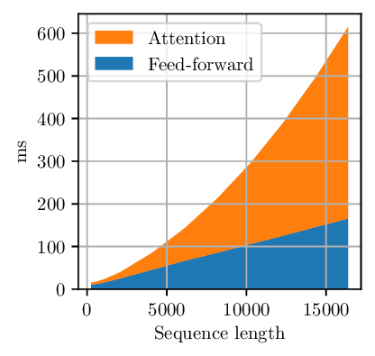

Full causal attention is $O(T^2)$ in sequence length $T$ — prefill and (with KV cache) decode both get expensive at long context.

---

## The “basic toolkit” — read the grid diagram

Lecture slide title: *combine local + global attention* and *systems engineering*. Before Mamba/MoE, most production models used **incremental** fixes.

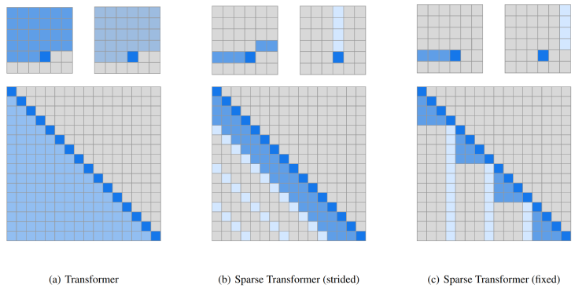

### What the grid actually is

Each big square is an **attention mask** for sequence length $T$ (here $T=16$).

| Axis | Meaning |
| --- | --- |
| **Row** $i$ | Query token $i$ (“who is asking?”) |
| **Column** $j$ | Key token $j$ (“who can be looked at?”) |
| **Blue cell** $(i,j)$ | Token $i$ **may attend** to token $j$ |
| **Gray cell** | Masked — attention weight forced to 0 |

Causal LM: only $j \le i$ can ever be blue (no looking into the future). That’s why patterns live in the **lower triangle**.

The two small $6\times6$ grids at the top of each panel are **zoom-ins** of one query row — “what can this one token see?”

### (a) Full causal attention — Transformer default

Every token sees **all** previous tokens.

```text
Row i (query):  [ · · · · · · ]  → all j ≤ i are blue
```

- **FLOPs / memory:** $O(T^2)$ — the whole lower triangle is filled.
- **Pros:** maximum expressivity per layer.
- **Cons:** doesn’t scale to 100k+ context without pain.

### (b) Sparse strided — local + strided global

Two patterns **combined** (union of blue cells):

| Small grid | Pattern | Meaning |
| --- | --- | --- |
| Left | **Local / sliding window** | Each token sees only the last $w$ tokens (e.g. 128) |
| Right | **Strided** | Also attend to every $s$-th older token (e.g. $s=64$) |

```text
Local only:     ····█████          (band along diagonal)
+ Strided:        █ · · █ · · █      (sparse columns)
= Combined:     band + periodic columns in lower triangle
```

**Idea:** nearby tokens matter most; strided columns give **cheap long-range** hooks without full $T^2$.

### (c) Sparse fixed — local + global columns

| Small grid | Pattern | Meaning |
| --- | --- | --- |
| Left | **Local window** | Same band as above |
| Right | **Fixed global** | A few **designated positions** (e.g. token 0, special tokens) are visible to **everyone** |

```text
Global columns: entire column j=* is blue for all rows i ≥ j
```

**Idea:** “sink” tokens ([attention sinks](https://arxiv.org/abs/2309.01653)) or CLS-style globals carry summary info; everyone can read them in one hop.

### Toolkit beyond the grid

| Lever | What it does | Example |
| --- | --- | --- |
| **Hybrid layers** | Some layers local, some full global | Gemma 2/3: mostly sliding window + periodic global layers; **last layer always global** |
| **GQA/MQA** | Shrink KV cache (lecture 03) | 8 Q heads share 1 KV head |
| **Systems** | Same math, faster kernels | FlashAttention-2 — IO-aware, no materialized $T\times T$ matrix |

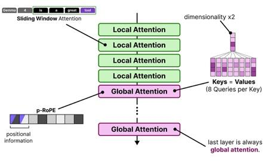

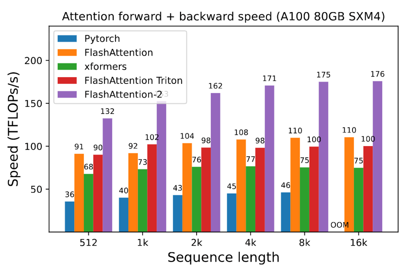

**Takeaway:** the grid is **not** a weight matrix — it’s **which $(i,j)$ pairs you even compute**. Sparse blue patterns = sub-quadratic attention. Systems tricks = compute the same (or similar) attention faster without changing the mask.

---

## Linear attention — matmul complexity made explicit

Standard attention (schematic, one head):

$$\mathrm{Attn}(Q,K,V) = \rho(QK^\top)\, V$$

$Q, K \in \mathbb{R}^{n \times d_k}$, $V \in \mathbb{R}^{n \times d_v}$, $n$ = sequence length.

$\rho$ = softmax (normal attention). **Linear attention** = drop softmax (or use a kernel trick so $\rho$ commutes) and use $\rho = \mathrm{identity}$:

$$\mathrm{Attn}(Q,K,V) = Q K^\top V$$

### Naive order: $QK^\top$ first → **quadratic in $n$**

**Step 1:** $S = Q K^\top$

```text
Q:     [n × d_k]
K^T:   [d_k × n]
S:     [n × n]        ← THE PROBLEM: n×n matrix
```

FLOPs: $\approx 2 n^2 d_k$.

**Step 2:** $Y = S V$

```text
S:     [n × n]
V:     [n × d_v]
Y:     [n × d_v]
```

FLOPs: $\approx 2 n^2 d_v$.

**Total:** $O(n^2 d_k + n^2 d_v)$ — dominated by the **$n \times n$** attention matrix. Memory to store $S$ is also $O(n^2)$.

### Reordered: $(K^\top V)$ first → **linear in $n$**

Associativity (the “silly but important” trick, [Katharopoulos et al. 2020](https://arxiv.org/abs/2006.14181)):

$$Q K^\top V = Q (K^\top V)$$

**Step 1:** $M = K^\top V$

```text
K^T:   [d_k × n]
V:     [n × d_v]
M:     [d_k × d_v]    ← size does NOT grow with n!
```

FLOPs: $\approx 2 n d_k d_v$ — **linear in $n$**.

**Step 2:** $Y = Q M$

```text
Q:     [n × d_k]
M:     [d_k × d_v]
Y:     [n × d_v]
```

FLOPs: $\approx 2 n d_k d_v$ — again linear in $n$.

**Total:** $O(n d_k d_v)$ — no $n \times n$ object ever built.

| Order | Dominant term | Scaling in $n$ |
| --- | --- | --- |
| $(QK^\top)V$ | $n^2 d_k$ | **Quadratic** |
| $Q(K^\top V)$ | $n d_k d_v$ | **Linear** |

**Caveat:** removing softmax changes the **model** — you lose the normalized competition between positions. Kernelized / feature-map variants try to recover expressivity while keeping reordering ([Shen et al. 2018](https://arxiv.org/abs/1810.04165)).

---

## Recurrent form — same math, different execution mode

The reordering isn’t just a FLOP trick — it exposes an **RNN**.

Define the **state** (one head):

$$S_t = \sum_{s=1}^{t} k_s v_s^\top \in \mathbb{R}^{d_k \times d_v}$$

This is a running sum of outer products $k_s v_s^\top$ (rank-1 updates to a $d_k \times d_v$ matrix).

**Recurrence:**

$$S_t = S_{t-1} + k_t v_t^\top, \qquad y_t = q_t^\top S_t$$

| Symbol | Shape | Role |
| --- | --- | --- |
| $k_t, v_t$ | $d_k$, $d_v$ | New key/value at step $t$ |
| $S_t$ | $d_k \times d_v$ | **Hidden state** — compressed memory of all past $(k,v)$ pairs |
| $q_t$ | $d_k$ | Query for current token |
| $y_t$ | $d_v$ | Attention output at $t$ |

**Check it matches parallel form:** row $t$ of $Q(K^\top V)$ is $q_t^\top (K^\top V) = q_t^\top \sum_s k_s v_s^\top = q_t^\top S_t$.

### The duality (why this matters)

| Mode | Formula | When used | Complexity in $n$ |
| --- | --- | --- | --- |
| **Parallel** | $Y = Q(K^\top V)$ | **Training** — full sequence on GPU | $O(n d_k d_v)$ matmuls, parallel over $n$ |
| **Recurrent** | $S_t = S_{t-1} + k_t v_t^\top$, $y_t = q_t^\top S_t$ | **Inference** — one token at a time | $O(d_k d_v)$ per step, **constant state** |

```text
Training:   process all tokens at once  →  use parallel linear form
Decoding:   one new token per step      →  update S_t, never touch old k,v again
```

Same as [[LM Architectures & Hyperparameters#Why KV cache exists|KV cache duality]] for softmax attention — but here the “cache” is the **fixed-size state** $S_t$ instead of growing $T \times d$ tensors.

**With decay** $S_t = \gamma S_{t-1} + k_t v_t^\top$ → [RetNet](https://arxiv.org/abs/2307.08621) style gated memory.

---

## Beyond linear attention — Mamba-2, GDN, hybrids

### Mamba-2 ([Dao & Gu 2024](https://arxiv.org/abs/2405.21060))

Add per-position gating and skip:

$$S_t = \gamma_t S_{t-1} + k_t v_t^\top, \qquad y_t = q_t^\top S_t + v_t^\top D$$

$\gamma_t = f(x_t)$ — input-dependent decay (more expressive than pure linear attention). Still has **parallel ↔ recurrent** duality for training vs inference.

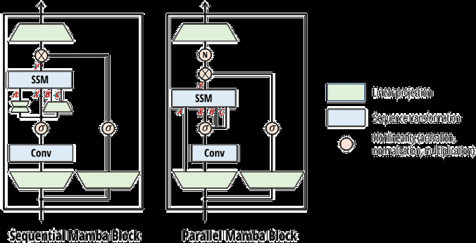

### Gated Delta Net (GDN)

Further generalize — **selective erase** of state in direction of current key:

$$S_t = \gamma_t (I - \beta_t k_t k_t^\top) S_{t-1} + \beta_t k_t v_t^\top, \qquad y_t = q_t^\top S_t$$

$\beta_t = 0$ → “no input” gate; $(I - \beta_t k_t k_t^\top)$ → wipe component of state along $k_t$. Used in Qwen 3.5 / Qwen-Next (3:1 GDN : full attention hybrid).

### Hybrid stacks (production pattern)

Interleave **cheap recurrent/linear layers** with **full attention** layers:

| Model | Ratio | Notes |
| --- | --- | --- |
| MiniMax M1 | 7 linear : 1 full | Linear scaling in context on benchmarks |
| Nemotron 3 | ~3:1 Mamba : attention | Competitive pref vs dense |
| Qwen 3.5 | 3:1 GDN : attention | Good inference characteristics |

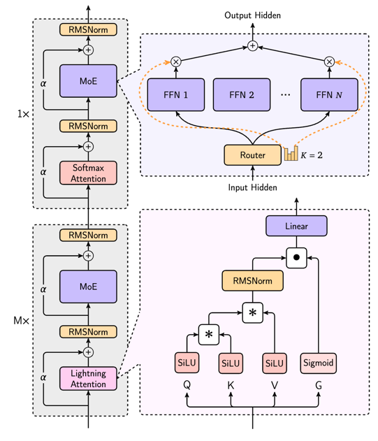

**Why hybrid?** Full attention keeps hard retrieval / copying; linear/recurrent layers handle long context cheaply. Ablations suggest small fraction of full layers is enough ([lecture 04 p11](assets/lecture04-p11-img0.jpeg)).

### Sparse attention without recurrence — DSA

**DeepSeek Sparse Attention (DSA):** lightweight **indexer** picks which past tokens each query attends to — sparse pattern learned/post-hoc. Can adapt a dense short-context pretrained model ([lecture 04 p12–13](assets/lecture04-p12-img0.png)).

---

## Mixture of Experts (MoE)

### What is MoE?

Replace the dense FFN with **many expert FFNs** + a **router** that sends each token to top-$k$ experts only.


```text
Dense:  every token → same FFN weights
MoE:    token 1 → expert 2,  token 2 → expert 1  (only k experts active)
```

**Key property:** total **parameters** ↑, active **FLOPs per token** ≈ flat ([Fedus et al. 2022](https://arxiv.org/abs/2101.03961) — Switch Transformer).

### Why MoEs are popular

| Benefit | Evidence |
| --- | --- |
| Same FLOPs, more params → better quality | Switch Transformer scaling plots |
| Faster training | OlMoE vs dense |
| Competitive vs dense at same active params | Many open MoE leaderboards |
| **Expert parallelism** — experts on different GPUs | Natural sharding axis |


### Why MoEs were slow to adopt

- Routing + all-to-all communication — multi-node infra complexity  
- Discrete top-$k$ routing — **not differentiable**  
- Load imbalance — some experts overloaded, others idle  
- Extra stochasticity — batch-level token dropping can affect other sequences ([lecture 04 p47](assets/lecture04-p47-img0.png))

### Where MoE sits in the stack

**Typical:** MoE replaces **FFN only**; attention stays dense.  
**Rare:** MoE over attention heads (ModuleFormer, JetMoE).

### MoE — what varies (slides 26–35)

Three design axes: **routing function**, **expert sizes / count**, **training objectives** (load balance, aux losses, upcycling).

### Routing — who picks whom?


Matrix: rows = experts $E_1\ldots E_5$, columns = tokens $T_1,T_2,T_3$, cell = router score $s_{i,t}$.

| Strategy | Highlighted region | Who decides? | Used in practice? |
| --- | --- | --- | --- |
| **Token-choice top-$k$** | One **column** at a time | Each token picks its top-$k$ experts | **Yes — default** (Mixtral, DeepSeek, Qwen, …) |
| **Expert-choice top-$k$** | One **row** at a time | Each expert picks top-$k$ tokens | Less common; helps balance load |
| **Global assignment** | Whole matrix | Solve matching / assignment (e.g. Hungarian) | Research ([Clark et al. 2022](https://arxiv.org/abs/2202.08906)) |

**Slide 28:** almost all production MoEs use **token-choice top-$k$**.

### Top-$k$ values and hashing baseline (slide 29)

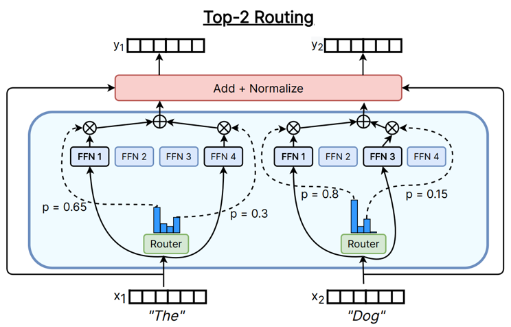

| Model | $k$ (experts per token) |
| --- | --- |
| Switch Transformer | 1 |
| GShard, Grok, Mixtral | 2 |
| Qwen MoE | 4 |
| DBRX | 4 |
| DeepSeek V1 | 7 |

**Hash routing:** fixed hash(token) → expert — no learned router. Common **baseline**; worse than learned top-$k$ at scale ([Fedus et al. 2022](https://arxiv.org/abs/2101.03961); slide 37 comparison).

### Other routing methods (slide 30)

| Method | Idea | Status |
| --- | --- | --- |
| **RL routing** | REINFORCE on discrete expert choice | Early work ([Bengio et al. 2013](https://arxiv.org/abs/1308.3432)); not common now |
| **Linear assignment** | Global optimal matching tokens ↔ experts | [Clark et al. 2022](https://arxiv.org/abs/2202.08906) |
| **Learned top-$k$** | Softmax/sigmoid scores + hard top-$k$ | **Production default** |

### Top-$k$ routing — full mechanics (slide 31)

From [Dai et al. 2024](https://arxiv.org/abs/2401.04088) / DeepSeek:

**MoE layer output** (residual around experts):

$$h_t^l = \sum_{i=1}^{N} g_{i,t}\,\mathrm{FFN}_i(u_t^l) + u_t^l$$

**Router score:**

$$s_{i,t} = \mathrm{Softmax}_i\!\left(u_t^{l\top} e_i^l\right)$$

**Top-$k$ gate:**

$$g_{i,t} = \begin{cases} s_{i,t} & \text{if } s_{i,t} \in \mathrm{Topk}(\{s_{j,t}\}_{j=1}^N,\, k) \\ 0 & \text{otherwise} \end{cases}$$


**Two weighting styles:**

| Style | Models | After top-$k$ |
| --- | --- | --- |
| **Sigmoid / logistic gate** | DeepSeek V1–2, Grok, Qwen | $g_i = \sigma(W_g x)_i$ on selected experts |
| **Softmax on top-$k$ only** | Mixtral, DBRX, DeepSeek V3 | Renormalize softmax **only over the $k$ winners** |

### Expert layout — shared & fine-grained (slides 32–35)

**DeepSpeed / DeepSeek pattern:** many **small routed** experts + **shared** experts (always on for every token).

| Finding | Source |
| --- | --- |
| More experts + shared experts help | DeepSeek ablations ([slide 33](assets/lecture04-p33-img0.png)) |
| Fine-grained experts help; shared experts **no gain** | OlMoE ablations ([slide 34](assets/lecture04-p34-img0.png)) |

**Fine-grained ratio** = routed expert size / typical dense FFN size.

| Model | Routed | Active $k$ | Shared | Fine-grained ratio |
| --- | --- | --- | --- | --- |
| GShard | 2048 | 2 | 0 | — |
| Switch | 64 | 1 | 0 | — |
| Mixtral | 8 | 2 | 0 | — |
| DBRX | 16 | 4 | 0 | — |
| Grok | 8 | 2 | 0 | — |
| DeepSeek V1 | 64 | 6 | 2 | ¼ |
| Qwen 1.5 MoE | 60 | 4 | 4 | ⅛ |
| DeepSeek V3 | 256 | 8 | 1 | ¹⁄₁₄ |
| OlMoE | 64 | 8 | 0 | ⅛ |
| MiniMax | 32 | 2 | 0 | ~¼ |
| Llama 4 Maverick | 128 | 1 | 1 | ½ |

---

## Training MoEs — why routing is hard (slides 36–60)

### The core problem (slide 36)

We need **sparsity at training time** — each token runs only $k$ of $N$ experts. Otherwise we pay for all $N$ FFNs and MoE buys nothing.

But routing is **discrete**:

```text
scores s_1, …, s_N  →  Topk  →  expert indices  →  0/1 mask
                              ↑
                    NOT differentiable (argmax / sort)
```

**What still gets gradients?**

- Router linear layer $W_g$ (scores $s_i = W_g x$ are differentiable).
- **Expert FFN weights** for the $k$ experts that were used.
- What does **not** get a clean gradient: “if I had routed to expert 3 instead of 1, loss would change by …” — the **switch** itself.

**Three solutions (slide 36)** — guess which is used in practice?

| # | Approach | Slides |
| --- | --- | --- |
| 1 | **RL** (REINFORCE) | 37 |
| 2 | **Stochastic perturbations** on logits | 38–39 |
| 3 | **Heuristic load-balancing aux losses** | 40–43 ← **production** |

---

### 1 · RL for routing (slide 37)

Expert choice = **policy**; optimize with REINFORCE + baseline ([Clark et al. 2020](https://arxiv.org/abs/2002.06801)).

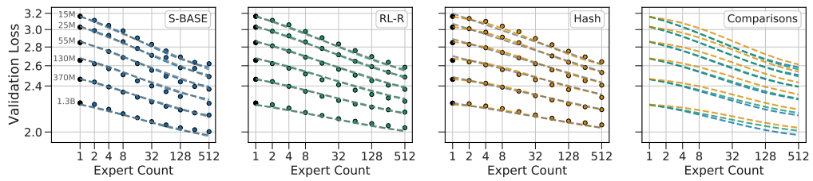

- Works; RL-R tracks learned Switch routing.
- Not clearly better; high variance + complexity.
- **Verdict:** theoretically “right”; **not widely used**.

---

### 2 · Stochastic routing (slides 38–39)

Soften brittle top-$k$; exploration so all experts get gradients early.

**Shazeer 2017** — learnable Gaussian noise before top-$k$:

$$H(x)_i = (x W_g)_i + \mathcal{N}(0,1)\cdot \mathrm{Softplus}((x W_{noise})_i)$$

$$G(x) = \mathrm{Softmax}(\mathrm{KeepTopK}(H(x), k))$$


**Switch Transformer** — multiplicative uniform jitter + fp32 softmax:

```python
if is_training:
    router_logits *= uniform(1-ε, 1+ε)
router_logits = float32(router_logits)
router_probs = softmax(router_logits)
```


**Zoph et al. 2022:** jitter later **removed** in ST-MoE.

---

### 3 · Load-balancing aux losses (slides 40–43)

**Second problem:** top-$k$ → **expert collapse** (few experts get all tokens). Systems need **even load** per expert and per GPU.

#### Switch Transformer (slide 40)

Batch $\mathcal{B}$, $T$ tokens, $N$ experts:

**Hard dispatch fraction** (non-diff):

$$f_i = \frac{1}{T}\sum_{x\in\mathcal{B}} \mathbb{1}\{\arg\max_j p_j(x) = i\}$$

**Soft mean probability** (diff):

$$P_i = \frac{1}{T}\sum_{x\in\mathcal{B}} p_i(x)$$

**Aux loss:**

$$\mathcal{L}_{\mathrm{bal}} = \alpha \cdot N \sum_{i=1}^{N} f_i \cdot P_i$$


**Intuition:** multiply hard counts $f_i$ with soft probs $P_i$ — gradient flows through $P_i$ to **downweight overused** experts. Ideally $f_i \approx P_i \approx 1/N$.

#### DeepSeek V1–2 (slide 41)

1. **Per-expert balancing** — Switch-style $\mathcal{L}_{\mathrm{Bal}} = \alpha \sum_i f_i P_i$.
2. **Per-device balancing** — aggregate by GPU $i$:

$$f'_i = \frac{1}{|\mathcal{E}_i|}\sum_{j\in\mathcal{E}_i} f_j, \qquad P'_i = \sum_{j\in\mathcal{E}_i} P_j, \qquad \mathcal{L}_{\mathrm{DevBal}} = \alpha_2 \sum_{i=1}^{D} f'_i P'_i$$


#### DeepSeek V3 (slide 42)

**Per-expert bias** for top-$k$ selection only (not gate weight):

$$g'_{i,t} = \begin{cases} s_{i,t} & s_{i,t}+b_i \in \mathrm{Topk}(\{s_{j,t}+b_j\}, K) \\ 0 & \text{otherwise} \end{cases}$$

$b_i$ updated online → underused experts get more tokens. Called **“aux-loss-free”** but still uses **sequence-wise aux loss**.

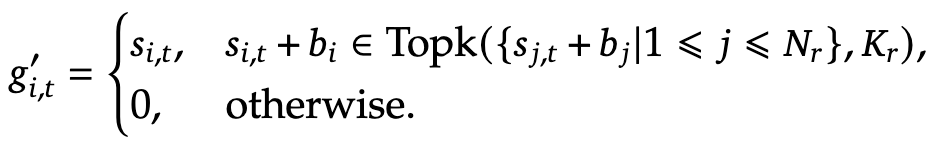

**Sequence-wise aux** — $f_i, P_i$ computed per sequence with normalized scores $s'_{i,t} = s_{i,t}/\sum_j s_{j,t}$:


#### Without balancing? (slide 43)


No LBL → 2 experts take ~100% of tokens; with LBL → all 8 ~equal; **lower train/val loss**.

---

### Systems (slides 44–46)

| Topic | Detail |
| --- | --- |
| **Expert parallelism** | Shard experts across GPUs |
| **All-to-all** | Route tokens to remote experts |
| **MegaBlocks** | Block-sparse matmuls for irregular MoE batches |
| **Nemotron 3** | Down-project activations before routing → less comm |

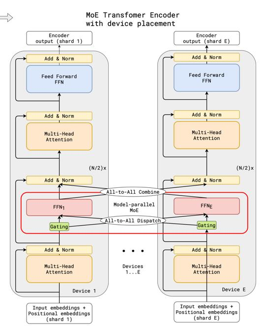


---

### Extra stochasticity (slide 47)

**Token dropping** when expert buffer full is **batch-level** — other sequences’ routing can drop your token. MoE has **extra randomness** beyond dropout.


---

### Router stability — fp32 + z-loss (slides 48–49)

Router logits in **bf16** can explode — tiny rounding on large values breaks softmax ([Zoph 2022](https://arxiv.org/abs/2202.08906) footnote).

**Fixes:** router in **float32**; **router z-loss** penalizes large logit magnitudes.

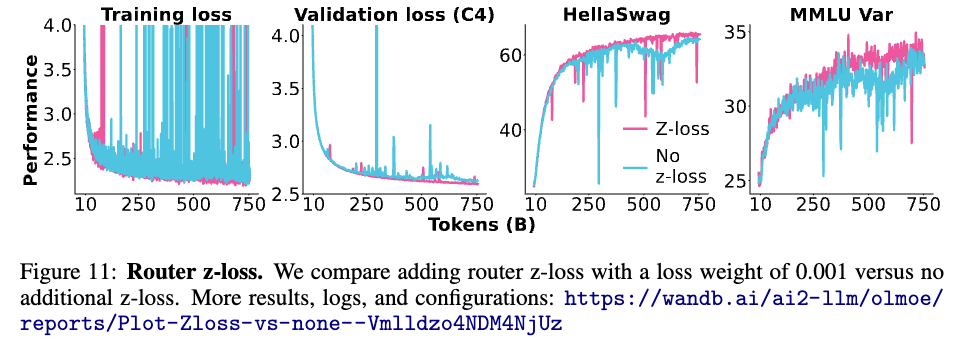

---

### Fine-tuning (slide 50)

Sparse MoEs **overfit** on small SFT sets.

| Mitigation | Who |
| --- | --- |
| Fine-tune **dense MLP**, not MoE layers | Zoph et al. |
| Very large SFT (~1.4M examples) | DeepSeek |

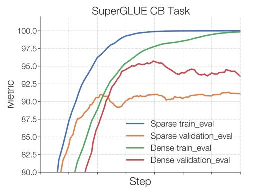

---

### Upcycling (slides 51–53)

Init MoE from **pretrained dense** LM:


| Component | Init |
| --- | --- |
| Attention + LayerNorm | **Copy** from dense |
| Experts | **Duplicate** dense MLP × $E$ |
| Router | **From scratch** |

| Model | Setup | Result |
| --- | --- | --- |
| MiniCPM MoE | $k$=2, 8 experts, ~4B active | Gains after ~520B tokens |
| Qwen MoE | From Qwen 1.8B; $k$=4, 60 + 4 shared | Early upcycling success |

---

### DeepSeek MoE evolution (slides 54–56)

| Version | Total / active | Routing & balance | Experts |
| --- | --- | --- | --- |
| **V1** (16B / 2.8B) | Top-$k$ sigmoid; expert + **device** aux balance | 64 routed ($k$=6) + 2 shared |
| **V2** (236B / 21B) | + **comm balance**; top-$M$ device routing | 160 routed ($k$=10) + 2 shared |
| **V3** (671B / 37B) | Sigmoid + softmax top-$k$; **bias balancing** + seq-wise aux | 256 routed ($k$=8) + 1 shared |

**Also V3:** [[LM Architectures & Hyperparameters#MHA → MQA → GQA → MLA|MLA]] + MTP (multi-token prediction).

### MoE summary (slide 60)

- Sparsity — not every input needs the full model.
- Discrete routing is hard; **top-$k$ + balancing aux** works.
- More params, same active FLOPs → better and cost-effective.

---

## Summary

| Approach | Cuts what? | Mechanism |
| --- | --- | --- |
| Sparse mask (grid) | Which pairs $(i,j)$ you compute | Local + strided/global columns |
| GQA / FlashAttention | Memory / wall-clock | Fewer KV heads; IO-aware kernel |
| **Linear attention** | $O(n^2)$ → $O(n)$ | $Q(K^\top V)$ instead of $(QK^\top)V$ |
| **Recurrent form** | Decode memory | State $S_t$ instead of growing cache |
| Hybrids | Best of both | e.g. 7 linear + 1 full attention |
| **MoE** | FFN FLOPs vs params | Top-$k$ sparse experts |

---

## Links
- [[LM Architectures & Hyperparameters]] — GQA, KV cache, sliding-window intro
- [[Transformer Architecture]] — standard attention baseline
- [[CS336 Overview]] — syllabus unit 1 (architecture)
- [[LLM-Everything/moe/README|LLM-Everything/moe]] — expert parallelism detail
