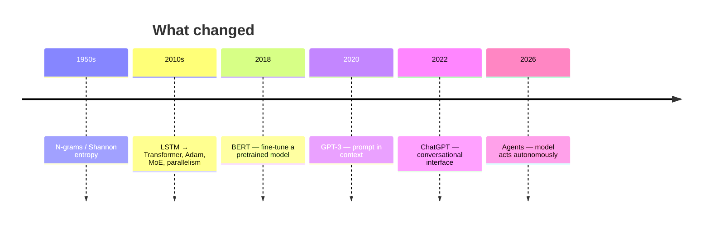

# CS336 — Language Modeling from Scratch
## Motivation
A growing problem in ML research: **researchers are drifting away from the technology itself**.
- **2016:** researchers implemented and trained their own models.
- **2018:** researchers downloaded pretrained models (e.g., BERT) and fine-tuned them.
- **Today:** researchers mostly prompt API models (e.g., GPT, Claude, Gemini).
Moving up levels of abstraction increases productivity, but these abstractions are leaky—unlike mature layers such as programming languages or operating systems—and fundamental research still requires going down the stack. Full understanding of this technology is necessary for that kind of work.
**Philosophy of this course:** understand by building.
But there is a catch: frontier models are expensive, and their training details are not public. We cannot replicate GPT-4 in a classroom. What we *can* do is build **small models from scratch** and learn the same underlying principles.
## What can we learn?
Three kinds of knowledge show up in this course:

| | What it is | Transfers across scale? |
| --- | --- | --- |
| **Mechanics** | How things work—a Transformer, model parallelism, etc. | Yes |
| **Mindset** | Squeezing hardware, taking scaling seriously | Yes |
| **Intuitions** | Which data and modeling choices yield good accuracy | Only partly |

We can teach mechanics and mindset; they transfer. Intuitions are harder—they do not necessarily carry over when you change scale.
## Efficiency matters
**Wrong reading:** scale is all that matters; algorithms do not.
**Right reading:** algorithms that **scale** are what matter.
$$
\text{accuracy} = \text{efficiency} \times \text{resources}
$$
Efficiency becomes *more* important at larger scales—you cannot afford to be wasteful. Hernandez et al. (2020) found roughly **44×** algorithmic efficiency gains on ImageNet between 2012 and 2019.
Useful framing for the whole course:
> Given a fixed compute and data budget, what is the best model you can build?
In other words: **maximize efficiency**.
## LM landscape
> Source: [[Lecture 01]] · [edtrace viewer](http://localhost:5173/?trace=lecture_01)

### History (selected)
- **Pre-neural:** [Shannon 1950](https://www.princeton.edu/~wbialek/rome/refs/shannon_51.pdf), [Brants n-grams 2007](https://aclanthology.org/D07-1090.pdf)
- **Neural ingredients:** [Bengio 2003](https://www.jmlr.org/papers/volume3/bengio03a/bengio03a.pdf), [Attention 2015](https://arxiv.org/pdf/1409.0473.pdf), [Transformer 2017](https://arxiv.org/pdf/1706.03762.pdf), [Adam 2014](https://arxiv.org/pdf/1412.6980.pdf), [MoE 2017](https://arxiv.org/pdf/1701.06538.pdf), [Megatron / ZeRO / GPipe 2018–19](https://arxiv.org/pdf/1909.08053.pdf)
- **Foundation models:** [ELMo 2018](https://arxiv.org/abs/1802.05365), [BERT 2018](https://arxiv.org/abs/1810.04805), [T5 2019](https://arxiv.org/pdf/1910.10683.pdf)
- **Scaling era:** [GPT-2 2019](https://cdn.openai.com/better-language-models/language_models_are_unsupervised_multitask_learners.pdf), [Scaling laws 2020](https://arxiv.org/pdf/2001.08361.pdf), [GPT-3 2020](https://arxiv.org/pdf/2005.14165.pdf), [PaLM 2022](https://arxiv.org/pdf/2204.02311.pdf), [Chinchilla 2022](https://arxiv.org/pdf/2203.15556.pdf)

### Today: three tiers of openness

| Tier | You get | Examples |
| --- | --- | --- |
| **Closed** | API only; training opaque | GPT, Claude, Gemini |
| **Open-weight** | weights + paper | [Llama](https://arxiv.org/abs/2407.21783), [DeepSeek V3/R1](https://arxiv.org/pdf/2412.19437.pdf), [Qwen 3](https://arxiv.org/abs/2505.09388), [Mistral/Mixtral](https://arxiv.org/pdf/2310.06825.pdf), [Kimi K2.5](https://arxiv.org/abs/2602.02276) |
| **Open-source** | + code + data | [Olmo 3](https://arxiv.org/abs/2512.13961), [Nemotron 3](https://arxiv.org/abs/2512.20856), [Marin](https://marin.readthedocs.io/en/latest/reports/marin-32b-retro/) |

Early open attempts ([The Pile](https://arxiv.org/abs/2101.00027), [GPT-J](https://github.com/kingoflolz/mesh-transformer-jax), [OPT](https://arxiv.org/abs/2206.05408), [BLOOM](https://arxiv.org/abs/2211.05100)) → credible open-weight models now **approach closed frontier**. Openness matters for trust and innovation — [Bommasani et al. 2024](https://arxiv.org/abs/2403.07918). CS336 builds on ideas from open models.

**Same fundamentals** (attention, kernels, optimization). **Different specs** (longer context; inference efficiency matters more). See [[Lecture 10]] for inference landscape.
## Syllabus
> Given fixed **data + compute** (memory, bandwidth), what is the best model you can train?
> Five units, one thread: **maximize efficiency** — at the token, FLOP, memory, data, and hyperparameter level.

| Unit | Goal | Components |
| --- | --- | --- |
| **1 · Basics** | Train a basic language model | Tokenization · model architecture · training |
| **2 · Systems** | Squeeze the most out of hardware | Resource accounting · kernels · parallelism · inference |
| **3 · Scaling laws** | Choose hyperparameters at target scale without full-scale tuning | Scaling recipes · extrapolation · compute-optimal tradeoffs |
| **4 · Data** | Curate data for desired capabilities | Evaluation · sourcing · processing · mixing |
| **5 · Alignment** | Improve a trained model with weak supervision | Generate → score → update |

### 1 · Basics
**Tokenization** — atoms the model operates on; bytes ↔ token IDs; [BPE](https://arxiv.org/abs/1508.07909); efficiency via shorter context + adaptive compute; tokenizer-free models ([ByT5](https://arxiv.org/abs/2105.13626), [MegaByte](https://arxiv.org/abs/2309.10668)) promising but not yet frontier-scale.
**Architecture** — [Transformer](https://arxiv.org/pdf/1706.03762.pdf) + refinements: SwiGLU, RoPE, LayerNorm/RMSNorm/QK-norm, attention (sparse, GQA, MLA), recurrence (Mamba, GDN), MoE, shape choices.
**Training** — loss (MTP), optimizers (AdamW, SOAP, Muon), init (Xavier, [μP](https://arxiv.org/abs/2203.03466)), LR schedules, batch size, regularization, MoE load balancing.
Balance **expressivity · stability · efficiency**.

### 2 · Systems
**Resource accounting** — memory vs compute; data moves from **High Bandwidth Memory (HBM)** to **Streaming Multiprocessors (SMs)**; roofline; profiling (nsight).
**Kernels** — minimize data movement; fusion, tiling (FlashAttention); CUDA / Triton / CUTLASS.
**Parallelism** — shard params, activations, gradients, optimizer states; data / tensor / pipeline / sequence / expert parallelism.
**Inference** — prefill (compute-bound) vs decode (memory-bound); quantization, speculative decoding, continuous batching.
Ref: [How to Scale Your Model](https://jax-ml.github.io/scaling-book/)

### 3 · Scaling laws
**Scaling recipe** — FLOPs → hyperparameters; fit loss at small scale, extrapolate to target (e.g. 1e25 FLOPs); needs careful construction + [hyperparameter transfer](https://arxiv.org/abs/2203.03466).
**Compute-optimal tradeoff** — given budget C = 6ND, model size N vs tokens D? [Kaplan 2020](https://arxiv.org/pdf/2001.08361.pdf), [Chinchilla 2022](https://arxiv.org/pdf/2203.15556.pdf): roughly **D ≈ 20N** (inference cost not included).
Predictability ≥ pure optimality.

### 4 · Data
**Evaluation** — internal (guide dev) vs external (real use cases); perplexity, GPQA, HLE, SWE-Bench, etc.
**Curation** — web, books, code, arXiv; copyright / licensing; raw formats need processing.
**Processing** — transform → filter → dedupe → mix ([RegMix](https://arxiv.org/abs/2412.02595)) → optional synthetic/rewrite.
**Data stages** — pretraining · mid-training (long context) · post-training (SFT, agent traces).

### 5 · Alignment
Base model trained on next-token prediction; then **weak supervision** (easier to critique than generate).
Loop: generate → score (human / verifier / LM judge) → update.
Algorithms: PPO ([InstructGPT](https://arxiv.org/pdf/2203.02155.pdf)), DPO, GRPO — unstable, inference-heavy at scale.

| Where efficiency shows up |
| --- |
| Tokenization — bytes are elegant but compute-expensive today |
| Architecture — KV sharing, sliding windows, fewer FLOPs |
| Systems — roofline, fusion, parallelism |
| Scaling laws — tune cheaply on small models |
| Data — don't waste compute on bad or duplicate data |

Next in [[Lecture 01]]: **tokenization** → [[Lecture 02]]: resource accounting.
