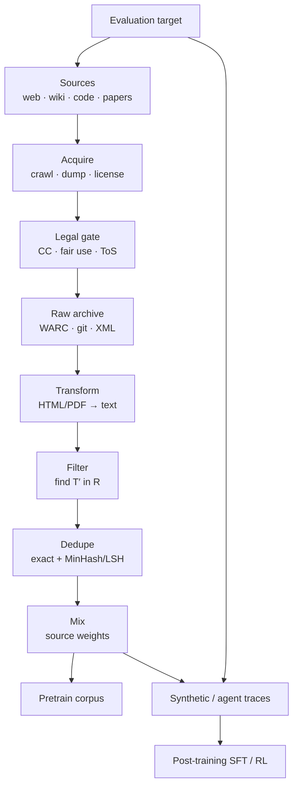
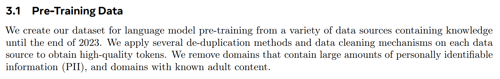
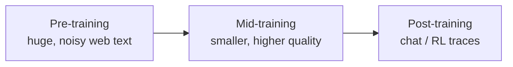
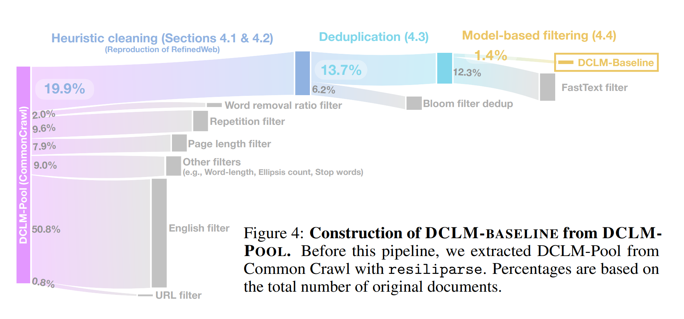
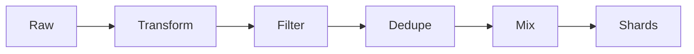
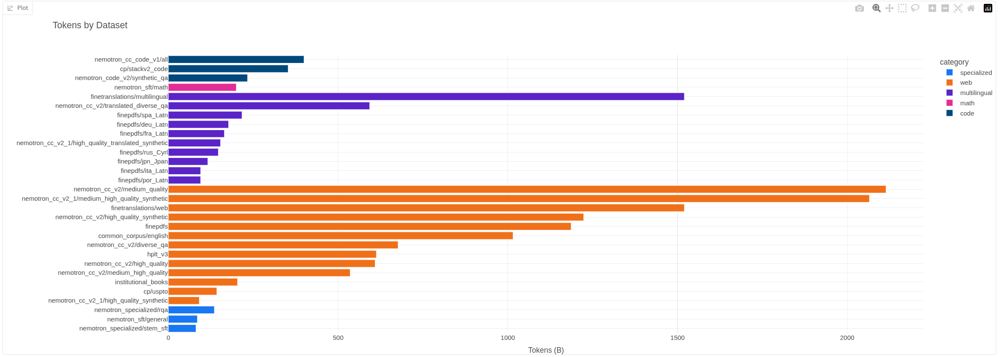
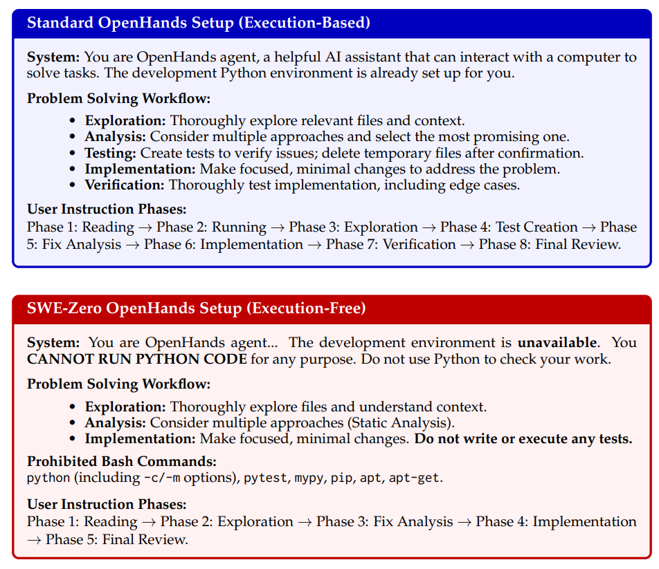

# Data
> [lecture_13.py](../lectures/lecture_13.py) · [lecture_14.py](../lectures/lecture_14.py) · [edtrace 13](http://localhost:5173/?trace=lecture_13) · [edtrace 14](http://localhost:5173/?trace=lecture_14)
> Prior: [[Evaluation]] — eval targets define *what* data you need
> Next: [[Post-Training]]

**One-liner:** data does not fall from the sky — you **acquire** it under legal constraints, **process** it through a pipeline, and **shape** post-training corpora to match your evals.

---

## End-to-end picture



---

## Why data is the differentiator

Open-weight models (Llama 3, etc.) disclose architecture and training procedure in detail. The one box that stays blank: **data**.



| Why secrecy? | Implication |
| --- | --- |
| Competitive moat | Recipe replication is hard without the mix |
| Copyright liability | Legal exposure scales with what you copied |

**Contrast with old ML:** less human **annotation**, vastly more **curation** — filtering, deduping, mixing, licensing. Long-tail judgment calls scale with human effort in a way architecture does not.

---

## Training stages (quality ↑, quantity ↓)



| Stage | Typical data | Model |
| --- | --- | --- |
| Pre-training | Web crawl, books, code | **Base** |
| Mid-training | Curated subsets, long-context | Enhanced base |
| Post-training | Instructions, agent trajectories | **Instruct / chat** |

**OLMo 2** (open reference): pretrain mix → Dolmino mid-train → Tülu post-train.


---

## Acquisition — live service to raw archive

Everything starts as a **live service**, not a `.txt` file:

```
Live service  →  crawl / dump / API  →  raw archive  →  processing (below)
   GitHub          GitHub Archive         WARC/HTML
   Wikipedia       Wikimedia dumps        XML/wiki
   arXiv           S3 bulk download       PDF/LaTeX
```

"Trained on the entire Internet" = **public snapshots the crawler could legally and technically reach** — a tiny, biased slice.

### What the web excludes

| Barrier | Example |
| --- | --- |
| Dynamic apps | Discord, wandb — content behind clicks |
| Paywalls / auth | Facebook, X, NYT |
| `robots.txt` | Voluntary bot opt-out |
| Bot defense | Cloudflare CAPTCHA |
| Terms of service | Scraping prohibited |

Restrictions in C4 / RefinedWeb / Dolma have **increased over time** — the free-web corpus is shrinking.


**Shadow libraries** (LibGen, Sci-Hub, Books3): pirated books used in The Pile, then taken down. Legally infringement; ethically contested.

### Copyright

**Default:** almost everything online is copyrighted.

| Path | Mechanism |
| --- | --- |
| **License** | CC (Wikipedia), paid deals (Google↔Reddit, OpenAI↔Stack Overflow) |
| **Fair use** (US) | Four-factor test; training may be transformative; **piracy is not** |

| Case (US, evolving) | Takeaway |
| --- | --- |
| Authors v. Anthropic | Training = fair use; pirated copies = not; $1.5B settlement |
| Authors v. Meta | Training on books = fair use (2025) |

ToS can override license (e.g. YouTube prohibits download even for CC videos).

### Four canonical sources

**Common Crawl** — monthly crawls, ~300B pages; **WARC** (raw HTML) vs **WET** (lossy text). HTML extractor choice shifts benchmark scores:


**Wikipedia** — CC dumps; high quality; **poisoning risk** if malicious edits land before dump.

**GitHub** — `git clone` for code; GitHub Archive for issues/PRs; **permissive licenses only** (MIT, Apache); massive fork duplication.

**arXiv** — bulk S3; LaTeX optional; CC-BY or all-rights-reserved per paper.

### Dataset evolution (patterns, not a catalog)

| Era | Move | Example |
| --- | --- | --- |
| 2018–19 | Small curated sets | WebText (Reddit karma links) |
| 2019 | Rule-filter CC | C4: 1.4T → **156B** tokens |
| 2019 | Classifier-filter | CCNet: KenLM "looks like Wikipedia" |
| 2020 | Quality classifier | GPT-3: positives = {Wiki, WebText, Books} |
| 2021 | Multi-domain soup | The Pile (22 sources, includes Books3) |
| 2023 | Web-only at scale | FineWeb: 15T tokens, MinHash dedup |
| 2024 | Classifier as product | DCLM: fastText on instruction-like positives |




**Nemotron-CC:** aggressive filters discard 90% — need more tokens via LLM quality scoring + synthetic rephrase → 6.3T (vs Llama 3 15T, Qwen3 ~36T).


**The Stack:** v1 = permissive-license git clones + MinHash; v2 adds issues/PRs, docs, PII redaction.

**Common Pile:** only permissively licensed data (~8 TB) — workable but token-starved vs frontier.


---

## Processing pipeline

Raw archives are not training data. Four stages:



---

### Transform — lossy linearization

| Format | Challenge |
| --- | --- |
| HTML | Boilerplate, tables, images |
| PDF | Layout, truncation |
| Code | Directory structure, binaries |

Tools: trafilatura, resiliparse, jusText. **Lossy** — tool choice is a modeling decision, not plumbing.

**FinePDFs:** recrawl truncated PDFs from CC → OCR → cleanup.

---

### Filter — find T′ in raw R


$$\text{Given target } T,\; \text{raw } R,\quad \text{keep } T' \subset R \text{ where docs resemble } T$$

| Use | T is… |
| --- | --- |
| Lang ID | English |
| Quality | Wikipedia / textbooks |
| Toxicity | Civil discussion |

**Scorers:**

| Type | Score |
| --- | --- |
| Generative (KenLM) | $p_T(x)$ |
| Discriminative (fastText, etc.) | $p(T \mid x)$ |

| Camp | Examples |
| --- | --- |
| Rules only | C4, FineWeb, Dolma |
| Classifier | GPT-3, LLaMA, DCLM, Nemotron-CC ← trend |

**Anchor results:**

- **OpenMathText:** 14.7B curated tokens beats 20× raw on math LMs
- **phi-1:** GPT-4 "educational value" labels → 17.7% vs 12.2% HumanEval, fewer steps
- **LLaMA:** positives = CC pages **referenced by Wikipedia**

**Scale-dependent thresholds** — same filter is wrong for different train lengths:


| Train longer | Prefer |
| --- | --- |
| More compute | Looser filter (more volume) |
| Less compute | Tighter filter (max quality/step) |

---

### Dedupe — exact and near

| Type | Example |
| --- | --- |
| Exact | Mirrors, forks |
| Near | ToS templates (one C4 blurb × 61,036) |

**Why:** save compute, reduce memorization / copyright / privacy risk.

**Exact:** MurmurHash buckets, MapReduce-friendly. C4: 3-sentence spans (can break coherence).

**Near:** Jaccard on shingles → **MinHash** ($\Pr[\text{collision}] = J(A,B)$) → **LSH** bands:

$$P(\text{collide}) = 1 - (1 - s^r)^b,\quad s = J(A,B)$$

↑$r$ = stricter; ↑$b$ = looser. Used in FineWeb, SlimPajama, The Stack.

---

### Mix — the epoch trap



| Strategy | Risk |
| --- | --- |
| Vibes | Unprincipled |
| Proportional to size | Underweights scarce quality sources |
| 50/50 abundant + scarce | **50× epochs** on scarce → overfit |

| Fix | Idea |
| --- | --- |
| **UniMax** | Cap epochs per source |
| **RegMix** | Regress mixture → loss at small scale, optimize |
| **Simulated epoching** | Downsample so small runs mimic large-run epochs |


---

## Post-training data — synthetic & agent traces

Pretrain corpus ≠ SFT data. Post-training examples **look like evals** — chats, tool traces, reasoning chains.

**Recipe:** environments + tasks + **teacher** model responses.

### OpenThoughts

- Teacher **QwQ-32B** > DeepSeek-R1 as teacher (teacher ≠ best student)
- 16 samples/prompt helps; curated math > huge diverse soup


### SWE family (code agents = infra problem)

| Project | Idea |
| --- | --- |
| SWE-smith | LM injects bugs → synthetic tasks |
| SWE-Zero | 300K trajectories **without** per-repo Docker |
| SWE-rebench | 21K executable tasks from PRs |
| SWE-ZERO-12M | 12M traces at scale |

Strong models solve many SWE tasks with **no execution** — internal code world model is enough for training signal.





| Mode | Example |
| --- | --- |
| Fully synthetic | SWE-smith bugs |
| Semi-synthetic | Real PRs + LM filtering |
| Real | StackExchange, GitHub traces |

**Filtering target T** should match what [[Evaluation]] rewards. This data feeds SFT and RL next.

---

## Assignment 4 (CS336)

- HTML → text (Common Crawl)
- Quality + toxicity classifiers
- MinHash dedup
- Leaderboard: min perplexity under **token budget**

---

## Things to remember

1. **Data ≠ free** — acquire, license, crawl politely.
2. **Quality ramp** — broad pretrain → narrow post-train.
3. **CC is the hub** — wiki/code/papers are seasoning.
4. **Transform** — extractor choice matters.
5. **Filter** — define T, score R; threshold ∝ training length.
6. **Dedupe** — MinHash+LSH for near-dups; saves compute and memorization.
7. **Mix** — watch epoch counts on scarce sources.
8. **Post-training data** — teacher traces shaped like evals; agents need scaffolds + infra.

---

## References

- [DCLM](https://arxiv.org/abs/2406.11794) · [MinHash dedup](https://arxiv.org/pdf/2107.06499) · [RegMix](https://arxiv.org/abs/2407.01492)
- [[Evaluation]] · [[CS336 Overview]]

Next: [[Post-Training]] — SFT (imitation) then RLHF (reward optimization).