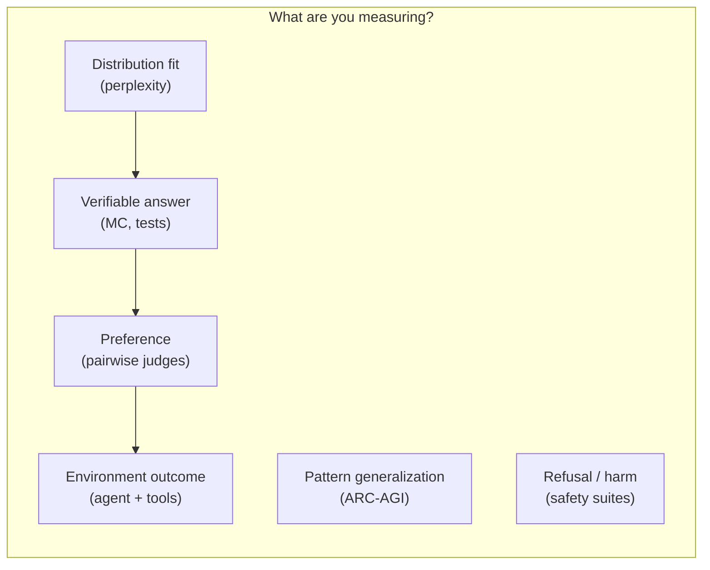
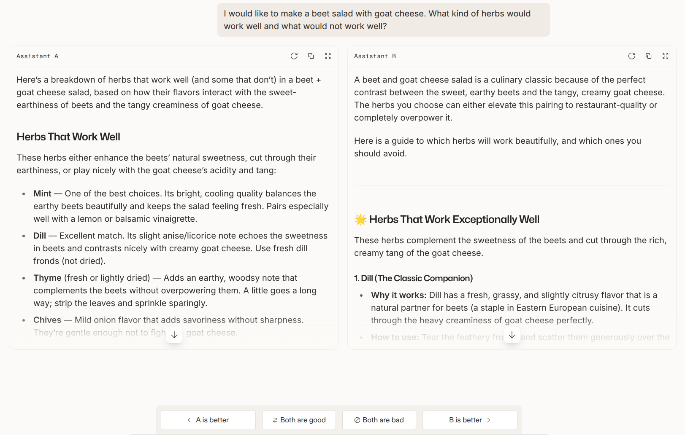
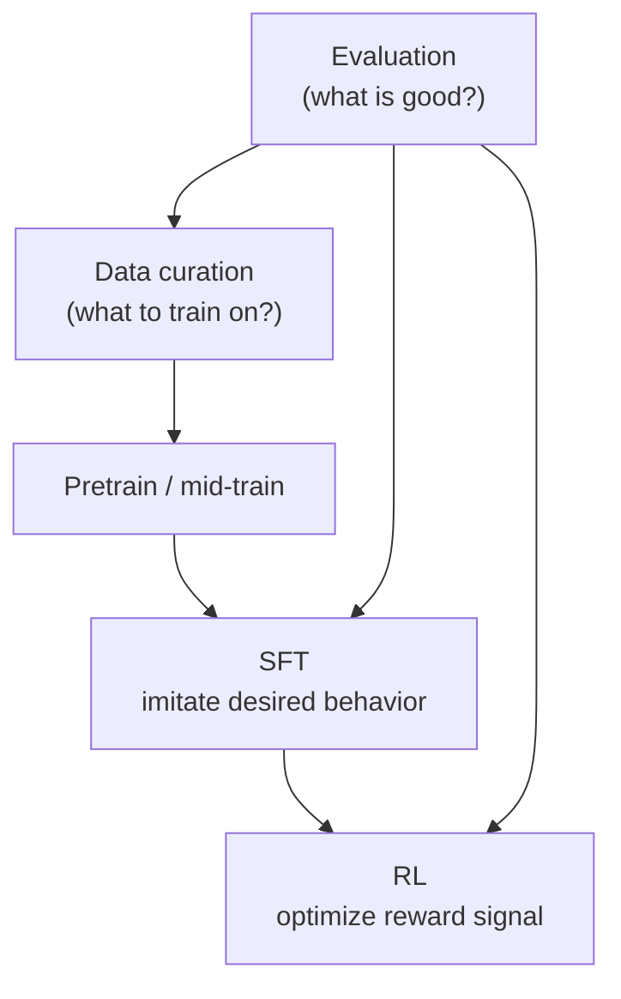

# Evaluation
> Lecture 12 · [lecture_12.py](../lectures/lecture_12.py) · [edtrace](http://localhost:5173/?trace=lecture_12)
> Prior: [[CS336 Overview]] (you know how to *train*; now: how do you know it's *good*?)
> Next: [[Data]] — evaluation targets drive data choices; later SFT/RL optimize for those targets

**One-liner:** evaluation turns vague goals ("helpful," "smart," "safe") into numbers — and **whatever you measure becomes what the field builds toward**.

---

## Why evaluation gates everything downstream

CS336 flow so far: tokenize → architect → train → (optionally) scale. All of that is **means**. Evaluation is **ends**.

| If you care about… | You will… |
| --- | --- |
| Low perplexity on web text | Crawl more web, dedupe harder |
| MMLU / GPQA | Upweight books, science, structured knowledge |
| Chat preference (Arena-style) | Collect conversational SFT data |
| SWE-Bench | Code repos + agent traces with tool use |
| Safety (HarmBench) | Refusal tuning, red-teaming, RL from human/AI feedback |

You cannot answer "what data should I train on?" (lectures 13–14) or "what should SFT/RL optimize?" (15–16) without first deciding **what good means for your use case**.

---

## The core problem: abstract → concrete

Evaluation *looks* mechanical:

```
prompts → model → score
```

It isn't. "Good" is an **abstract construct**; benchmarks are **concrete proxies**. Different proxies imply different "best" models:

| Proxy | Optimizes for | Blind spot |
| --- | --- | --- |
| Benchmark accuracy | Fixed-task performance | May not match how anyone actually uses the model |
| Accuracy ÷ cost | Capability per dollar | Cheaper model wins even if worse on hard tasks |
| Human pairwise preference (Elo) | What raters *like* | Style ≠ truth; sycophancy; who are the raters? |
| Market usage (API traffic) | What people pay for | Popularity ≠ correctness or safety |

**Lesson:** there is no universal leaderboard — only "good *for what question?*"

---

## Six evaluation paradigms (how to classify any benchmark)

Don't memorize benchmark names. Learn the **paradigm** — then new benchmarks (HLE, Terminal-Bench, …) are just instances.



### 1 · Distribution fit — perplexity

An LM defines **p(x)** over token sequences. Perplexity on dataset D:

$$\text{PPL}(D) = \left(\frac{1}{p(D)}\right)^{1/|D|}$$

**Intuition:** geometric average inverse probability per token. Lower = model is less "surprised" by D.

| Use case | Why PPL works |
| --- | --- |
| Internal model development | Smooth across scale; ties to training loss |
| Scaling-law experiments | Comparable across hyperparameter sweeps |
| Private held-out text | Hard to game if data never leaked |

**The optimistic argument:** if p = true distribution t, then p(solution | problem) is optimal for *every* task — so crushing PPL should eventually solve everything. (Faith more than proven science.)

**Where it breaks:**

- *Stanford was founded in 1885* — PPL penalizes every token, including ones irrelevant to your downstream task (*founded*).
- **Fix:** conditional PPL on the response given a prompt.
- Many "benchmarks" are just masked PPL: [LAMBADA](https://arxiv.org/abs/1606.06031) (last word), [HellaSwag](https://arxiv.org/pdf/1905.07830) (pick best continuation).

**Critical implementation trap** — two different games:

| Mode | You compute | Requires |
| --- | --- | --- |
| **Likelihood** | log p(test tokens) | Honest probabilities (sum to 1) |
| **Generation** | sample/argmax response, grade output | Task-specific grader |

Mixing these on a leaderboard is invalid.

**Historical shift:** classic LM research = train and test on the *same* corpus (PTB, WikiText-103). GPT-2 era = train on WebText, evaluate **zero-shot** on old sets — transfer helps on small sets, not on large specialized ones (1 Billion Word).


---

### 2 · Verifiable answers — the "exam" family

**Pattern:** fixed questions + unambiguous scoring. Works because it's cheap and reproducible.

**What exams actually test:** mostly **knowledge retrieval** under a format constraint — not "language understanding" (despite benchmark names like MMLU).

**Saturation arms race** — as models climb, benchmarks get harder:

| Generation | Escalation tactic |
| --- | --- |
| MMLU | 57 subjects, 4-way MC |
| MMLU-Pro | Drop easy questions, 10 choices, require CoT |
| GPQA | PhD-written, Google-proof |
| HLE | Multimodal, prize-funded, frontier-filtered |

**Anchor numbers to remember (GPQA):** PhD experts 65% · humans + Google 34% · GPT-4 39%. The benchmark is *hard* and *not saturated*.

**Limits:** nobody deploys chatbots to take exams. Open-ended real tasks have no single correct answer. Exams are useful for **research signals**, weak for **ecological validity**.

---

### 3 · Preferences — open-ended chat

Real prompt: *"Beet salad with goat cheese — which herbs work, which don't?"*

There is no ground-truth string. Evaluation = **whose judgment counts?**

**Key design insight:** pairwise comparison ("A vs B") gives higher signal than absolute scoring ("rate 1–10") because humans (and LLMs) are better at relative judgments.

**Chatbot Arena** ([LMSYS](https://arxiv.org/abs/2403.04132)): real users, blind A/B, fit **Elo** from wins:

$$P(A \text{ wins}) = \frac{1}{1 + 10^{(Elo_B - Elo_A)/400}}$$

| Strength | Weakness |
| --- | --- |
| Real prompt distribution | Rater demographics unknown; spam |
| Free product → genuine usage | Preference conflates **eloquence** and **correctness** |
| Models need not see identical prompts | Users rarely verify facts |

**Automated judges** (AlpacaEval, WildBench): GPT-4 grades model outputs vs a baseline. Scalable, but:

- LLM judges **favor longer answers** → leaderboard gaming → debiasing (AlpacaEval 2.0)
- Sanity check: correlation with Arena matters more than absolute score
- **Rubrics / checklists** (WildBench) improve reliability for both human and LLM judges



---

### 4 · Environment outcomes — agents

**Shift:** stop evaluating *what the model says*; evaluate *what the system accomplishes*.

$$\text{Agent} = \text{LM} + \text{scaffold}$$

Scaffold = planning, tool calls, memory, sub-agents, context engineering. **Leaderboard score often reflects scaffold + model**, not the LM weights alone.

**Pattern:** put agent in a world, grade with an **objective verifier**:

| Benchmark | Environment | Grader |
| --- | --- | --- |
| SWE-Bench | GitHub issue + codebase | Unit tests pass? |
| Terminal-Bench | Shell session | Task completion in terminal |
| CyBench | CTF challenge | Flag captured |
| MLEBench | Kaggle competition | Leaderboard metric |

SWE-Bench is the canonical CS336 example: 2294 real Python issues → submit patch → tests decide. No human rubric needed.

**Benchmarks rot:** SWE-Bench → **Verified** (fixed broken tests), **Platinum** subsets, **Docent** (LLM audits agent traces for dataset bugs). Agentic evals are especially vulnerable to insufficient tests and trivial shortcuts.

---

### 5 · Isolated reasoning — ARC-AGI

**Ambition:** test **generalization** on novel grid puzzles, not memorized facts. Each task is unique; pretraining on text barely helps.

**Observation from the field:** base LMs flatlined for years; **reasoning models** (o1, o3, RL on verifiable rewards) moved the needle. ARC-AGI-3 (2026) adds interactive environments.

**Honest caveat:** fully separating reasoning from knowledge is probably impossible — but the benchmark still exposes gaps standard exams miss.

---

### 6 · Safety — refusal under adversarial pressure

Safety ≠ one number. Risks span hallucination, sycophancy, crime facilitation, inequality, loss of critical thinking — and **norms vary by jurisdiction**.

Benchmarks like HarmBench (harmful behaviors) and AIR-Bench (policy/regulation categories) test **refusal rate**.

**Eval meets attack:** [GCG](https://arxiv.org/pdf/2307.15043) optimizes adversarial suffixes that jailbreak open models — and transfers to closed APIs. A safety score is only meaningful if you specify the **threat model** (naive user vs adaptive attacker).

**Dual-use tension:** the same agent that passes CyBench can be used for defense or offense.

---

## Three lenses — stress-test any benchmark

Before trusting a number, run it through:

| Lens | Ask |
| --- | --- |
| **Difficulty** | Will frontier models saturate in 6 months? (MMLU: yes → MMLU-Pro; GPQA: not yet) |
| **Realism** | Does anyone use the product this way? (Exams: no. Arena: closer. GDPVal/MedHELM: practitioner tasks) |
| **Validity** | Is the test set clean? Are judges biased? Can the benchmark be gamed? |

These are orthogonal. A benchmark can be hard but unrealistic (HLE), realistic but contaminated (scraped web evals), or valid but easy.

---

## Validity deep dive — the modern contamination crisis

Old ML: fixed train/test splits (ImageNet, SQuAD). **Foundation models train on the Internet** and rarely publish the recipe. Your "test set" may be in the training mix.

**Mitigations (pick based on resources):**

| Strategy | Mechanism | Best for |
| --- | --- | --- |
| Detect overlap statistically | Exchangeability tests on model outputs | Public benchmarks |
| Disclosure norms | Providers report overlap | Trust, not verification |
| Fresh / live evals | Scrape new content (LiveCodeBench) | Coding, news — timestamps aren't perfect |
| Private evals | Your codebase, your documents | Perplexity, internal tasks |


**Dataset quality** is a moving target. The community patches benchmarks after release (Verified, Platinum) because **evaluation is a living artifact**, not a static gold standard.

---

## Who is asking? — match metric to stakeholder

| Stakeholder | Real question | Sensible eval family |
| --- | --- | --- |
| Company choosing a model | A or B for *my* chatbot / coding agent? | Domain-specific + preference + cost |
| Researcher | What are raw capabilities? | Exams + reasoning + scaling-friendly PPL |
| Policy / society | Benefits and harms? | Safety suites + realism studies (GDPVal, MedHELM) |
| Model developer | What should we fix next? | Internal PPL + targeted failing buckets on public benches |

Same model, four different "best" answers.

---

## Methods vs models vs systems — state the rules

| Era | Evaluated object | Rules |
| --- | --- | --- |
| Pre-GPT-3 research | **Method** (architecture, optimizer) | Fixed data, fixed splits, same compute |
| Today (default) | **Model / system** | Any prompting, tools, scaffolds, compute |
| Deliberate throwback | **Method** again | e.g. Karpathy nanogpt speedrun — fixed data + time → val loss |

When you read a leaderboard, ask: **are we comparing models or recipes?** Announcing "our model beats X" without disclosing CoT, scaffold, or inference budget is comparing incomparable systems.

---

## How this connects to data & alignment (your path 12→16)



- **Perplexity-driven** → more diverse pretraining data, better dedupe
- **Exam-driven** → knowledge-heavy sources (books, arXiv, Wikipedia)
- **Chat preference-driven** → instruction/conversation datasets (FLAN → ShareGPT → tool-use traces)
- **Agent eval-driven** → SWE trajectories, sandbox rollouts
- **RL** needs both a **reward** (often derived from eval) and **inference** (lecture 10) for rollouts

Evaluation is not the end of the pipeline — it's the **spec** for everything after pretraining.

---

## Cheat sheet — picking an eval

| Your goal | Start here | Watch out for |
| --- | --- | --- |
| Compare training runs internally | Val PPL on held-out shard | Leakage from dedupe bugs |
| Publish "smartest model" claim | GPQA, HLE, ARC-AGI | Contamination; prompting protocol |
| Ship a chat product | Arena-style preference + your own private eval | Judge bias; not your user population |
| Ship a coding agent | SWE-Bench Verified + your repos | Scaffold confound; test coverage |
| Red-team safety | HarmBench + adaptive attacks (GCG-style) | Static refusal tests overstate safety |
| Regulatory / enterprise | Domain realism (MedHELM, GDPVal) | Privacy limits data access |

---

## Things to remember

1. **No true eval** — only fit-for-purpose proxies.
2. **The metric is the product spec** — optimizing Arena Elo shapes chattiness; optimizing SWE-Bench shapes tool-use scaffolds.
3. **Likelihood ≠ generation** — different code paths, different leaderboards.
4. **Agents ≠ LMs** — always ask what scaffold was used.
5. **Benchmarks saturate and rot** — difficulty arms race; Verified/Platinum/Docent exist for a reason.
6. **Validity is harder than ever** — secret training data makes public test sets suspect.
7. **State the rules** — methods vs systems, prompting, compute, tools.

---

## References

- [HELM](https://crfm.stanford.edu/helm/capabilities/latest/) — inspect per-instance predictions, not just leaderboard rows
- [llm-stats.com](https://llm-stats.com/) — aggregated scores across benchmarks
- [[CS336 Overview]] — units 4 (data) and 5 (alignment)

Next: [[Data]] — once you know *what* to optimize, *where* does the training data come from?