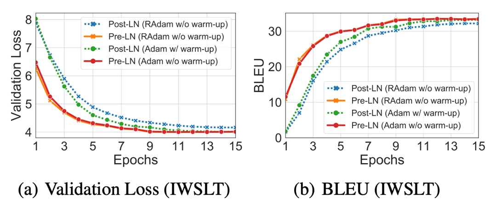
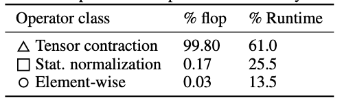
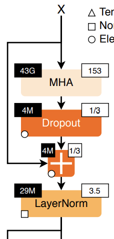
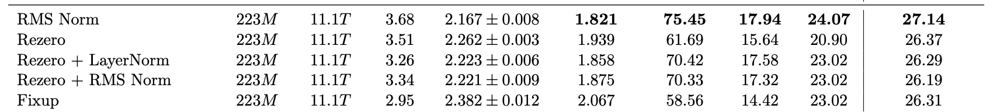

# Lecture 03 — LM Architectures & Hyperparameters
> **Everything you didn't want to know about LM architecture and hyperparameters** (Tatsu Hashimoto, CS336 Spring 2026)
> Source: [lecture_03.pdf](../lectures/lecture_03.pdf) · Prep: [[Transformer Architecture]] · [[CS336 Overview]]

**Theme:** learn from others' experience — what do big LMs share, what varies, and why?

---

## Quick recap: original Transformer (2017)
Decoder block (per layer): **masked self-attention** → Add & Norm → **position-wise FFN** → Add & Norm.

| Component | Original paper |
| --- | --- |
| Position | Sinusoidal (additive) |
| FFN activation | ReLU |
| Norm | **Post-Norm** + **LayerNorm** |
| Attention | Multi-Head Attention (MHA) |
| Bias | Yes (linear + LayerNorm) |

See [[Transformer Architecture]] for full module walkthrough and diagrams.

---

## What you implement in CS336 (modern default)
Assignment 1 target — **LLaMA-like** decoder-only stack:

| Piece | CS336 / modern choice | vs original |
| --- | --- | --- |
| Norm placement | **Pre-Norm** | Post-Norm |
| Position | **RoPE** | Sinusoidal |
| FFN | **SwiGLU** (gated) | ReLU |
| Bias | **No bias** on linear + norm | With bias |

**Design triangle** (from syllabus): expressivity · stability · efficiency — architecture choices trade all three.

---

## Modern variants — normalization

### Residual norm vs non-residual norm

The **residual stream** is the main highway $x$ that skip-connections add into at every sub-layer. Where you put normalization relative to that highway is one of the biggest architecture splits.

| Term (lecture) | Also called | Formula (one sub-layer) | Effect on residual stream |
| --- | --- | --- | --- |
| **Residual-stream norm** | **Post-Norm** | $x \leftarrow \mathrm{Norm}(x + f(x))$ | Norm sits **on the highway** after each add — the tensor passed to the next layer is already normalized |
| **Non-residual norm** | **Pre-Norm** | $x \leftarrow x + f(\mathrm{Norm}(x))$ | Norm only on the **branch** into $f$; the skip path carries **unnormalized** $x$ through the add |

**Intuition for pre-norm:** keep the clean residual highway from [ResNet](https://arxiv.org/abs/1512.03385) — gradients and signal propagate through unnormalized skips; norm only scales what enters attention/FFN ([Xiong et al. 2020](https://arxiv.org/abs/2007.14038)).


*Left: post-norm — green LayerNorm **after** each residual add. Right: pre-norm — LayerNorm **before** MHA/FFN on the branch only.*

Formal layer equations ([Xiong et al. 2020](https://arxiv.org/abs/2007.14038)):


**Consensus (2024+):** almost everyone uses **non-residual / pre-norm**. Exceptions: BERT (post-norm); OPT-350M (post-norm — unclear why).

**Empirical support — pre-norm trains faster and more stably:**




| Observation | Post-norm | Pre-norm |
| --- | --- | --- |
| Gradients | Can **attenuate** deep in stack ([Xiong 2020](https://arxiv.org/abs/2007.14038)) | Cleaner path through residual |
| Training | Loss **spikes** without care ([Salazar & Nguyen 2019](https://arxiv.org/abs/1911.00359)) | Larger LRs, often **no warmup** needed |
| Original selling point | — | Remove warmup requirement |
| Today | Legacy / BERT-era | Default for GPT-3+, Llama, … |

### Double norm & non-residual post-norm

If norm **on** the residual stream is bad, why add norm back **outside** the stream?

- **Double norm** (Grok, Gemma 2): pre-norm on branches **plus** an extra norm placed outside the classic residual path.
- **Non-residual post-norm only** (OLMo 2): post-norm-style block without putting norm on the main residual highway the way classic post-LN does.

These are newer tweaks on top of the pre-norm consensus — not the default for A1.

### LayerNorm vs RMSNorm

Both normalize **per token** over the $d_{model}$ feature dimension (see cube diagram in [[Transformer Architecture#How normalization works]]). Original Transformer: **LayerNorm** — center mean and scale variance. Most modern LMs: **RMSNorm** — scale by root-mean-square only (no mean subtraction, no bias $\beta$).

**LayerNorm** — for one token's feature vector $x \in \mathbb{R}^D$:

$$
\mu = \frac{1}{D}\sum_{j=1}^{D} x_j, \qquad
\sigma^2 = \frac{1}{D}\sum_{j=1}^{D}(x_j - \mu)^2
$$

$$
\mathrm{LN}(x_i) = \gamma_i \cdot \frac{x_i - \mu}{\sqrt{\sigma^2 + \epsilon}} + \beta_i
$$

**RMSNorm** ([Zhang & Sennrich 2019](https://arxiv.org/abs/1910.07467)):

$$
\mathrm{RMS}(x) = \sqrt{\frac{1}{D}\sum_{j=1}^{D} x_j^2 + \epsilon}
$$

$$
\mathrm{RMSNorm}(x_i) = \gamma_i \cdot \frac{x_i}{\mathrm{RMS}(x)}
$$

| | **LayerNorm** | **RMSNorm** |
| --- | --- | --- |
| Subtract mean? | Yes | No |
| Learned params | $\gamma$, $\beta$ | $\gamma$ only |
| Who | GPT-1/2/3, OPT, BLOOM | Llama, PaLM, Chinchilla, T5, most 2023+ |

### Why RMSNorm?

**Naive explanation:** fewer ops (no mean) and fewer params (no $\beta$) → faster. **But does that make sense?** Matmuls dominate total FLOPs *and* memory traffic in a layer ([Ivanov et al.](https://proceedings.mlsys.org/paper_files/paper/2021/file/bc86e95606a6392f51f95a8de106728d-Paper.pdf) — slide cites as Ivanov et al. 2023).

### Why RMSNorm (2)

> **Important lesson: FLOPS are not runtime!** (systems unit goes deeper on this)

Same BERT encoder layer profiling ([Ivanov et al.](https://proceedings.mlsys.org/paper_files/paper/2021/file/bc86e95606a6392f51f95a8de106728d-Paper.pdf)):



| Operator class | % FLOP | % Runtime |
| --- | --- | --- |
| △ Tensor contraction (matmuls, MHA) | 99.80 | 61.0 |
| □ Stat. normalization (LayerNorm, softmax, …) | 0.17 | **25.5** |
| ○ Element-wise (dropout, add, …) | 0.03 | 13.5 |

Normalization is **0.17% of FLOPs** but **~26% of wall-clock** — these kernels are **memory-bound**, not compute-bound.

Per-operator breakdown in one sub-layer (post-norm wiring shown):



| Block | Top-left (black) | Top-right (white) | Bound |
| --- | --- | --- | --- |
| **MHA** | **43G** FLOPs | **153** FLOP-to-memory ratio | Compute-bound |
| LayerNorm | 29M FLOPs | 3.5 ratio | **Memory-bound** |
| Dropout / Add | 4M FLOPs | ~⅓ ratio | Memory-bound |

**RMSNorm can still matter** because runtime is driven by **data movement** (load/store $\gamma$, activations), not raw FLOP count. Dropping $\beta$ and the mean pass means **fewer bytes moved** per token → better wall-clock even when FLOP savings look negligible.

**Quality:** RMSNorm ≈ LayerNorm in practice ([Narang et al. 2020](https://arxiv.org/abs/2007.14902)):



### No bias terms

Most modern transformers drop **bias** on linear layers (and RMSNorm has no $\beta$). Same theme as RMSNorm: less memory traffic + often better optimization stability.

### Normalization recap (end of lecture norm block)

| Choice | Consensus |
| --- | --- |
| Placement | **Non-residual / pre-norm** |
| Type | **RMSNorm** |
| Bias | Off on linear + norm |
| Why RMSNorm | Not FLOPs — **data movement** at inference and training |
| Newer | Double norm (Grok, Gemma 2); OLMo 2 non-residual post-norm |

---

## Modern variants — activations & FFN

### Classic FFN shapes
$$\mathrm{FFN}(x) = \sigma(x W_1) W_2$$

| Activation | Formula | Notable models |
| --- | --- | --- |
| **ReLU** | $\max(0, xW_1) W_2$ | Original Transformer, T5, Gopher, Chinchilla, OPT |
| **GeLU** | $\mathrm{GeLU}(xW_1) W_2$ | GPT-1/2/3, GPT-J, GPT-NeoX, BLOOM |
| **SwiGLU** | $(\mathrm{Swish}(xW_1) \odot xV) W_2$ | Llama, PaLM, Mistral, OlMo, most 2023+ |

### Gated Linear Units (*GLU)
Replace linear+activation with **gated** branch:

$$\mathrm{FF}_{\mathrm{ReGLU}}(x) = (\max(0, xW_1) \odot xV)\, W_2$$

| Variant | Gate | Models |
| --- | --- | --- |
| GeGLU | GELU gate | T5 v1.1, mT5, LaMDA, Phi-3, Gemma |
| **SwiGLU** | Swish gate | Llama, PaLM, Mistral, OlMo |

**Consensus:** *GLU not required* (GPT-3 works without) but rare to see non-gated today. [Shazeer 2020](https://arxiv.org/pdf/2002.05202.pdf) shows consistent gains.

**FF dim with GLU:** use $d_{ff} = \frac{8}{3} d_{model}$ (not $4\times$) to keep param count similar.

**Outlier:** Nemotron 340B uses Squared ReLU.

### Serial vs parallel layers
| | **Serial** (default) | **Parallel** |
| --- | --- | --- |
| Order | Attention → FFN | Attention ∥ FFN, then combine |
| Models | Most LMs | GPT-J, PaLM, GPT-NeoX, Cohere Command A/R+, Falcon 2 |

Parallel can share norm and fuse matmuls — niche, not dominant.

---

## Modern variants — position embeddings

| Type | How | Models |
| --- | --- | --- |
| **Sinusoidal** | Add fixed sin/cos to embedding | Original Transformer |
| **Learned absolute** | Add learned position vector | GPT-1/2/3, OPT |
| **Relative** | Bias attention by distance | T5, Gopher, Chinchilla |
| **RoPE** | Rotate Q/K by position | GPT-J, PaLM, **Llama**, most 2024+ |

### RoPE (Rotary Position Embedding)
**Goal:** attention score depends only on **relative** position $i - j$, not absolute $i, j$.

**Idea:** treat pairs of dims as complex numbers; rotate Q/K by angle proportional to position. Dot product then depends on $i - j$ only ([Su et al. 2021](https://arxiv.org/abs/2104.06364)).

- Applied at **each** attention layer (not just input embedding)
- Multiply Q/K by $\cos,\sin$ position matrices before attention
- vs sinusoidal: **multiplicative**, no cross-terms between positions

---

## Modern variants — attention

### Q, K, V — roles and shapes

| Symbol | Role | Intuition |
| --- | --- | --- |
| **Q** | query | What **this** token is looking for |
| **K** | key | What each token **offers** / its address |
| **V** | value | The **information** retrieved if a key matches |

**Mental model:** database lookup — $Q$ is the search query; past tokens' $K$ are the index; their $V$ is the content.

| Symbol | Meaning |
| --- | --- |
| $B$ | batch size |
| $T$ | sequence length |
| $d_{model}$ | hidden dimension |
| $H$ | number of **query** heads ($n_q$) |
| $G$ | number of **KV** heads ($n_{kv}$) |
| $d_{head}$ | dimension per head |

Usually $d_{model} = H \times d_{head}$. Toy example: $B=1$, $T=5$, $d_{model}=512$, $H=8$, $d_{head}=64$.

```text
X: [B, T, d_model] = [1, 5, 512]

Q = X W_Q     W_Q: [d_model, H × d_head]
K = X W_K     W_K: [d_model, H × d_head]   # MHA: same output dim as Q
V = X W_V     W_V: [d_model, H × d_head]

Before head split: Q, K, V each [B, T, d_model]
After reshape:    Q, K, V each [B, H, T, d_head] = [1, 8, 5, 64]
```

**Attention (per head):**

```text
Attention(Q, K, V) = softmax(Q K^T / sqrt(d_head)) V

Q K^T:   [B, H, T, T]        # token i → score over all tokens j
weights @ V → [B, H, T, d_head]
```

Example: `[1, 8, 5, 64] × [1, 8, 64, 5] → [1, 8, 5, 5]`. Concat heads → `[B, T, d_model]`; output proj `W_O: [d_model, d_model]`.

**Training:** full sequence at once; causal mask blocks future positions in the $T \times T$ matrix.

### Why KV cache exists

Autoregressive generation: `"The cat sat on"` → `"the"` → `"The cat sat on the"` → …

Without cache, each new token **recomputes** $K, V$ for all past tokens. Old tokens' $K, V$ **never change** → store them in the **KV cache**.

**Why K and V, not Q?** The new token needs a fresh **$Q$** (*what am I looking for?*). Past tokens' **$K, V$** are fixed → reuse.

```text
At decode step t:
  compute Q_new, K_new, V_new   # only for the new token
  K_cache = [old K, K_new]
  V_cache = [old V, V_new]
  Q_new attends to all K_cache, V_cache
```

Decode shapes (100 tokens already cached):

```text
Q_new:   [B, H, 1, d_head]
K_cache: [B, H, 100, d_head]
V_cache: [B, H, 100, d_head]

Q_new K_cache^T → [B, H, 1, 100]
(weights) @ V_cache → [B, H, 1, d_head]
```

```text
Old Q is not reused.   Old K and V are reused constantly.
```

| Phase | $T$ | What you compute |
| --- | --- | --- |
| **Prefill** (prompt) | full prompt | $Q, K, V$ for all prompt tokens; fill cache |
| **Decode** (each step) | 1 | $Q, K, V$ for **one** new token; append $K, V$ |

**Memory per layer (MHA):**

```text
K_cache, V_cache: [B, H, T_cache, d_head]
memory ≈ 2 × B × H × T_cache × d_head × bytes
       = 2 × B × T_cache × d_model × bytes
```

Example: $B=1$, $T_{cache}=4096$, $H=32$, $d_{head}=128$, 32 layers, fp16 → **~2.1 GB** total KV cache. This is why MQA/GQA matter at **inference**, not training.

**Walkthrough:** prompt `"I love machine learning"` (4 tokens) → prefill stores $K_1\ldots K_4$, $V_1\ldots V_4$. Token 5: compute $Q_5, K_5, V_5$, append; $Q_5$ attends to $K_1\ldots K_5$. Token 6: same with $Q_6$ and six keys. Old $Q$ never stored.

### Training vs decoding — why this matters

| Phase | What happens | Bottleneck |
| --- | --- | --- |
| **Training** (full sequence) | All tokens in parallel; matmuls over $(B, T, d)$ | **Compute** — high arithmetic intensity |
| **Decoding** (one token at a time) | New token attends to **all past** tokens via cache | **Memory** — reload entire KV cache each step |


At decode, arithmetic intensity is poor — **memory-bound** unless batch is huge or context is tiny.

### MHA → MQA → GQA → MLA

| | Full name | Q heads | KV heads | Who shares K,V? |
| --- | --- | --- | --- | --- |
| **MHA** | Multi-Head Attention | $H$ | $H$ | Q head $i$ → K/V head $i$ |
| **MQA** | Multi-Query Attention | $H$ | **1** | All $H$ Q heads share one K,V |
| **GQA** | Grouped Query Attention | $H$ | $G$ | $H/G$ Q heads per KV head |
| **MLA** | Multi-head Latent Attention | $H$ | compressed | Cache low-dim **latent** K/V (DeepSeek V2+) |

**MHA** — `n_q = n_kv = H`:

```text
Q, K, V: [B, T, H, d_head]
```

Most expressive; **largest** cache.

**MQA** — `n_q = H`, `n_kv = 1`:

```text
Q: [B, T, H, d_head]
K, V: [B, T, 1, d_head]    # broadcast to all Q heads
```

Cache ÷ $H$ vs MHA. Small quality hit ([Shazeer 2019](https://arxiv.org/abs/1911.02150)).

**GQA** — `1 < G < H`. Example $H=8$, $G=2$: Q heads 0–3 → KV head 0; 4–7 → KV head 1; group size $= H/G = 4$.

```text
Q: [B, T, 8, d_head]
K, V: [B, T, 2, d_head]
```

Near-MHA quality, smaller cache ([Ainslie et al. 2023](https://arxiv.org/abs/2305.13245)). Default in Llama, Mistral, etc.


**Dimension comparison** ($d_{model}=4096$, $H=32$, $d_{head}=128$):

| | MHA | GQA ($G=8$) | MQA |
| --- | --- | --- | --- |
| Q shape | `[B,T,32,128]` | `[B,T,32,128]` | `[B,T,32,128]` |
| K/V shape | `[B,T,32,128]` | `[B,T,8,128]` | `[B,T,1,128]` |
| $W_K, W_V$ out dim | 4096 | 1024 | 128 |
| KV cache vs MHA | 1× | **4× smaller** | **32× smaller** |

For GQA/MQA, $K/V$ total dim $= G \times d_{head}$ can be **smaller than** $d_{model}$.


**MLA:** don't cache full $K, V$ — project to smaller latent $c_t$, cache $c_t$, expand at attention time. Shrinks cache further than GQA (worth it at long context).

| Variant | KV cache | Quality |
| --- | --- | --- |
| MHA | Largest | Baseline |
| MQA | Smallest | Small PPL hit |
| GQA | Middle | Near-MHA |


**Cheat sheet:**

```text
X: [B, T, d_model]
Q (all):     [B, T, n_q_heads, d_head]
K/V MHA:     [B, T, n_q_heads, d_head]
K/V MQA:     [B, T, 1, d_head]
K/V GQA:     [B, T, n_kv_heads, d_head]

At decode: Q changes every step; old K,V reusable → cache K,V.
Fewer KV heads → smaller cache → cheaper inference.
```

**Takeaway:** MHA/MQA/GQA change **inference memory and speed**, not the attention formula. Training cost barely changes; **serving long contexts** is where KV cache bites.

### Sparse / sliding-window attention
Full attention is $O(n^2)$. Alternatives:
- **Sparse patterns** ([Child et al. 2019](https://arxiv.org/pdf/1904.10509.pdf)) — structured sparsity
- **Sliding window (SWA)** — local context only (Mistral, GPT-OSS)

**Hybrid (2024+ trend):** interleave full-attention layers with local/SWA layers:
- Cohere Command A: every 4th layer full attention; NoPE for long-range + RoPE+SWA for local
- Llama 4, Gemma 3/4, OlMo 3, Qwen 3.5: similar interleaving

SSM hybrids (Jamba, Falcon 3, Qwen 3.5) → next lectures.

---

## Hyperparameters — what actually matters

### 1 · FFN / model dim ratio
**Rule of thumb:** $d_{ff} = 4 \cdot d_{model}$ (ReLU/GeLU).

**With GLU:** $d_{ff} \approx \frac{8}{3} d_{model}$ (~2.5–3.5× in practice).

| Model | $d_{ff} / d_{model}$ |
| --- | --- |
| Most dense LMs | ~2.5–4 |
| PaLM | 4 |
| LLaMA-2 70B | 3.5 |
| **T5 11B** (bold outlier) | **64** |
| Gemma 2/3/4 (GLU) | 4–8 |

[Kaplan et al. 2020](https://arxiv.org/pdf/2001.08361.pdf): basin of near-optimal ratios roughly 1–10. T5 v1.1 later moved to standard ~2.5× GeGLU.

### 2 · Head dim × num heads ≈ model dim
Usually: $d_{head} \times n_{heads} \approx d_{model}$ (ratio ~1).

| Model | Heads | Head dim | $d_{model}$ | Ratio |
| --- | --- | --- | --- | --- |
| GPT-3 | 96 | 128 | 12288 | 1.0 |
| T5 | 128 | 128 | 1024 | 16 (outlier) |
| T5 v1.1 | 64 | 64 | 4096 | 1.0 |
| PaLM | 48 | 256 | 18432 | 1.48 |
| LLaMA-2 | 64 | 128 | 8192 | 1.0 |
| Qwen 3.5 27B | 24 | 256 | 5120 | 1.2 |

### 3 · Aspect ratio — deep vs wide
Sweet spot: $d_{model} / n_{layers} \approx 100$–$200$.

| Model | $d_{model} / n_{layers}$ |
| --- | --- |
| GPT-3, OPT, Mistral, Qwen, OLMo 3 | ~128 |
| LLaMA / LLaMA-2 | ~102 |
| PaLM 540B | ~156 |
| Gemma 4 | ~61 |
| T5 11B | ~33 (wide & shallow) |

Very deep → harder to parallelize, higher latency ([Tay et al. 2021](https://arxiv.org/abs/2107.03334)). Systems often drives this choice.

### 4 · Vocabulary size
| Type | Typical size | Examples |
| --- | --- | --- |
| Monolingual | 30k–50k | GPT-2/3 (50k), LLaMA (32k) |
| Multilingual / production | 100k–250k | PaLM (256k), GPT-4 (100k), Gemma 4 (262k), DeepSeek (100k) |

More languages / byte-level tricks → larger vocab.

### 5 · Regularization
**Intuition:** trillions of tokens, single epoch → overfitting less scary. **Practice:**

| | Dropout | Weight decay |
| --- | --- | --- |
| Older (GPT-2/3, T5, OPT) | 0.1 | 0–0.1 |
| Newer (LLaMA, T5 v1.1) | **0** | 0.1 |
| Qwen 14B | 0.1 | 0.1 |

Weight decay on LMs mainly affects **optimization dynamics**, not classic overfitting ([Andriushchenko et al. 2023](https://arxiv.org/abs/2305.18292)).

---

## Stability tricks
Watch for loss spikes / divergence — often from **softmax** (exp + divide).

| Trick | Where | What |
| --- | --- | --- |
| **z-loss** | Output softmax | Penalize large logit magnitudes; stabilizes final softmax ([PaLM](https://arxiv.org/abs/2204.02311)) |
| **QK-Norm** | Attention softmax | RMSNorm/LayerNorm on Q and K before $QK^\top$ ([Dehghani et al. 2023](https://arxiv.org/abs/2309.16588)) — Gemma 2, Qwen 3, OLMo 2/3 |
| **Logit soft-capping** | Output | $\tanh$ cap on logits — prevents blow-up |

Used in: PaLM, Baichuan 2, DCLM, OLMo 2/3, Gemma 2/4, Qwen 3.

---

## Summary tables

### Architecture consensus (2024–2025)
| Component | Consensus |
| --- | --- |
| Stack | Decoder-only, LLaMA-like |
| Norm | Pre-Norm + **RMSNorm** |
| Bias | Off |
| FFN | **SwiGLU** (gated) |
| Position | **RoPE** |
| Attention | **GQA** (or MHA at small scale); hybrid full+local layers emerging |
| Layers | Serial (not parallel) |

### What varies most across releases
1. Position / attention pattern (RoPE variants, SWA, NoPE, SSM hybrids)
2. Activations & gating details
3. Tokenizer & vocab size
4. Stability extras (QK-norm, z-loss)

### What is surprisingly stable
- $d_{ff} \propto d_{model}$ (~8/3 with GLU)
- $n_{heads} \times d_{head} \approx d_{model}$
- $d_{model} / n_{layers} \sim 100$–$128$
- Pre-norm + RMSNorm + no bias

---

## Links
- [[Transformer Architecture]] — modules, shapes, why $\sqrt{d_k}$
- [[CS336 Overview]] — syllabus unit 1 (basics)
- Assignment 1: implement the modern variant above
