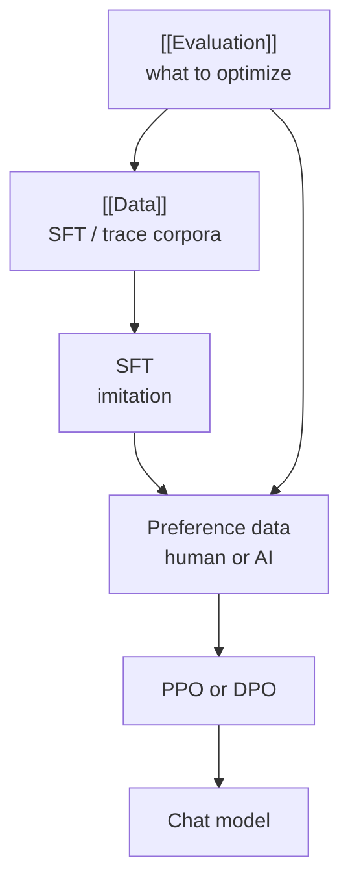

# Post-Training
> [lecture_15.pdf](../lectures/lecture_15.pdf) · Tatsu Hashimoto, CS336 Spring 2026
> Prior: [[Data]] — pretrain corpus + synthetic traces
> Next: RL from verifiable rewards ([lecture_16.pdf](../lectures/lecture_16.pdf))

**One-liner:** pretraining gives you GPT-3; post-training gives you ChatGPT — first **imitate** desired behavior (SFT), then **optimize** what people actually prefer (RLHF).

---

## Where this sits in the stack


| Stage | Objective | Gets you |
| --- | --- | --- |
| Pre-training | Minimize CE on web text | Base LM (GPT-3 class) |
| Mid-training | Continue pretrain with mixed instruct-like data | Capabilities without forgetting |
| SFT | Imitate (prompt, response) pairs | Follows instructions |
| RLHF | Maximize human/AI reward | Aligns with *preferences* |

**Standard recipe** ([InstructGPT / Ouyang 2022](https://arxiv.org/pdf/2203.02155.pdf)): SFT → RLHF.

**Information asymmetry:** pre-ChatGPT papers (Stiennon 2020, Anthropic HH) documented annotation guidelines richly. Modern open models mostly **distill**; closed models hide the "secret sauce."

---

## Part 1 — Supervised fine-tuning (SFT)

### Two ingredients

| Ingredient | What you choose |
| --- | --- |
| **Data** | What conversations / tasks to imitate |
| **Method** | Usually plain supervised CE on assistant tokens; at scale → mid-training tricks |

### What SFT data looks like (open-world evolution)

Not a random walk — each generation fixes the previous one's failure mode:

| Era | Dataset | Character |
| --- | --- | --- |
| NLP-tasks | **FLAN** | Valid but feels like benchmarks — email subjects, MCQ, summarization bullets |
| Synthetic instructions | **Self-Instruct → Alpaca** | Short helpful Q&A ("three health tips", define algorithm) |
| Real chats | **ShareGPT / Vicuna** | Actual user–assistant logs |
| Crowdsourced quality | **OpenAssistant** | Long, detailed, citations |
| Scale + diversity | **WizardLM, Tülu3, Nemotron** | Broader coverage |
| Agents | **Nemotron-OpenCode, tool-use SFT** | `tool_calls`, todos, skills — not plain text |

**Three axes that drift over time:**

| Axis | FLAN | Later sets (OASST, Nemotron) |
| --- | --- | --- |
| **Chattiness** | Terse, task-like | Longer, conversational |
| **Detail** | Minimal | Rich explanations, references |
| **Tool use** | None | Function calls, agent scaffolds |

### What actually matters in SFT data

**Visible:** length, bullet style, whether responses include references.

**Hidden but important:** scale, safety coverage, diversity of failure modes.

#### Style ≠ capability (for exams)

Response **length** varies hugely across models ([Wang et al. 2023](https://arxiv.org/abs/2307.09288)). Length strongly drives **preference** scores (humans and GPT judges; [Dubois et al. 2023](https://arxiv.org/pdf/2404.04475)) — but mostly **does not** move MMLU-style benchmarks.

**Implication:** optimizing for Arena Elo shapes verbosity; optimizing for GPQA does not.

#### References and "teaching facts"

OASST monopsony example ends with a real citation (Bivens & Mishel 2013). What is SFT teaching?

1. **Citation behavior** — output a References block when asked ← usually what you want
2. **Tail knowledge** — the specific paper's content ← model may not know it; forcing it can **hallucinate**

**Folklore backed by evidence** ([Schulman 2023](https://www.youtube.com/watch?v=hhiLw5Q0EFw), [Gekhman et al. 2023](https://arxiv.org/abs/2305.14251)): fine-tuning on facts the base model doesn't know makes it **confidently wrong**, not knowledgeable.

| Takeaway | Meaning |
| --- | --- |
| Don't SFT on tail facts | Even if that's the user-facing use case |
| RL with correctness signal | Can help where SFT hurts |
| Knowledge in LMs | Storage and extraction are messy — SFT is not a database insert |

#### Safety — small data, big effect

Deployed models need guardrails (misinformation, scams — [Kang et al. 2023](https://arxiv.org/abs/2304.05189), [Goldstein et al. 2023](https://arxiv.org/abs/2304.03738)).

Public details are sparse (Llama 2: ~few thousand safety examples). Best-documented pipeline pattern:

1. **Mine scenarios** from real user logs (what people actually try to do)
2. **Write/refine** safe responses for those scenarios
3. **Mix** a small safety set into SFT

**~500** targeted safety examples + ordinary Alpaca-style data → large gains on hate-speech / HH-style evals. Safety is a **high-leverage** slice of SFT — not a separate magic stage.

### SFT data — three principles

1. **Extract, don't invent** — SFT works best when eliciting behaviors already latent from pretraining (instruction following, coding patterns), not implanting wholly new knowledge.
2. **Correct can still hurt** — factually true tail-fact SFT can increase hallucination rate.
3. **Small targeted sets matter** — safety, tone, instruction format shift behavior fast; long-tail quality still wants scale.

---

## Scaling SFT — mid-training

Academic default: SFT = gradient descent on chat JSON. Frontier problem: **lots** of instruct data + risk of **catastrophic forgetting** of pretrain knowledge.

**Mid-training / two-phase recipe** (industry-common, rarely documented; public in miniCPM, jetMoE):

1. Pretrain on web text (as usual)
2. **Mix instruction-tuning data into continued pretraining** (treat chats almost like pretrain corpus)
3. Short, sharp **final SFT** round on high-quality chats

This lets you scale instruct-like tokens without washing out base capabilities — bridges [[Data]]'s pretrain/mid-train/post-train ramp.


---

## Part 2 — From imitation to optimization (RLHF)

### Two framings of the same LM

| | **SFT (imitation)** | **RLHF (optimization)** |
| --- | --- | --- |
| Goal | $\hat{p}(y|x) \approx p^*(y|x)$ | $\max_p \mathbb{E}_p[R(y,x)]$ |
| View | Generative model of human writes | **Policy** that generates actions (tokens) |
| Needs | Samples from reference (human/teacher) | Measurable **reward** |
| Failure | Can't exceed demonstrator quality | Can exceed demos if reward says so |

### Why not stop at SFT? — the G–V gap

**Generation vs. value:** humans don't always write what they *prefer* models to write.

Classic example: news summarization ([Zhang et al. 2023](https://arxiv.org/abs/2309.16794)) — human-written summaries aren't the ones human *raters* prefer; models can beat human writers on preference while not matching human prose.

SFT imitates **written** data. RLHF optimizes **judged** quality. When those diverge, RLHF adds signal SFT cannot.

---

## RLHF data — pairwise preferences

### Standard setup

For each prompt $x$:

1. Sample two (or more) responses $y_1, y_2$ from the policy
2. Human (or AI) picks the better one
3. Train reward model or run DPO on $(x, y_w, y_l)$

**InstructGPT annotator guidelines** (still the reference design): show criteria for helpful, honest, harmless; disallow vague comparisons; encourage concrete failure identification.

### Collection is hard

| Issue | Consequence |
| --- | --- |
| **Annotator quality** | Hard to verify factual correctness at scale |
| **Demographics** | Preference data shifts model culture ([Santurkar et al. 2023](https://arxiv.org/abs/2303.11473)) |
| **Individual annotators** | Style preferences differ a lot ([Hosking et al. 2024](https://arxiv.org/abs/2402.13881)) |
| **Economics** | Expert vs gig-worker pay spread widening (Scale, Outlier, …) |
| **Ethics** | Large-scale labeling has documented labor concerns |
| **Annotator AI use** | Contaminates "human" feedback |

### AI feedback (RLAIF)

**GPT-4 as judge:** agreement with humans near inter-annotator agreement; system-level ranking correlation very high.

Frontier practice: **Ultrafeedback**, **Zephyr**, **Tülu3**, **OLMo** use LM-generated pairwise labels — cheaper, scalable, biases of their own.

**Constitutional AI** ([Bai et al. 2022](https://arxiv.org/abs/2212.08073)): model critiques and revises its own outputs against principles → synthetic preference pairs without humans in the loop.

**Length bias returns:** RLHF often **lengthens** responses ([Chen et al. 2024](https://arxiv.org/abs/2401.10095), [Singhal et al. 2024](https://arxiv.org/abs/2402.10200)) — reward models and humans both reward verbosity.

---

## RLHF algorithms

### PPO — the original (finicky)

**Evolution of ideas:**

1. **Policy gradients** — $\nabla_\theta \mathbb{E}_{p_\theta}[R] = \mathbb{E}[R \nabla_\theta \log p_\theta]$ — high variance
2. **TRPO** — trust region around current policy
3. **PPO** — clip probability ratios to avoid destructive updates

**InstructGPT stack:** SFT policy → train reward model on comparisons → PPO with KL penalty to reference policy (stay close to SFT).

Innocuous on paper; painful in production (rollouts, value head, advantage estimation, instability). See lecture 16 for implementation detail.

**Naive alternatives people try:**

| Hack | Idea |
| --- | --- |
| Control tokens | Prepend `[GOOD]` / `[BAD]` on chosen/rejected |
| Preferred-only SFT | Train only on winners |
| Best-of-N | Sample many, train on highest reward |

These help but don't fully replace on-policy optimization when reward is rich.

### DPO — RLHF without rollouts

**Motivation:** drop explicit reward model + PPO outer loop.

**Key trick** ([Rafailov et al. 2023](https://arxiv.org/abs/2305.18290)):

1. Assume optimal policy has closed-form relation to reward (nonparametric optimum)
2. **Reparameterize** reward in terms of policy $\pi_\theta$ and reference $\pi_{\text{ref}}$
3. Plug into Bradley-Terry / Stiennon pairwise loss → **pure supervised** objective on preferences

**Intuition:** push up log-prob of **chosen** response, push down **rejected**, weighted by how wrong the implicit reward model is — "positive gradient on good, negative on bad."

**Standard loss (sketch):**

$$\mathcal{L}_{\text{DPO}} = -\mathbb{E}\left[\log \sigma\left(\beta \log \frac{\pi_\theta(y_w|x)}{\pi_{\text{ref}}(y_w|x)} - \beta \log \frac{\pi_\theta(y_l|x)}{\pi_{\text{ref}}(y_l|x)}\right)\right]$$

$\beta$ = how strongly to stay near reference; $\pi_{\text{ref}}$ = usually the SFT checkpoint.

**Why it won mindshare:** same preference data as PPO, no online sampling, stable-ish, easy to implement in a training loop.

### Variants (Tülu 3 family)

| Variant | Change |
| --- | --- |
| **SimPO** | Drop reference model; use average log-prob as implicit reward |
| **Length-normalized DPO** | Reduce length exploitation in the objective |

**Empirical caveat:** PPO still wins some setups — RL results are **highly contingent** on data, reward model, KL coeff, and base model. No universal winner.

---

## RLHF pitfalls

### Overoptimization

Training past the sweet spot on proxy reward **hurts** true quality ([Gao et al. 2023](https://arxiv.org/abs/2305.18292) pattern) — holds for human preferences and noisy AI judges; less so for noiseless oracle rewards.

```
Reward ↑ during training ... then actual helpfulness ↓
         ^ overoptimization knee
```

**Lesson:** early-stop on a **held-out human eval**, not training reward.

### Mode collapse & calibration

RLHF policies optimize a point estimate of quality — they are **not** calibrated probabilistic models anymore. Uncertainty, entropy, and tail behaviors degrade; outputs homogenize.

Watch **entropy** during RL — collapse often precedes quality cliffs.

---

## How this connects



| From | To post-training |
| --- | --- |
| [[Evaluation]] | Defines chat vs exam vs agent targets → shapes SFT/RL data |
| [[Data]] | Synthetic teachers (OpenThoughts, SWE-Zero) feed SFT before RL |
| Assignment 5 | Implement **DPO** and **GRPO** (lecture 16 extends RL) |

---

## Cheat sheet

| Question | Answer |
| --- | --- |
| When is SFT enough? | Behavior already in base model; you just need format/style |
| When add RLHF? | Preferences ≠ demonstrations (G–V gap); need safer/better-than-human outputs |
| What SFT data to prioritize? | Instruction following, safety, tool format — not tail facts |
| How much safety data? | Hundreds–thousands can matter enormously |
| Mid-training? | Mix instruct data in continued pretrain before final SFT |
| PPO vs DPO? | PPO: flexible, fragile. DPO: simpler, offline, no reward model |
| What to monitor? | Length, reward overoptimization, entropy collapse |

---

## Things to remember

1. **Post-training is data-secretive** — even more than pretrain.
2. **SFT = extract latent behaviors**; stuffing new facts invites hallucination.
3. **Style dominates preferences** — length and tone move Arena, not MMLU.
4. **~500 safety examples** can shift refusal behavior materially.
5. **Mid-training** scales instruct tokens without forgetting pretrain.
6. **RLHF data is messy** — annotator identity is part of the spec.
7. **DPO** rewrites RLHF as weighted preference classification; **PPO** still matters at frontier scale.
8. **Overoptimize the proxy reward** and real quality breaks.

---

## References

- [InstructGPT (Ouyang 2022)](https://arxiv.org/pdf/2203.02155.pdf) — SFT + PPO pipeline
- [DPO (Rafailov 2023)](https://arxiv.org/abs/2305.18290)
- [Constitutional AI (Bai 2022)](https://arxiv.org/abs/2212.08073)
- [Gekhman — don't SFT unknown facts](https://arxiv.org/abs/2305.14251)
- [[Data]] · [[Evaluation]] · [[CS336 Overview]]

Next: [lecture_16.pdf](../lectures/lecture_16.pdf) — RL from **verifiable** rewards (GRPO, o1/R1-style reasoning).