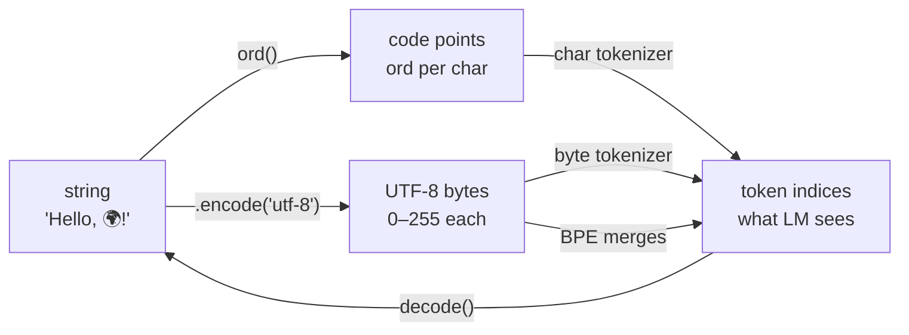

# Tokenizer
> Source: [[Lecture 01]] · [edtrace viewer](http://localhost:5173/?trace=lecture_01) · [Karpathy: Let's build the GPT Tokenizer](https://www.youtube.com/watch?v=zduSFxRajkE)
> Prep for [[Transformer Architecture]] · CS336 Assignment 1 (basics)

## Primer: string → bytes → indices

Computers don't store `"Hello"` as text — they store **numbers**. Tokenization is about choosing *which* numbers represent your text.

### Layer 1 · String (what you see)

A Python `str` is a sequence of **Unicode characters**:

```
"Hello, 🌍! 你好!"
→  ['H', 'e', 'l', 'l', 'o', ',', ' ', '🌍', '!', ' ', '你', '好', '!']
```

### Layer 2 · Unicode code point (one number per character)

Every character has a global ID assigned by the [Unicode standard](https://en.wikipedia.org/wiki/Unicode):

| Char | `ord(char)` |
| --- | --- |
| `'a'` | 97 |
| `'H'` | 72 |
| `'🌍'` | 127757 |
| `'你'` | 20320 |

```python
ord('a')    # 97
chr(97)     # 'a'   ← reverse
```

This is what the **character tokenizer** uses:

```python
string  = "Hello, 🌍! 你好!"
indices = [ord(c) for c in string]
# → [72, 101, 108, 108, 111, 44, 32, 127757, 33, 32, 20320, 22909, 33]
#   13 characters → 13 indices
```

### Layer 3 · UTF-8 bytes (how the string is actually stored on disk)

Unicode tells you *which* character; **UTF-8** is an **encoding** — a recipe for packing characters into **bytes** (integers 0–255) for storage and transmission.

```python
string.encode("utf-8")   # str → bytes
bytes(...).decode("utf-8")  # bytes → str
```

| Char | UTF-8 bytes (as ints) | Why |
| --- | --- | --- |
| `'a'` | `[97]` | ASCII fits in 1 byte |
| `'🌍'` | `[240, 159, 140, 141]` | emoji needs 4 bytes |
| `'你'` | `[228, 189, 160]` | CJK needs 3 bytes |

One character ≠ one byte. Emoji and Chinese each **explode into multiple bytes**.

Full example — `"Hello, 🌍! 你好!"` (13 characters) becomes **20 bytes**:

```
[72, 101, 108, 108, 111, 44, 32, 240, 159, 140, 141, 33, 32, 228, 189, 160, 229, 165, 189, 33]
```

This is what the **byte tokenizer** uses:

```python
string  = "Hello, 🌍! 你好!"
indices = list(string.encode("utf-8"))
# → [72, 101, 108, 108, 111, 44, 32, 240, 159, 140, 141, 33, 32, 228, 189, 160, 229, 165, 189, 33]
#   13 characters → 20 indices (emoji + CJK each cost extra bytes)

# decode back:
bytes(indices).decode("utf-8")  # → "Hello, 🌍! 你好!"
```

Python shows bytes in hex (`b'\xf0\x9f\x8c\x8d'`) — that's just notation for the same integers (`240, 159, 140, 141`).

In the byte tokenizer, a **byte** and an **index** are the same thing: an int in `[0, 255]`.

### Layer 4 · Token indices (what the model sees)

**Indices** = a `list[int]` — that's it. The word is generic; what the integers *mean* depends on the tokenizer:

| Tokenizer | What each index means | Example for `"Hi"` |
| --- | --- | --- |
| Character | Unicode code point | `[72, 105]` |
| Byte | One UTF-8 byte (0–255) | `[72, 105]` |
| Word | Row in a vocab table | e.g. `[4821, 97]` |
| BPE | Row in a learned vocab table | e.g. `[15496, 2159]` |

The model is just a function over integers: `f([72, 101, 108, 108, 111, ...])`. It has no idea what "Hello" means unless you decode back.

**Same string, different index lists:**

| Path | How | `"Hello, 🌍! 你好!"` → |
| --- | --- | --- |
| Character | `ord()` per char | 13 indices (one per character) |
| Byte | `.encode("utf-8")` | 20 indices (one per byte) |
| BPE | bytes + merge frequent pairs | fewer indices (e.g. ~6–8) |

### How the layers connect

```
You type:     "Hello, 🌍! 你好!"
                    │
        ┌───────────┴───────────┐
        ▼                       ▼
  ord() per char          .encode("utf-8")
  (character tok)            (byte tok / BPE start)
        │                       │
        ▼                       ▼
  [72, 101, …, 127757, …]  [72, 101, …, 240, 159, 140, 141, …]
  13 indices                 20 indices
        │                       │
        └───────────┬───────────┘
                    ▼
              model sees list[int]
                    │
              decode() → original string
```

### Glossary

| Term | Plain meaning |
| --- | --- |
| **String** | What you type — a sequence of Unicode characters |
| **Unicode** | Global table assigning every character a number (code point) |
| **UTF-8** | Encoding recipe: characters → bytes for storage on disk / in memory |
| **Byte** | One storage unit = integer 0–255 (8 bits). Computers only store bytes. |
| **Index** | Any integer in the `list[int]` the model receives. Meaning depends on tokenizer. |
| **`encode()`** | string → indices (text to numbers) |
| **`decode()`** | indices → string (numbers back to text) |

### The round-trip

```
string  ──encode──▶  list[int] (indices)  ──decode──▶  string
```

Every tokenizer must satisfy `decode(encode(s)) == s`.



---

## What is a tokenizer?

Raw text is a **Unicode string**. A language model places a probability distribution over **sequences of tokens** — integers, not characters.

A **tokenizer** is the bridge:

| Direction | Job |
| --- | --- |
| `encode(string) → list[int]` | text → token IDs |
| `decode(indices) → string` | token IDs → text |

Round-trip must hold: `decode(encode(s)) == s`.


Formally: convert between raw inputs (bytes) and sequences of integers (tokens). The model never sees the original string — only these indices.

---

## Why tokenization matters

**Efficiency lens** (CS336's recurring theme):

| Benefit | Mechanism |
| --- | --- |
| **Shorter context** | ~1000 UTF-8 bytes → ~250 BPE tokens → less quadratic attention cost |
| **Adaptive compute** | More modeling capacity on frequent, meaningful chunks |
| **Compression ratio** | `num_bytes / num_tokens` — higher is better (shorter sequences) |

Trade-off: larger **vocabulary size** → higher compression ratio, but sparser token distribution and more parameters in the embedding matrix.

**The dream:** tokenizer-free architectures that operate directly on bytes — [ByT5](https://arxiv.org/abs/2105.13626), [MegaByte](https://arxiv.org/abs/2309.10668), [BLT](https://arxiv.org/abs/2412.09871), [T-FREE](https://arxiv.org/abs/2410.13872), [H-Net](https://arxiv.org/abs/2507.07962). Promising, but not yet scaled to frontier.

Whatever the solution, it must satisfy:

1. The model operates on **chunks** (abstractions) of the sequence — text, video, DNA, etc.
2. Chunks should be **variable** — allocate more capacity to interesting parts.

---

## Real tokenizer behavior (GPT-5 / tiktoken)

Play with [tiktokenizer](https://tiktokenizer.vercel.app/?encoder=gpt2) to build intuition.

**Observations** on production tokenizers:

- A word and its preceding space are one token (e.g. `" world"`).
- Same word at sentence start vs middle tokenizes differently (e.g. `"hello hello"`).
- Numbers split every few digits.

GPT-5 uses `o200k_base` via [tiktoken](https://github.com/openai/tiktoken). For `"Hello, 🌍! 你好!"`:

- `encode` → short integer list
- `decode` round-trips exactly
- Compression ratio > 1 (fewer tokens than bytes)
- Vocabulary size ~200K

---

## Four approaches (in increasing sophistication)

### 1 · Character tokenizer

Each Unicode character → code point via `ord`; reverse with `chr`.

```python
indices = list(map(ord, string))       # encode
string  = "".join(map(chr, indices))   # decode
```

| | |
| --- | --- |
| Vocab | ~150K Unicode characters ([list](https://en.wikipedia.org/wiki/List_of_Unicode_characters)) |
| Compression | Poor — one token per character |
| Problem | Huge vocab + rare characters (🌍) waste capacity |

**Worst of both worlds:** large vocabulary, low compression.

### 2 · Byte tokenizer

Unicode → UTF-8 bytes → integers 0–255.

```python
indices = list(string.encode("utf-8"))  # encode
string  = bytes(indices).decode("utf-8")  # decode
```

| | |
| --- | --- |
| Vocab | 256 (fixed, tiny) |
| Compression | 1.0 — one token per byte |
| Problem | Sequences too long; attention is O(n²) in sequence length |

Elegant and universal, but **compute-inefficient** with today's Transformer architectures.

### 3 · Word tokenizer

Classical NLP approach: split a string into **words** (and punctuation as separate tokens), then map each chunk to an integer.

```python
string = "I'll say supercalifragilisticexpialidocious!"
chunks = regex.findall(r"\w+|.", string)
# → ['I', "'", 'll', ' ', 'say', ' ', 'supercalifragilisticexpialidocious', '!']
```

The regex `\w+|.` means:

- `\w+` — greedily keep alphanumeric characters together (a "word")
- `.` — anything else (apostrophe, space, punctuation) becomes its own single-character token

**Building a `Tokenizer`:** scan training data, collect every distinct chunk, assign each a unique integer (`chunk → id`). `encode` looks up chunks; `decode` reverses the mapping.

**What's good:** each token is **semantically meaningful** — humans invented words, so one token ≈ one linguistic unit. Compression ratio is strong (long words like `supercalifragilisticexpialidocious` = one token).

| | |
| --- | --- |
| Vocab size | Number of **distinct chunks in training data** — not fixed upfront; can grow to hundreds of thousands |
| Compression | Good — one token per word |
| Semantics | Tokens align with human word boundaries |

**Problems:**

1. **Rare words** — most vocabulary slots are low-frequency; the model sees them rarely and learns little.
2. **No fixed vocabulary** — vocab size depends entirely on the corpus; hard to cap or standardize across runs.
3. **Out-of-vocabulary (OOV)** — words unseen at training time map to a special `<UNK>` token. Ugly in practice, and it **distorts perplexity** (the model can't score novel words at all).

Closer to classical NLP (MT, early LMs); doesn't scale cleanly to open-vocabulary LLMs — which is why BPE replaced it.

### 4 · Byte Pair Encoding (BPE) ✓

The standard for modern LLMs. Used in [Sennrich et al. 2016](https://arxiv.org/abs/1508.07909) (NMT), then [GPT-2](https://cdn.openai.com/better-language-models/language_models_are_unsupervised_multitask_learners.pdf).

**Idea:** train the tokenizer on raw text. Common byte sequences → single token; rare sequences → many tokens.

**Algorithm sketch:**

1. Start with each **byte** (0–255) as a token.
2. Count adjacent pairs; **merge** the most frequent pair into a new token.
3. Repeat for `num_merges` steps.
4. Vocabulary grows: 256 base bytes + one new token per merge.

```
"the cat in the hat"  →  bytes  →  merge (t,h)→256  →  merge (th,e)→257  →  ...
```

**Training** (`train_bpe`):

```python
indices = list(map(int, string.encode("utf-8")))
vocab   = {i: bytes([i]) for i in range(256)}
merges  = {}  # (i, j) → new_index

for i in range(num_merges):
    pair      = most_common_adjacent_pair(indices)
    new_index = 256 + i
    merges[pair] = new_index
    vocab[new_index] = vocab[pair[0]] + vocab[pair[1]]
    indices   = merge(indices, pair, new_index)
```

**Encoding** (given trained `merges` + `vocab`):

1. Convert string to byte indices.
2. Apply merges in training order (replace each pair with merged index).
3. Return final index list.

**Decoding:** map each index → bytes via `vocab`, concatenate, UTF-8 decode.

| | |
| --- | --- |
| Vocab | Fixed size = 256 + num_merges (data-driven) |
| Compression | Good — frequent patterns collapse to one token |
| OOV | No UNK — any UTF-8 string decomposes to bytes |
| Trade-off | Heuristic, not optimal — but works well in practice |

---

## Comparison

| Method | Vocab size | Compression | OOV handling | Used in LLMs? |
| --- | --- | --- | --- | --- |
| Character | ~150K | Low | N/A | No |
| Byte | 256 | 1.0 | Perfect | Research (ByT5, etc.) |
| Word | Unbounded | High | `<UNK>` | Classical NLP |
| **BPE** | Fixed (~32K–200K) | High | Byte fallback | **GPT, Llama, Qwen, …** |

---

## Assignment 1 extensions

The lecture's `BPETokenizer` is intentionally minimal. Assignment 1 asks you to go further:

- **Efficient encode:** only apply merges that actually appear (not loop over all merges).
- **Special tokens:** detect and preserve tokens like `<|endoftext|>`.
- **Pre-tokenization:** GPT-2-style regex before BPE (splits words, numbers, whitespace).
- **Speed:** make training and encoding fast enough for real corpora.

Also in Assignment 1: implement Transformer, cross-entropy loss, AdamW, training loop → train on TinyStories and OpenWebText.

- [Assignment 1 GitHub](https://github.com/stanford-cs336/assignment1-basics)
- [PDF](https://github.com/stanford-cs336/assignment1-basics/blob/main/cs336_spring2026_assignment1_basics.pdf)

---

## Summary

- Tokenizer: **strings ↔ token indices**; must round-trip.
- Character, byte, and word tokenization are all **highly suboptimal** for Transformer LLMs.
- **BPE** is an effective, data-driven heuristic — start from bytes, greedily merge frequent pairs.
- Tokenization is a **separate preprocessing step** today; end-to-end byte models are the long-term bet.
- Whatever scheme you pick: chunks as abstractions + variable granularity.

Next: [[Lecture 02]] — resource accounting (memory, FLOPs, roofline).