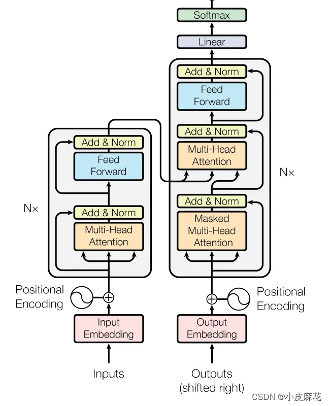
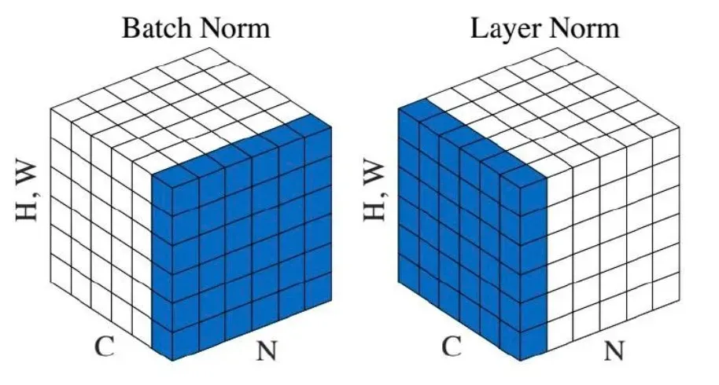
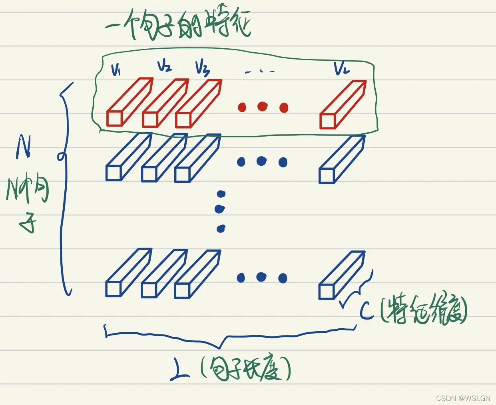
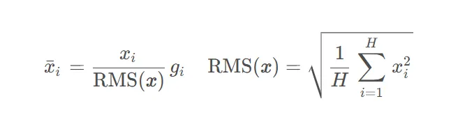
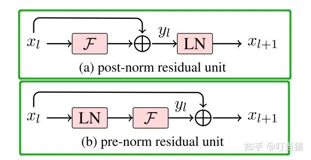
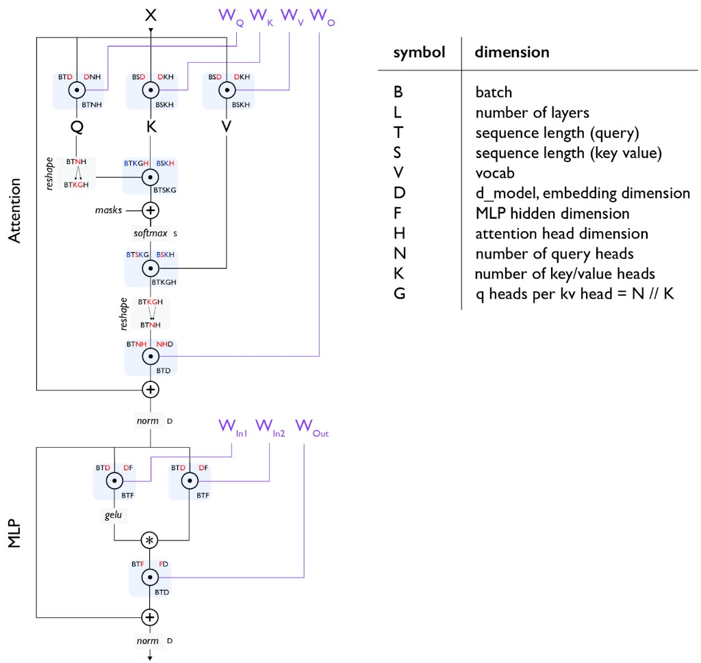

# Transformer Architecture
> Prep before [[LM Architectures & Hyperparameters]] · aligned with [[CS336 Overview]] syllabus unit 1
> Refs: [Attention Is All You Need (2017)](https://arxiv.org/pdf/1706.03762.pdf) · [The Illustrated Transformer](https://jalammar.github.io/illustrated-transformer/) · [[LLM-Everything/transformer/README|LLM-Everything/transformer]]

## Why Transformers?
Sequence models before 2017 — **Recurrent Neural Networks (RNNs)**, **Long Short-Term Memory (LSTM)**, **Gated Recurrent Units (GRUs)** — processed tokens **one step at a time**. Hidden state at step *t* depended on step *t − 1*, so training could not parallelize over the time dimension — a major bottleneck on GPUs.

| Problem | What goes wrong |
| --- | --- |
| **Sequential computation** | Step *t* waits for *t − 1*; hard to use full hardware parallelism. |
| **Long-range dependencies** | Distant tokens linked through many RNN hops; vanishing/exploding gradients. |
| **Encoder bottleneck** | Classic seq2seq squeezes the source into **one fixed vector**. |
| **Attention as patch** | [Bahdanau attention (2015)](https://arxiv.org/pdf/1409.0473.pdf) helps the decoder look back, but the **backbone is still an RNN**. |

**Attention Is All You Need** drops recurrence entirely: **self-attention** lets each position read all others (within the mask) in parallel. Resolving *"it"* → *"animal"* no longer requires carrying context through many steps ([Illustrated Transformer](https://jalammar.github.io/illustrated-transformer/)).

Trade-off: attention alone has **no word order** → positional encoding is required.

---

## Original architecture (2017)
Figure 1 from [Vaswani et al.](https://arxiv.org/pdf/1706.03762.pdf) — encoder–decoder for seq2seq (e.g. translation):


| Part | Role |
| --- | --- |
| **Encoder stack** (×N) | Read full source; each layer = multi-head self-attention + position-wise FFN; Add & Norm around each sub-layer. |
| **Decoder stack** (×N) | Generate target; **masked** self-attention + **cross-attention** to encoder + FFN. |
| **Output** | Linear → softmax over target vocabulary. |

Data flow: **token IDs → embeddings (+ position) → encoder → decoder → logits → next token.**

Below: same pipeline **module by module** (following [[LLM-Everything/transformer/README|LLM-Everything/transformer]]).

---

## Module-by-module

### 1 · Tokenizer
→ [[Tokenizer]] · [[LLM-Everything/transformer/tokenizer|LLM-Everything/tokenizer]]

Maps raw text ↔ **token IDs** before the model sees anything.

| Granularity | Idea | Trade-off |
| --- | --- | --- |
| Character | One char = one token | Tiny vocab; very long sequences |
| Word | One word = one token | Huge vocab; OOV words |
| **Subword (BPE, etc.)** | Frequent chunks as tokens | Standard for LLMs — balance vocab size & sequence length |

Why it matters: the model only sees integers; tokenization fixes the **atoms** of computation. CS336 Assignment 1 implements **BPE**.

### 2 · Embeddings
→ [[LLM-Everything/transformer/embeddings/README|embeddings]]

Each token ID → dense vector in ℝ^D (`d_model`). Similar meaning → nearby vectors after training.

| Type | Context-dependent? | Notes |
| --- | --- | --- |
| Static (Word2Vec, GloVe) | No — one vector per word | Pre-Transformer era |
| **Dynamic (ELMo, BERT, GPT)** | Yes — vector depends on sentence | Built into the model stack |

**ELMo** ([[LLM-Everything/transformer/embeddings/elmo|elmo]]) — **E**mbeddings from **L**anguage **Mo**dels. Bidirectional **LSTM** language model; character CNN → biLM → layer-wise weighted sum. **Pre-train LM, then use vectors as features** for downstream tasks (not end-to-end fine-tune of full stack).

**BERT** ([[LLM-Everything/transformer/embeddings/bert|bert]]) — **B**idirectional **E**ncoder **R**epresentations from **T**ransformers. **Encoder** stack; **masked LM** (predict masked tokens from both sides) + **next-sentence prediction**. Embedding = token + segment + position. Use case: **understanding** — classify, tag, extract ([CLS] or per-token outputs).

**GPT** ([[LLM-Everything/transformer/embeddings/gpt|gpt]]) — **G**enerative **P**re-trained **T**ransformer. **Decoder** stack with **causal (masked) self-attention**; left-to-right next-token prediction. Embedding = token + learned position. Use case: **generation** — modern LLMs (Llama, Qwen) inherit this recipe.

### 3 · Positional encoding
→ [[LLM-Everything/transformer/positional-encoding|positional-encoding]]

Self-attention is **permutation-invariant** without position info. Fix: add position signal to embeddings.

| Method | Original / classic | Modern LLM |
| --- | --- | --- |
| **Sinusoidal** (sin/cos) | Vaswani 2017 — fixed, extrapolates to longer lengths | Rare today |
| **Learned absolute** | BERT, GPT-2 | Fixed max length |
| **RoPE** | — | Llama, Qwen — encodes relative position in Q/K |

Requirements: unique per position; stable relative offsets; ideally generalize beyond train length.

### 4 · Self-attention
→ [[LLM-Everything/transformer/self-attention|self-attention]]

Each token queries all tokens (subject to mask): *"who should I listen to?"*

1. Linear maps → **Q**, **K**, **V** per token.
2. Score: dot product qᵢ · kⱼ (similarity).
3. **Softmax** over keys → attention weights.
4. Output: weighted sum of **V** vectors.

$$\mathrm{Attention}(Q,K,V) = \mathrm{softmax}\!\left(\frac{QK^\top}{\sqrt{d_k}}\right) V$$

**Self**-attention: Q, K, V all come from the **same** sequence (vs cross-attention: Q from decoder, K/V from encoder).

#### Why divide by $\sqrt{d_k}$?
Scores are dot products $q_i \cdot k_j = \sum_{m=1}^{d_k} q_{i,m}\, k_{j,m}$. With $d_k$ terms summed, **variance of the dot product grows with $d_k$** (roughly ×$d_k$ if each dimension is unit scale).

Without scaling, softmax inputs become **too large** → softmax enters the **saturation zone** (one weight ≈ 1, others ≈ 0). After differentiation, gradients there are **vanishingly small** → attention is hard to train.

**Fix:** divide by $\sqrt{d_k}$ before softmax — **compresses the inputs and rescales variance back to ~1**, keeping softmax in a non-saturated region with usable gradients.

```
scores = (Q @ K.T) / sqrt(d_k)   # variance ~1, not ~d_k
weights = softmax(scores)
output = weights @ V
```

Paper default: $d_k = 64$ → divide by $\sqrt{64} = 8$.

### 5 · Multi-head attention
→ [[LLM-Everything/transformer/multi-head-attention|multi-head-attention]]

Run **h parallel** attention heads (paper: h = 8), each with smaller d_k; **concat** → linear **W_O**. Different heads capture different relation types (syntax, coreference, …).

| Variant | Full name | KV heads vs Q heads | Inference |
| --- | --- | --- | --- |
| **MHA** | **Multi-Head Attention** | K = N | Full KV cache per head |
| **MQA** | **Multi-Query Attention** | K = 1 | Smallest cache |
| **GQA** | **Grouped Query Attention** | 1 < K < N | Middle ground — common in open LLMs |

→ [[LM Architectures & Hyperparameters#Modern variants — attention]] for shapes and KV cache.

### 6 · Add & Norm
→ [[LLM-Everything/transformer/add-and-norm|add-and-norm]] (figures fixed for Obsidian in that note too)



Each sub-layer (attention, FFN):

```
output = LayerNorm(x + Sublayer(x))   # Post-Norm (2017 paper)
output = x + Sublayer(LayerNorm(x))   # Pre-Norm (most LLMs today)
```

**Residual (Add):** gradient highway through deep stacks.

### How normalization works
Hidden activations form a **3D block of numbers**. Normalization = pick a **region** of that block, compute mean/variance (or RMS) over that region, then re-scale.

#### The cube diagram (Batch Norm vs Layer Norm)
Axes on each cube: **H, W** (spatial / sequence positions), **C** (channels / features), **N** (batch — different samples).



| | **Batch Norm** (left) | **Layer Norm** (right) |
| --- | --- | --- |
| **Blue region** | One thin slice at fixed **C** — spans **N × H × W** | One thin slice at fixed **N** — spans **C × H × W** |
| **Meaning** | “For this feature channel, compare **all batch items and all positions**” | “For **this one sample**, normalize **all channels and positions together**” |
| **μ, σ from** | Other sentences/images in the batch | Only that sample — **independent of batch** |
| **Typical use** | CNNs | **Transformers** |

**Read the cubes:** each small cell is one activation value. **Batch Norm** slides a sheet through the batch dimension (same channel, pool everyone). **Layer Norm** slides a sheet through one sample (same N, pool all its features).

#### Map to Transformers — shape (B, T, D)
| Cube axis | In NLP / Transformer |
| --- | --- |
| N | **B** — batch of sentences |
| H, W | **T** — token positions (flattened spatial) |
| C | **D** — hidden dim per token |

**LayerNorm in a Transformer** = same idea as the **right cube**: for **one token** (one (b, t)), take all **D** features → compute μ, σ over those D numbers only. No other tokens, no other sentences.



#### Formulas
**Batch Norm** — stats over batch (and spatial) dims:

$$
\mathrm{BN}(x_i) = \alpha \cdot \frac{x_i - \mu_B}{\sqrt{\sigma_B^2 + \epsilon}} + \beta
$$

**Layer Norm** — stats over **D features of one token**:

$$
\mu_L = \frac{1}{D}\sum_{j=1}^{D} x_j, \qquad \mathrm{LN}(x_i) = \gamma \cdot \frac{x_i - \mu_L}{\sqrt{\sigma_L^2 + \epsilon}} + \beta
$$

**RMSNorm** (Llama, Qwen) — **same region as Layer Norm** (one token's D features), but skip mean; only divide by RMS:



$$
\mathrm{RMSNorm}(x_i) = \frac{x_i}{\sqrt{\frac{1}{D}\sum_{j=1}^{D} x_j^2 + \epsilon}} \cdot \gamma_i
$$

| Method | Full name | Same cube slice as | Subtract mean? |
| --- | --- | --- | --- |
| BN | Batch Normalization | Left cube (across N) | Yes |
| LN | Layer Normalization | Right cube (one N) | Yes |
| RMSNorm | Root Mean Square Layer Normalization | Right cube (one N) | No |

#### Post-Norm vs Pre-Norm (where norm sits in the block)


### 7 · Feedforward (FFN)
→ [[LLM-Everything/transformer/feedforward|feedforward]]

Applied **independently per token** (position-wise): same MLP on every position.

```
FFN(x) = W₂ · activation(W₁ · x + b₁) + b₂     # D → F → D
```

Original: ReLU, F = 4D. Provides **nonlinearity** (without it, stacked layers stay linear) and most **parameters** per layer. Modern: **SwiGLU** gated FFN; **MoE** replaces dense FFN with sparse experts.

Attention = horizontal mixing; FFN = vertical per-token transform + "memory."

### 8 · Linear & Softmax
→ [[LLM-Everything/transformer/linear-and-softmax|linear-and-softmax]]

Top of decoder: hidden vector `(B, T, D)` → linear **D → |V|** → **logits** (one score per vocab token).

**Softmax** → probabilities: exponentiate logits, normalize to sum to 1. Training: cross-entropy vs correct next token. Inference: pick token from this distribution (see decoding).

Often **weight-tied** with input embedding matrix (same D × V matrix).

### 9 · Decoding strategy
→ [[LLM-Everything/transformer/decoding-strategy|decoding-strategy]]

Autoregressive: generate **one token at a time**; append to context; repeat.

| Strategy | Rule | Trade-off |
| --- | --- | --- |
| **Greedy** | argmax each step | Fast; repetitive loops |
| **Beam search** | keep top-k partial sequences | Better for translation; less diverse |
| **Sampling** | sample from distribution (+ temperature, top-p) | Creative; needs tuning |

Training uses teacher forcing (true previous tokens); inference uses model's own outputs.

---

## Modern LLM block (shape reference)
Today's decoder-only models drop the encoder and cross-attention; one block ≈ causal self-attention + SwiGLU MLP + Pre-Norm.



| Symbol | Meaning |
| --- | --- |
| B | batch size |
| T / S | sequence length (causal: S = T) |
| D | `d_model` |
| F | MLP inner dim |
| H | head dim |
| N / K | query / KV heads |
| G | N // K (**Grouped Query Attention** groups) |

## 2017 vs today
| Piece | Original paper | Typical open LLM |
| --- | --- | --- |
| Stack | Encoder + decoder | **Decoder-only** |
| Positional | Sinusoidal | **RoPE** |
| Attention | 8-head **Multi-Head Attention (MHA)** | **Grouped Query Attention (GQA)** |
| FFN | ReLU | **SwiGLU** |
| Norm | Post LayerNorm | **Pre RMSNorm** |

## Why are modern LLMs decoder-only?
The 2017 Transformer was **encoder + decoder** (translation: read source, write target). Today's GPT / Llama / Qwen stacks are **decoder-only** — one causal stack, no encoder, no cross-attention.

| Architecture | Example | Trained to… | Good at |
| --- | --- | --- | --- |
| **Encoder-only** | BERT | Fill in masked tokens (bidirectional) | Understanding, classification |
| **Encoder–decoder** | Original Transformer, T5 | Map input sequence → output sequence | Translation, summarization |
| **Decoder-only** | GPT, Llama | Predict **next token** (left-to-right) | General text generation + prompting |

**Why decoder-only won for frontier LMs:**

1. **One objective scales** — next-token prediction on all of the web is simple, data-rich, and scales with compute ([GPT-2](https://cdn.openai.com/better-language-models/language_models_are_unsupervised_multitask_learners.pdf) → [GPT-3](https://arxiv.org/pdf/2005.14165.pdf)). No need to pair source/target sentences.

2. **Generation is the product** — chatbots, code, agents all **autoregressively decode**. Decoder-only trains the same module you serve at inference.

3. **Prompting replaces encoders** — put instructions + context in the **prefix**; causal attention lets later tokens attend to the full prefix (prefill). [GPT-3 in-context learning](https://arxiv.org/pdf/2005.14165.pdf) showed one stack can do many tasks without task-specific heads.

4. **Simpler = easier to scale** — half the blocks, no cross-attention, one training loop, one weight file. Matters at 70B+ parameters.

5. **Encoder-only doesn't generate** — BERT sees both directions but has no autoregressive decoding head for open-ended text. Encoder–decoder adds complexity mainly when input and output are **different** structured tasks (e.g. EN → FR).

**When encoder–decoder still makes sense:** strict seq2seq (machine translation), multimodal models that encode images/audio then decode text, some encoder-heavy retrieval setups.

**CS336 builds decoder-only** — Assignment 1 trains a small GPT-style LM on TinyStories / OpenWebText.

## CS336 next steps
- [[Attention Alternatives & MoE]] — linear attention, hybrids, MoE (Lecture 04)
- Assignment 1: BPE + Transformer block from scratch
- Code: [[LLM-Everything/code-from-scratch/README|LLM-Everything/code-from-scratch]]
